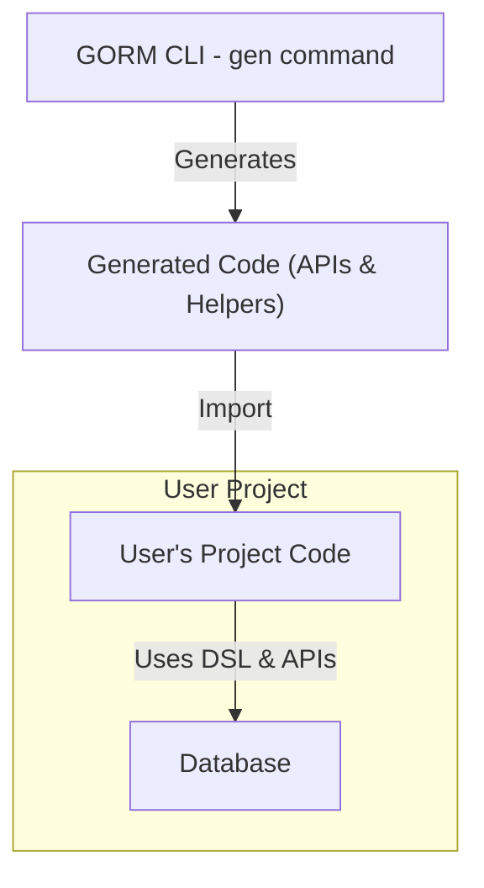

# Integrating Generated Code

This guide helps you seamlessly import and use the type-safe APIs and field helpers generated by GORM CLI in your Go projects. By following these instructions, you'll quickly move from running the generation tool to writing real application code that interacts with your database using the expressive, fluent, and compile-time safe interfaces and helpers.

---

## 1. Locate Generated Code

After running the GORM CLI generation command (`gorm gen -i <input_path> -o <output_path>`), your generated code will be placed in the specified output directory (default is `./g`).

Consider the following:

- The output directory contains generated query APIs and model-driven helpers.
- The directory layout reflects your package structure.
- Typical generated code includes interface implementations and field helpers as Go packages.


## 2. Import Generated Packages

To use the generated code, import the appropriate package(s) into your Go source files. For example, if your generation output path is `generated`, import it as:

```go
import (
    "gorm.io/gorm"
    "your/module/path/generated"
    "context"
)
```

Use the full module path relevant to your project.


## 3. Using Generated Query APIs

The generated code provides strongly typed, fluent APIs for executing your SQL templates through Go interfaces. Follow these patterns:

### Example: Simple Query Method

Suppose you generated from an interface `Query[T any]` with a method `GetByID(id int)`.

```go
ctx := context.Background()
db := /* your *gorm.DB instance */

user, err := generated.Query[models.User](db).GetByID(ctx, 123)
if err != nil {
    // handle error
}
// use user
```

### How it works

- `generated.Query[models.User](db)` constructs a type-safe API bound to your `User` model.
- Methods correspond to your interface's SQL templates, passing parameters as defined.
- Context is injected automatically for database calls.


### Tips

- The generic interface enforces compile-time safety.
- Method calls return appropriate results or errors, matching your interface signatures.


## 4. Employing Model-Driven Field Helpers

Field helpers simplify building dynamic queries, filters, and updates with strong typing.

### Example: Using Field Predicates

```go
// Query all users older than 18
users, err := gorm.G[models.User](db).
    Where(generated.User.Age.Gt(18)).
    Find(ctx)
if err != nil {
    // handle error
}
```

### Example: Updates with Field Helpers

```go
err := gorm.G[models.User](db).
    Where(generated.User.ID.Eq(123)).
    Set(generated.User.Name.Set("newname"), generated.User.Age.Incr(1)).
    Update(ctx)
if err != nil {
    // handle error
}
```

### Working with Associations

Generated helpers exist for associations (has one, has many, belongs to, many2many).

```go
// Create a user with a pet
err := gorm.G[models.User](db).
    Set(
        generated.User.Name.Set("alice"),
        generated.User.Pets.Create(generated.Pet.Name.Set("fido")),
    ).
    Create(ctx)
```

### Best Practice

- Always use field helpers for conditions and updates rather than raw SQL to benefit from type safety.
- Use `.Where(...)` to filter before `.Set(...)` updates or creates.


## 5. Practical Patterns for Common Operations

### Filtering

Use generated predicates for dynamic querying:

```go
users, err := gorm.G[models.User](db).
    Where(generated.User.Status.Eq("active"), generated.User.Age.Between(18, 65)).
    Find(ctx)
```

### Batch Creation for Associations

```go
err := gorm.G[models.User](db).
    Where(generated.User.ID.Eq(1)).
    Set(generated.User.Languages.CreateInBatch([]models.Language{{Code: "EN"}, {Code: "FR"}})).
    Update(ctx)
```

### Unlinking and Deleting Associated Records

```go
// Unlink pet
err := gorm.G[models.User](db).
    Where(generated.User.ID.Eq(1)).
    Set(generated.User.Pets.Unlink()).
    Update(ctx)

// Delete pet named "fido"
err := gorm.G[models.User](db).
    Where(generated.User.ID.Eq(1)).
    Set(generated.User.Pets.Where(generated.Pet.Name.Eq("fido")).Delete()).
    Update(ctx)
```


## 6. Handling Generated Code Updates

Whenever you update your query interfaces or models and re-run generation:

- Rebuild your project to sync with generated code changes.
- Adjust your usage if interface signatures change.
- Keep configuration consistent to avoid overwriting customized generation settings.


## 7. Troubleshooting Common Integration Issues

<AccordionGroup title="Common Problems & Solutions">
<Accordion title="Package Import Errors">
- Verify the import path corresponds to your project and the output directory.
- Use `go mod tidy` to refresh dependencies.
- Ensure generated code builds without errors before importing.
</Accordion>
<Accordion title="Method Not Found or Signature Mismatch">
- Confirm you generated code after modifying interfaces.
- Check that the method signatures in your interfaces match expected usage.
- Ensure context parameters are passed if the generator adds them.
</Accordion>
<Accordion title="Runtime Errors from Database Calls">
- Validate your `*gorm.DB` instance is properly initialized.
- Pass a valid `context.Context` to methods.
- Check database connectivity and permissions.
</Accordion>
</AccordionGroup>


## 8. Next Steps & Further Resources

- Explore the [Defining Query Interfaces & Models](../guides/getting-started-workflows/defining-interfaces-models) guide to learn how to craft interfaces for generation.
- Review [Generating and Using Type-Safe APIs](../guides/getting-started-workflows/generating-using-apis) for deep dives into generation options and usage.
- Visit [Template-Based Queries & SQL DSL](../guides/advanced-usage-patterns/template-based-queries) to leverage advanced templating in your query interfaces.


---

## Summary Diagram: Integration Workflow




---

By integrating the generated type-safe APIs and model-driven field helpers, you unlock the full power of GORM CLI—seamless, safe, and productive database operations in your Go applications.

---