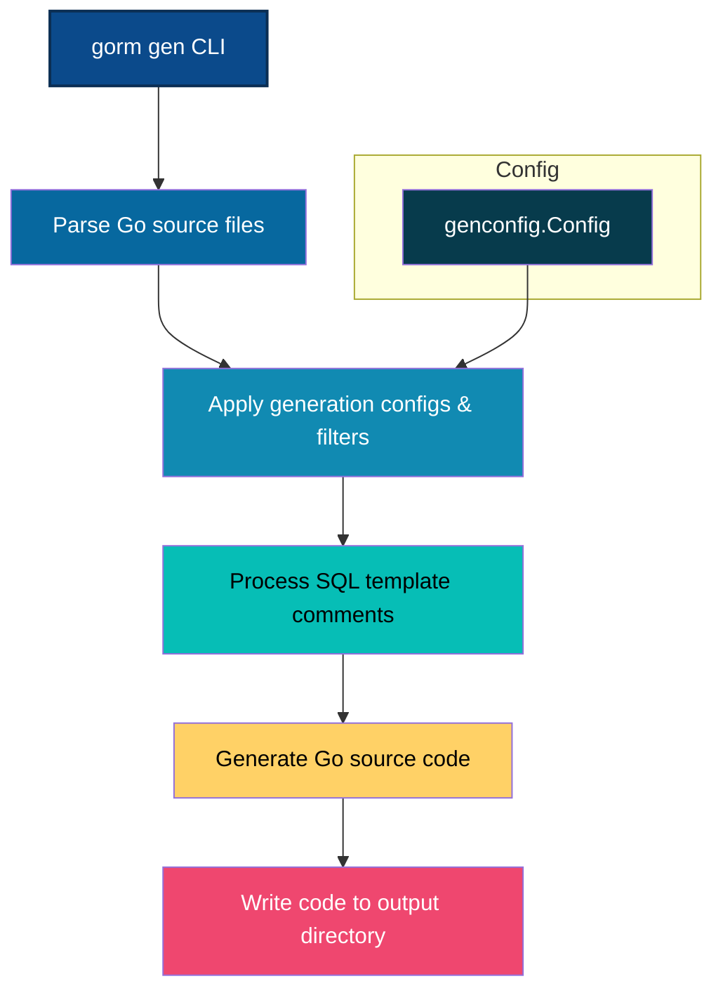

# Generating Type-Safe APIs and Helpers

Transform your Go models and SQL-template query interfaces into type-safe, discoverable APIs and model-driven field helpers with GORM CLI. This page guides you through the core CLI commands you use to execute code generation, explains key command options, and details the structure of the generated code so you can quickly understand and start leveraging the generated APIs.

---

## 1. Overview of the Generation Step

The generation step is the heart of GORM CLI’s workflow where your declared Go interfaces (with embedded SQL templates) and model structs are transformed into:

- **Query APIs:** You get compile-time safe, strongly typed interfaces reflecting your SQL queries and CRUD operations.
- **Field Helpers:** These are fluent, typed constructs for model fields and associations, dramatically improving query construction and maintenance.

The process parses your Go source files, applies any generation configurations, interprets your SQL templates with placeholder support, and emits idiomatic Go code ready for integration.

---

## 2. Running the CLI Command

Use the following CLI command to generate code:

```bash
gorm gen -i <input_path> -o <output_path>
```

- `-i, --input` (required): Specify the directory or Go file containing your query interfaces with SQL templates.
- `-o, --output` (optional): Directory to place the generated code. Defaults to `./g` if not set.

_Example:_
```bash
gorm gen -i ./examples -o ./generated
```

**Tip:** The input path should contain both your query interface definitions and model structs for the generator to detect and process them properly.

---

## 3. Understanding CLI Key Options

| Option          | Description                                                   | Default   |
|-----------------|---------------------------------------------------------------|-----------|
| `-i`, `--input`  | Path to Go source file or directory with SQL-annotated interfaces | (required) |
| `-o`, `--output` | Output directory for generated Go source code                 | `./g`     |

The CLI command validates your input path and outputs detailed success or error messages.

---

## 4. Anatomy of Generated Code

Once generation completes successfully, explore your output directory to find files structured as follows:

### a. Query API Files

For each interface with SQL templates, a concrete implementation is generated:

- **Interface function:** e.g., `Query[T any](db *gorm.DB)` — entry point returning the generated interface implementation.
- **Interface definition:** Reflects your original interface methods with added context parameters.
- **Implementation struct:** Concrete receiver with method implementations embodying SQL templating logic.

#### Example Snippet
```go
func Query[T any](db *gorm.DB, opts ...clause.Expression) _QueryInterface[T] {
    return _QueryImpl[T]{Interface: gorm.G[T](db, opts...) }
}

type _QueryInterface[T any] interface {
    gorm.Interface[T]
    GetByID(ctx context.Context, id int) (T, error)
    FilterWithColumn(ctx context.Context, column string, value string) (T, error)
    // ... other methods
}

type _QueryImpl[T any] struct {
    gorm.Interface[T]
}

func (e _QueryImpl[T]) GetByID(ctx context.Context, id int) (T, error) {
    // method body with SQL template rendering
}
```

### b. Model Field Helpers

For each model struct, the generator creates a helper struct exposing each field and association as typed, fluent helpers.

#### Usage
```go
var User = struct {
    ID   field.Number[uint]
    Name field.String
    Age  field.Number[int]
    Pets field.Slice[Pet]
}{
    ID:   field.Number[uint]{}.WithColumn("id"),
    Name: field.String{}.WithColumn("name"),
    Age:  field.Number[int]{}.WithColumn("age"),
    Pets: field.Slice[Pet]{}.WithName("Pets"),
}
```

This enables expressive calls such as:

```go
generated.User.Name.Like("%smith%")  // name LIKE '%smith%'
generated.User.Age.Between(18, 65)     // age BETWEEN 18 AND 65
```

### c. Association Helpers

Associations like `has many`, `belongs to`, or `many2many` are surfaced as specialized helpers on the model helpers allowing safe, expressive CRUD and linking operations.


---

## 5. How SQL Templates Are Processed

Your interface method comments include SQL with placeholders and directives. The generator parses these templates and converts them into Go code building parameterized SQL with:

- **Placeholders:** `@param`, `@@table`, `@@column` replaced dynamically by method args and model names.
- **Control Directives:** `{{if}}`, `{{for}}`, `{{where}}`, `{{set}}` define conditional fragments and clauses.

See the [Template DSL and SQL Templating](https://example.com/concepts/core-architecture/template-dsl-concepts) page for full syntax and examples.

Example:

```go
// SELECT * FROM @@table WHERE id=@id
GetByID(id int) (T, error)
```

Is emitted as Go code that builds SQL string and argument list with correct binding.

---

## 6. Best Practices and Tips

- **Define your query interfaces with clear, concise SQL comments using the template DSL syntax.** This directly maps to generated methods.
- **Keep your models and queries in the same package or directory** for full automatic detection and generation.
- **Use the CLI `-o` option wisely** to organize generated code for maintainability.
- **Utilize generation config** (`genconfig.Config`) if you need to customize field mappings or include/exclude rules.

---

## 7. Common Troubleshooting

<AccordionGroup title="Troubleshooting Generation Issues">
<Accordion title="The generator reports 'no Query interface found' error">
Ensure your input path includes the Go file where your query interface is declared and that it uses the correct interface naming and SQL template comments.
</Accordion>
<Accordion title="Generated code has syntax errors">
Check that your SQL template comments use proper syntax and placeholders. Run `go fmt` or the CLI's built-in formatting support to identify the problem.
</Accordion>
<Accordion title="Output directory not created or files missing">
Confirm your CLI tool has write permissions for the output directory; manually create the target directory or use an explicit `-o` path.
</Accordion>
</AccordionGroup>

---

## 8. Next Steps

Once you have successfully generated your type-safe APIs and helpers:

- Integrate them into your project imports and start using the generated methods.
- Explore the [Using Generated APIs: First Query](https://example.com/getting-started/core-workflow-quickstart/using-generated-code) guide for code examples demonstrating typical queries.
- Customize field helper behaviors and generation with the [Basic Generation Configuration](https://example.com/getting-started/configuration-troubleshooting/basic-configuration) guide.
- Dive deeper into writing SQL templates in interfaces via the [Template-Based Queries](https://example.com/guides/advanced-patterns/template-based-queries) page.


---

## 9. Reference Links

- [GORM CLI Official GitHub Repository](https://github.com/go-gorm/cli)
- [GORM CLI Quickstart Guide](https://example.com/getting-started/core-workflow-quickstart/prepare-models-interfaces)
- [Generation Configuration Reference](https://example.com/concepts/generation-configuration/genconfig-overview)


---

### Related Diagram: Generation Flow Overview



This flow illustrates how the CLI command kickstarts the parsing of user code, applies configurations, interprets SQL templates, and finally emits generated code ready to use.

---

End of documentation for **Generating Type-Safe APIs and Helpers**.