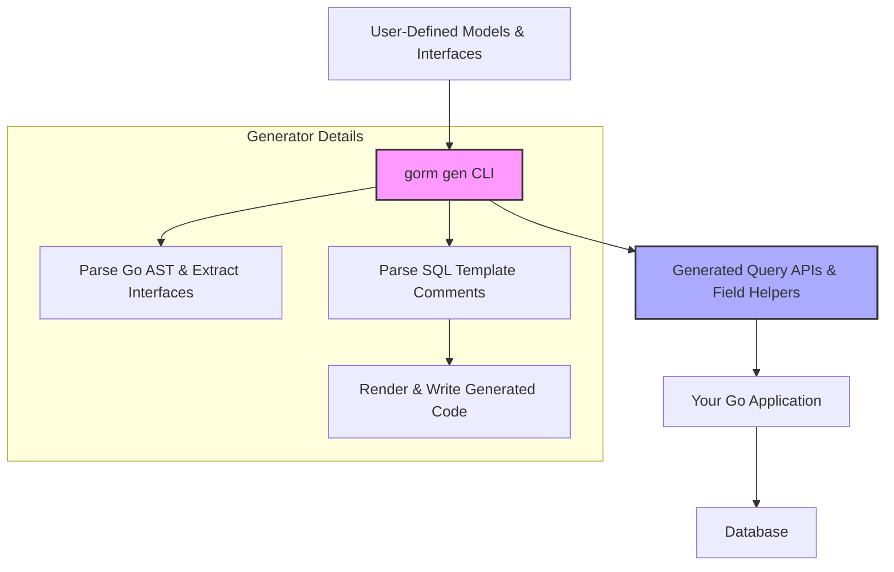

# Your First Code Generation

Walk through generating type-safe query APIs and field helpers from your own models and interfaces. This guide takes you step-by-step from declaring your query interface and models, to running the code generator, and finally using the generated code in your Go project.

---

## 1. Prepare Your Models and Query Interface

Start by creating Go structs for your database models and defining Go interfaces annotated with SQL templates for your queries.

Example: Define a simple `User` model and a generic `Query[T]` interface:

```go
// models/user.go
package models

import (
  "gorm.io/gorm"
)

type User struct {
  gorm.Model
  Name string
  Age  int
}
```

```go
// query.go
package examples

import "gorm.io/cli/gorm/examples/models"

type Query[T any] interface {
  // SELECT * FROM @@table WHERE id=@id
  GetByID(id int) (T, error)

  // where("name=@name AND age=@age")  (chained queries)
  FilterByNameAndAge(name string, age int)
}
```

### Tips
- Use `@@table` placeholder to resolve the actual database table for the model.
- Annotate each method with SQL templates or raw SQL queries in comments above the method.
- You can make interfaces generic to reuse across different models.

## 2. Run the GORM CLI Generator

Use the `gorm gen` command to generate code from your interfaces and models. The basic command structure:

```bash
gorm gen -i ./examples -o ./generated
```

- `-i` specifies the input path: your interface and model files directory.
- `-o` specifies the output directory for generated files.

### Expected Outcomes
- Generates type-safe query API implementations from your interfaces.
- Generates model-driven field helpers for building fluent, safe query predicates and updates.

### Example
If your project structure is:

```
./examples/models/user.go
./examples/query.go
```

The generator will process those and output generated code in `./generated`.

## 3. Using Generated Code in Your Project

Once generated, you can import the generated package and invoke queries and updates with safety and discoverability.

### Basic Usage Example

```go
package main

import (
  "context"
  "fmt"
  "gorm.io/gorm"
  "your_project/generated" // Adjust import path
  "your_project/examples/models"
)

func main() {
  ctx := context.Background()
  db := setupGormDB() // your *gorm.DB instance

  // Query user by ID
  user, err := generated.Query[models.User](db).GetByID(ctx, 123)
  if err != nil {
    panic(err)
  }
  fmt.Println("User:", user)

  // Fluent filtered queries using field helpers
  users, err := gorm.G[models.User](db).
    Where(generated.User.Name.Eq("Alice")).
    Where(generated.User.Age.Gt(18)).
    Find(ctx)
  if err != nil {
    panic(err)
  }
  fmt.Println("Users:", users)
}
```

### Explanation
- `generated.Query[models.User](db)` returns the interface implementation for your user queries.
- `generated.User` contains field helpers so you can build predicates like `Name.Eq("Alice")` safely.

## 4. Walkthrough Example

Here is a complete minimal scenario that you can use as a reference:

### Step 1: Define Models and Interface
```go
package examples

import "gorm.io/gorm"

type User struct {
  gorm.Model
  Name string
  Age  int
}

type Query[T any] interface {
  // SELECT * FROM @@table WHERE id=@id
  GetByID(id int) (T, error)

  // where("name=@name AND age=@age")
  FilterByNameAndAge(name string, age int)
}
```

### Step 2: Generate code
Run:
```bash
gorm gen -i ./examples -o ./generated
```

### Step 3: Use generated code
```go
ctx := context.Background()
user, err := generated.Query[User](db).GetByID(ctx, 1)
if err != nil {
  // handle error
}

users, err := gorm.G[User](db).
  Where(generated.User.Name.Eq("John"), generated.User.Age.Gt(20)).
  Find(ctx)
```

## 5. Understanding the Generated Artifacts

- **Interface implementations** for each SQL-template-defined method
- **Field helpers** for each model's fields, typed for predicate building
- **Association helpers** for managing relations (if any in your models)

These generated pieces enable a highly type-safe, declarative approach to querying your database.

## 6. Best Practices & Tips

- Place your interfaces and models in the same package or folder to ease generation.
- Annotate methods clearly with SQL comment templates using the `@@table`, `@param`, and `{{where}}` directives.
- Use generics in interfaces (`Query[T]`) for reusable and flexible query interfaces.
- Validate input and output types carefully; the generator enforces interface/return signature safety.
- Use the optional `genconfig.Config` struct to customize output paths, field mappings, and filters if needed.

## 7. Troubleshooting Common Issues

<Tip>
If `gorm gen` fails to generate code or produces no output:
- Verify your input path points to the correct folder or files containing interfaces and models.
- Make sure you've annotated query interfaces with proper SQL template comments.
- Confirm your Go environment supports generics (Go 1.18+).
- Check that interfaces return appropriate return values: either `(T, error)` or `(error)` for command methods.
</Tip>

<Tip>
If generated code does not compile:
- Check for version mismatches between GORM, GORM CLI, and your Go version.
- Review any field type mappings you declared for custom types in genconfig.
</Tip>

## 8. Next Steps

After your first generation and usage:

- Explore customizing generation with [`genconfig.Config`](getting-started/essential-setup/configuration-basics).
- Learn to write advanced SQL template queries using the Template DSL.
- Manage associations using generated helpers for relation operations.
- See example workflows and feature highlights in guides to deepen usage.

---

## Diagram: Simplified Generation Workflow



---

For a comprehensive overview, refer to:
- [Supported Features at a Glance](/overview/feature-overview/supported-features)
- [Configuration Basics](/getting-started/essential-setup/configuration-basics)
- [Quickstart Guide](/guides/core-workflows/quickstart-guide)

---

## Summary
This page empowers you to generate your first type-safe query APIs and model-based field helpers using GORM CLI. Walk through defining your models and query interfaces, invoking the generator, and integrating the generated helpers into your Go project for safer and more maintainable database access.

---

For further exploration, consult:
- The [Installation Guide](/getting-started/essential-setup/installation) to set up the CLI tool.
- The [Core Concepts & Terminology](/overview/introduction-and-key-concepts/core-concepts-and-terminology) to master key terms.
- The [Advanced Configuration](/guides/advanced-patterns/customizing-generation) for tuning generation behavior.

This documentation page fits into the onboarding workflow right after installation and before diving into querying patterns or association handling.