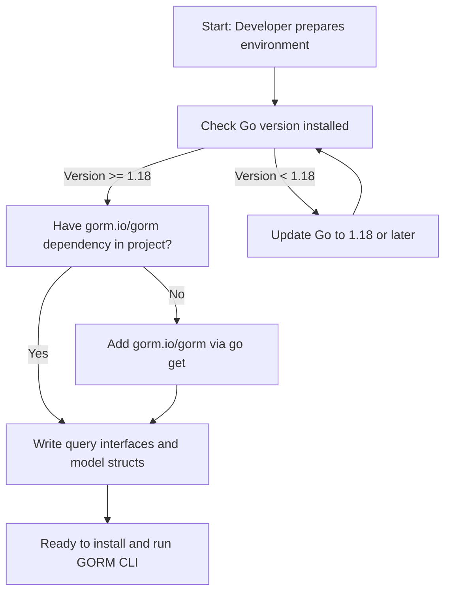

# Prerequisites & System Requirements

Before you begin installing and using the GORM CLI tool, ensure your development environment meets the necessary prerequisites to avoid common setup issues and ensure a smooth experience generating type-safe database APIs.

---

## 1. System Requirements

- **Operating Systems Supported**: GORM CLI runs on any platform where Go is supported, including Linux, macOS, and Windows.
- **Go Version**: Go 1.18 or later is required to support generics, a core feature leveraged by GORM CLI.
- **Disk Space**: Minimal disk space is needed, but ensure enough space for generated code output (default is `./g` directory).


## 2. Dependencies

- **Go Toolchain**: Make sure Go 1.18+ is installed and available in your system PATH.

- **GORM integration**: GORM CLI generates code for use with the `gorm.io/gorm` ORM package. Your project should already depend on or be ready to incorporate GORM.

- **Optional Tools**: Text editors or IDEs with Go support will help you write interfaces and models, but are not mandatory.


## 3. Access and Network Requirements

- **Local Access**: GORM CLI runs locally as a command-line tool; no special network access is required to operate.

- **Internet Access for Installation**: Required only to install GORM CLI via Go modules.


## 4. Environment Setup Overview

To prepare for installing and using GORM CLI, follow these steps:

<Steps>
<Step title="Verify Go Installation">
Open your terminal and run:

```bash
go version
```

Expected output confirms your Go version is 1.18 or higher:

```
go version go1.18 linux/amd64
```

If your Go version is older, update to the latest version.
</Step>

<Step title="Ensure GORM Dependency in Your Project">
Your project must use `gorm.io/gorm`. If not present, initialize a Go module and add GORM:

```bash
go mod init your/module/name
```

```bash
go get gorm.io/gorm
```

This is necessary because generated code integrates tightly with GORM.
</Step>

<Step title="Prepare Your Interface and Model Files">
Write Go interfaces containing method signatures with SQL templates in comments, and define your models in Go structs. Both should exist in the same package or directory for scanning.

Example interface snippet:

```go
// SELECT * FROM @@table WHERE id=@id
GetByID(id int) (T, error)
```

Example model snippet:

```go
type User struct {
  ID   uint
  Name string
  Age  int
}
```
</Step>
</Steps>


## 5. Important Notes & Best Practices

<Tip>
Always use Go 1.18 or later because GORM CLI relies on Go generics for type safety and code generation.
</Tip>

<Tip>
Place your model structs and SQL template interfaces together in a logical directory structure to simplify code generation inputs.
</Tip>

<Warning>
Skipping prerequisite checks will likely cause the generator to fail or produce invalid code. Validate your environment before installation.
</Warning>

## 6. Common Pitfalls

- Using Go versions earlier than 1.18 will cause the CLI not to install or run.
- Interfaces or models placed outside the generation path or in separate modules may cause import errors in generated code.
- Missing `gorm.io/gorm` dependency in your project will lead to compilation errors when using the generated code.


## 7. Summary Diagram of Environment Setup




## 8. Next Steps

Once your environment is confirmed and configured following these prerequisites, proceed to the **Installation** page where you will find step-by-step instructions to install the GORM CLI binary and verify the installation.


---

### Helpful Resources
- [Installation Guide](/getting-started/essential-setup/installation) — Install the CLI tool
- [Quickstart: Your First Code Generation](/getting-started/essential-setup/quickstart-your-first-generation) — Start generating type-safe APIs
- [Configuring the Generator](/getting-started/configuration-troubleshooting/configuring-generator) — Customize code generation behavior
- [Troubleshooting Common Setup Issues](/getting-started/configuration-troubleshooting/troubleshooting-common-issues) — Address common environment problems


---

For a deep understanding of the overall product and how environment readiness fits, explore:

- [What is GORM CLI?](/overview/product-intro-value/what-is-gorm-cli)
- [Quickstart & Basic Workflow](/overview/feature-overview-workflows/quickstart-workflow)


<Check>
You have confirmed your environment meets all prerequisites:
- Go 1.18+ installed
- gorm.io/gorm dependency ready
- Query interfaces and model structs prepared
You are ready to install and run GORM CLI.
</Check>
