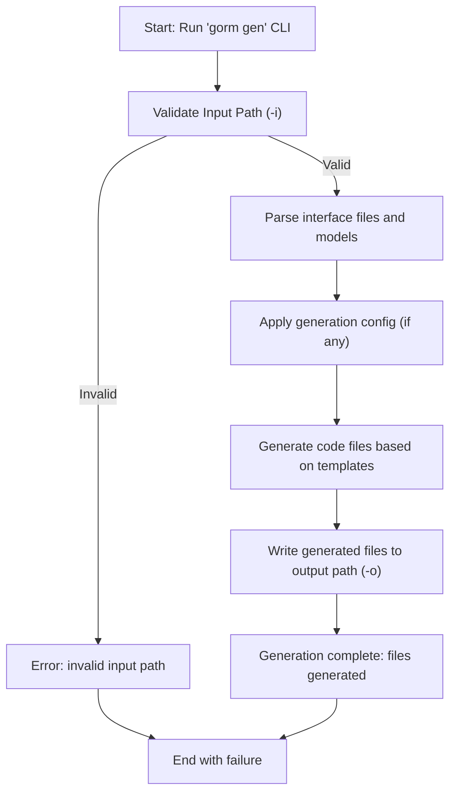

# Running the Generator

This guide walks you through executing the GORM CLI code generator. You will learn how to run the CLI tool, pass necessary parameters, understand expected outputs, and verify the generated code structure.

---

## 1. Prerequisites

Before running the generator, ensure the following:

- **Go Environment**: Go 1.18 or higher is installed and your `GOPATH` and `PATH` are configured to allow executing Go binaries.
- **GORM CLI Installed**: Install the CLI binary using:
  ```bash
  go install gorm.io/cli/gorm@latest
  ```
- **Prepared Interfaces and Models**: Your project contains Go interfaces annotated with SQL templates and model structs appropriately defined.
- **Working Directory**: You know the path to your interface files or directories containing them.

<Tip>
It is recommended to have a minimal example interface and model ready for testing generation, as shown in the [Writing Models & Query Interfaces](https://yourdocs.example.com/getting-started/first-code-gen/writing-models-interfaces) guide.
</Tip>

---

## 2. Running the GORM CLI Generator

The CLI executable is called `gorm gen`. It takes mandatory input and optional output parameters.

### Basic Command Syntax

```bash
gorm gen -i <input_path> [-o <output_path>]
```

- `-i, --input`: Path to the Go interface file or directory containing interfaces with raw SQL annotations. 
- `-o, --output`: (Optional) Directory where generated code files will be placed. Defaults to `./g`.

### Example Commands

- Generate from a single interface file:
  ```bash
  gorm gen -i ./examples/query.go
  ```
- Generate from an entire package/directory, outputting to a custom folder:
  ```bash
  gorm gen -i ./examples -o ./generated
  ```

### Expected Console Output

When run successfully, the generator will print logs similar to:

```
Generating file ./generated/query.go from ./examples/query.go...
Generating file ./generated/models.go from ./examples/models.go...
```

This confirmation shows which source files were processed and where the generated code files are saved.

### Parameter Details

| Parameter | Description                                | Example                      |
|-----------|--------------------------------------------|------------------------------|
| `-i`      | Input file or directory path to interfaces | `./examples/query.go`        |
| `-o`      | Output directory for generated code files  | `./generated` (default `./g`)|

<Tip>
Always specify the input (`-i`) path accurately, pointing to the file or directory containing your query interfaces with SQL annotations.
</Tip>

---

## 3. Directory Structure After Generation

After running the generator, your output directory will contain Go source files representing the generated query APIs and field helpers.

Typical structure:
```
generated/
  ├── query.go        # Generated interface implementations
  ├── models.go       # Generated model-based field helpers
  └── ...             # Possible additional generated files
```

### Structure Explanation:
- **query.go**: Contains generated implementations for your raw SQL annotated interfaces, each providing type-safe methods matching your interface.
- **models.go**: Contains generated model fields and helpers for building queries and managing associations.

<Tip>
The file names and number depend on your input files and configuration. You can customize the output path or structure via optional `genconfig.Config` settings in your packages.
</Tip>

---

## 4. Verification

To confirm the generation was successful:

1. **Verify Console Output**: Check that the generator printed file generation messages without errors.
2. **Inspect Output Directory**: Confirm the output folder contains `.go` files corresponding to your input interfaces and models.
3. **Check Generated Source**: Open generated files to ensure structs, interfaces, and methods are present and contain your SQL queries.

### Example:

```bash
cat ./generated/query.go
```
Look for generated interface implementations with method signatures matching your source interfaces.

<Tip>
If you see no files generated or errors, ensure your input path contains properly defined Go interfaces with SQL annotations, and that you have write permissions to the output directory.
</Tip>

---

## 5. Troubleshooting Common Issues

<AccordionGroup title="Common Issues During Generation">
<Accordion title="No output generated">
- Verify the input path is correct and contains `.go` files with annotated interfaces.
- Confirm interfaces include SQL comments using correct syntax.
- Check for any syntax errors in source files.
</Accordion>

<Accordion title="Permission denied when writing files">
- Ensure you have write permission on the output directory.
- Try running the command with elevated permissions or choosing a different output folder.
</Accordion>

<Accordion title="Method signature validation errors">
- Ensure methods in interfaces return appropriate return types as per GORM CLI requirements (e.g., last return value must be `error`).
- Refer to [Writing Models & Query Interfaces](https://yourdocs.example.com/getting-started/first-code-gen/writing-models-interfaces) for correct method signature patterns.
</Accordion>

<Accordion title="Command not found or executable not found">
- Ensure you installed `gorm` CLI using `go install gorm.io/cli/gorm@latest`.
- Confirm your `$GOPATH/bin` is in your system `PATH`.
- Run `gorm version` to verify CLI availability.
</Accordion>
</AccordionGroup>

---

## 6. Next Steps

After the generator runs successfully:

- See [Using the Generated Code](https://yourdocs.example.com/getting-started/first-code-gen/first-use) to integrate generated query interfaces and models into your project.
- Explore [Writing Models & Query Interfaces](https://yourdocs.example.com/getting-started/first-code-gen/writing-models-interfaces) to refine your definitions for advanced queries and associations.
- Consult [Troubleshooting Common Issues](https://yourdocs.example.com/getting-started/troubleshooting-validation/troubleshooting) if you encounter difficulties.

---

For detailed command options and flags, use:

```bash
gorm gen --help
```

This prints usage help directly from the CLI.

---

## Summary Diagram of Generation Workflow



---

## References

- [GORM CLI Installation & Setup](https://yourdocs.example.com/getting-started/setup-basics/installation)
- [Writing Models & Query Interfaces](https://yourdocs.example.com/getting-started/first-code-gen/writing-models-interfaces)
- [Using the Generated Code](https://yourdocs.example.com/getting-started/first-code-gen/first-use)
- [Troubleshooting Common Issues](https://yourdocs.example.com/getting-started/troubleshooting-validation/troubleshooting)

---

By following this guide, you will successfully run the GORM CLI generator, creating robust, type-safe query code ready to use in your Go projects.