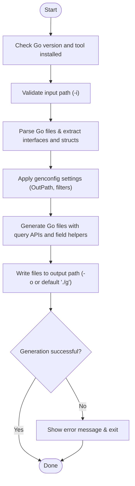

# Running the Code Generator

This guide explains how to run the `gorm gen` command-line tool to generate type-safe query code and model-driven field helpers from your Go interfaces and model structs. You will learn how to specify input and output paths, interpret the generation feedback, and understand what files and directories are created by default.

---

## 1. Prerequisites

Before running the generator, ensure you have completed the following:

- Installed the GORM CLI tool following the [Installation Instructions](/getting-started/setup-and-installation/installation-instructions).
- Created your Go model structs and query interfaces with SQL annotations, as described in [Defining Models and Query Interfaces](/getting-started/first-code-generation/defining-models-and-interfaces).
- Optionally configured generation preferences via `genconfig.Config` in your source package for fine-tuning output paths and field mappings.


<Check>
Make sure you have Go 1.18+ installed and the `gorm` binary is available in your PATH:

```bash
gorm --help
```
Should display usage information.
</Check>

---

## 2. Running the Generator

The main command for generation is `gorm gen`. It requires an input path pointing to your Go source file or directory containing annotated query interfaces, and optionally an output directory.

### Basic Command Syntax

```bash
gorm gen -i <input_path> [-o <output_path>]
```

- `-i`, `--input`: Path to the Go interface file or directory containing your SQL-annotated interfaces. This flag is **required**.
- `-o`, `--output`: Directory to place the generated Go code. Defaults to `./g` if omitted.


### Example

Generate code from interfaces in `./examples` and output into `./generated`:

```bash
gorm gen -i ./examples -o ./generated
```


### What Happens During Execution

- The generator parses Go files at the input path, extracting interfaces with SQL templates and model structs.
- It applies any package-level configuration defined in `genconfig.Config` (e.g., output path overrides, field mappings).
- It creates the output directory structure mirroring the input directory layout.
- For each interface and struct, it generates corresponding type-safe query APIs and field helpers.
- Generated files include comments with a "DO NOT EDIT" warning to prevent manual modifications.
- On success, you will see console output about each generated file.


### Interpreting CLI Output

Typical output lines:

```
Generating file ./generated/examples/query.go from ./examples/query.go...
Generating file ./generated/examples/models/user.go from ./examples/models/user.go...
```

These lines confirm which files were processed and where generated files were written.


<Info>
If any errors occur (e.g., parsing failures, missing input files), the command will exit with a non-zero status and print the error details.
</Info>

---

## 3. Understanding Generated Output

### Output Directory Structure

The generated code is organized parallel to your input source path, maintaining the same package structure for ease of integration.

Example:

```
./examples
  |- query.go           # Your source interface file
  |- models
      |- user.go       # Your source model file

./generated
  |- examples
      |- query.go       # Generated type-safe query API
      |- models
          |- user.go    # Generated model-driven field helpers
```


### Contents of Generated Files

- **Query API files** contain implementations of methods from your interfaces, generating fluent, type-safe query methods backed by raw SQL templates.
- **Field helper files** declare typed field helper variables (e.g., `generated.User.Name`) to be used in filtering, updates, and associations with compile-time type safety.


### Default Output Path

If you do not specify `-o`, files are generated under `./g` by default:

```
./g
  |- (mirrors input directory)
```

You can override this by specifying a custom output directory or by providing a `genconfig.Config` with the `OutPath` field.


---

## 4. Practical Tips & Best Practices

- **Always specify your input path explicitly** with `-i` to avoid running generation on an unintended directory.
- **Use meaningful output directories** to separate generated code from handwritten code, aiding in version control and IDE navigation.
- **Commit generated files to your repository** to ensure other team members and CI environments have access to the generated APIs.
- **Leverage `genconfig.Config` in your packages** to automate output paths and exclude unwanted interfaces or structs.
- When you change your query interfaces or models, **rerun the generator** to keep generated code up-to-date.


---

## 5. Common Issues and Troubleshooting

<AccordionGroup title="Troubleshooting Running the Generator">
<Accordion title="Command not found or unrecognized flag">
This usually means the `gorm` binary is not installed or not in your PATH.

- Install with:
  ```bash
go install gorm.io/cli/gorm@latest
  ```
- Verify with:
  ```bash
gorm --help
  ```
</Accordion>

<Accordion title="Input path does not exist or is incorrect">
Check the path you provide with `-i`. It must point to an existing Go source file or directory containing query interfaces.

- Use relative or absolute paths.
- Ensure files have appropriate interface annotations.
</Accordion>

<Accordion title="No interfaces or structs detected for generation">
- Confirm that your interfaces have SQL annotations in comments.
- Check if you have filters in `genconfig.Config` excluding your interfaces or structs.
- Ensure your Go files are parseable and free from syntax errors.
</Accordion>

<Accordion title="Write permission errors when generating files">
Make sure you have write access to the output directory.

- Create the directory manually or specify another path with `-o`.
- Check for file locks or antivirus interference.
</Accordion>
</AccordionGroup>

---

## 6. Next Steps

After successfully running the generator:

- Integrate the generated code into your Go project by importing the output package.
- Use the generated type-safe query interfaces and field helpers to build database operations with compile-time safety.
- Explore [Validation and Quick Usage](/getting-started/first-code-generation/validation-and-quick-usage) to test your generated API.
- Customize generation through [Basic Configuration](/getting-started/setup-and-installation/basic-configuration) or advanced config for better control.


---

For more detailed walkthroughs and examples, consult these linked resources:

- [Defining Models and Query Interfaces](/getting-started/first-code-generation/defining-models-and-interfaces)
- [Basic Configuration](/getting-started/setup-and-installation/basic-configuration)
- [Troubleshooting Common Setup Issues](/getting-started/first-code-generation/troubleshooting-common-issues)


---

## Summary Diagram: Running the Code Generator Workflow



---

{/* End of Running the Code Generator */}