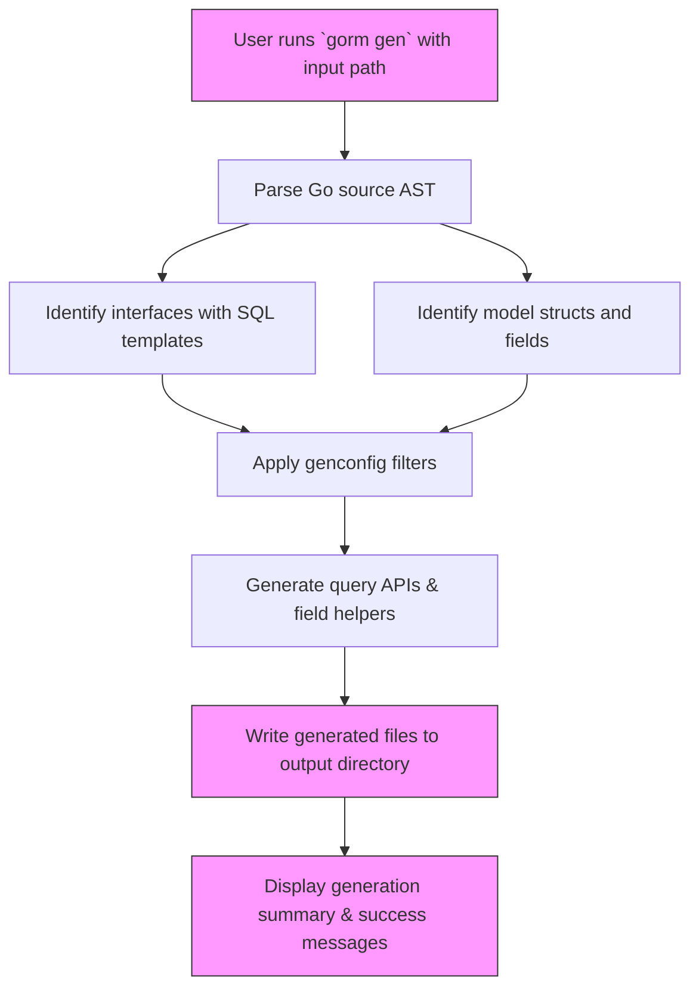

# Generating Code with GORM CLI

Learn how to invoke the GORM CLI to generate type-safe query APIs and model-driven field helpers from your Go source files. This guide walks you through common command-line usage, explains what files are produced, and provides practical tips to ensure successful code generation.

---

## 1. Prerequisites

Before generating code, confirm you have:

- [Go 1.18 or higher](https://go.dev/doc/install) installed and properly configured.
- Your Go project organized with **model structs** and **query interfaces** declared.
- GORM CLI installed (see **Installing GORM CLI** guide).


<Tip>
The CLI reads your Go interfaces annotated with SQL templates plus your model structs to produce the generated APIs.
</Tip>

## 2. Running the Generator CLI

The `gorm gen` command generates the code based on the input source files or directories.

### Basic Command Structure

```bash
gorm gen -i <input_path> -o <output_dir>
```

- `-i` or `--input`: required; path to the Go file or directory containing your interfaces and models.
- `-o` or `--output`: optional; output directory for generated files, defaults to `./g`.

### Examples

Generate code from a single file:

```bash
gorm gen -i ./examples/query.go -o ./generated
```

Generate code recursively from a package directory:

```bash
gorm gen -i ./examples -o ./generated
```

If you omit the output directory, generated code will be placed under `./g`:

```bash
gorm gen -i ./examples
```


## 3. What the Generator Produces

Upon successful generation, the tool produces:

- **Query API implementations:** Concrete types implementing your query interfaces with type-safe methods.
- **Model field helpers:** Strongly-typed field predicates and setters for your structs' fields, enabling fluent query building.

The files placed under the output directory preserve your source file package structure, making integration into your project seamless.


## 4. Integrating Generated Code

### Importing Generated Packages

In your Go code, import the generated package(s) and create query instances or use field helpers:

```go
import "your/module/generated"

// Using generated Query API
q := generated.Query[models.User](db)
user, err := q.GetByID(ctx, 123)

// Using generated field helpers
users, err := gorm.G[models.User](db).Where(generated.User.Age.Gt(18)).Find(ctx)
```

### Tips
- Ensure your generated output path is a proper Go module/package with a valid `go.mod`.
- Regenerate the code whenever you modify your query interfaces or models.


## 5. Common Generator Flags

| Flag          | Description                               | Default     |
|---------------|-------------------------------------------|-------------|
| `-i, --input` | Path to input Go file or directory (required) | *none*      |
| `-o, --output`| Directory for generated code               | `./g`       |


## 6. Verifying Generation and Troubleshooting

### Success Indicators

- CLI outputs `Generating file ...` messages showing source-to-output mapping.
- Generated Go files exist under the output directory matching input packages.
- The generated code compiles in your project without errors.

### Common Issues

<AccordionGroup title="Troubleshooting Common Problems">
<Accordion title="Missing or Invalid Input Path">
Ensure the `-i` flag points to an existing Go file or directory containing interfaces/models demonstrating SQL templates.

```bash
gor m gen -i ./path/to/interfaces.go -o ./generated
```

Check the path is correct and accessible.
</Accordion>

<Accordion title="Output Directory Not Created or Empty">
Make sure you have write permissions for the output directory path.

If the directory does not exist, the CLI creates it. Check folder permissions.
</Accordion>

<Accordion title="No Interfaces or Models Found to Generate">
Confirm your source files define interfaces with SQL template comments and model structs.

Include configuration files (`genconfig.Config`) can limit which interfaces or structs are generated—review your config if you use one.
</Accordion>

<Accordion title="Compilation Errors After Generation">
These often indicate mismatched package imports or missing dependencies.

- Check that generated code is within the correct Go module.
- Ensure that all referenced models and imports are accessible.
- Run `go mod tidy` to fix dependencies.
</Accordion>
</AccordionGroup>


## 7. Best Practices

- Keep your query interfaces and models well-organized and documented.
- Use configuration via `genconfig.Config` to customize generation behavior (mapping field types, including/excluding interfaces).
- Frequently regenerate code as your source interfaces or structs evolve to keep API in sync.
- Combine generated query APIs with GORM's underlying DB instance (`*gorm.DB`) for extended querying.


## 8. Next Steps

After generating your code:

1. Explore the [Using the Generated APIs](../first-codegen-project/quickstart-usage) guide to learn how to call your queries and use field helpers.
2. Customize generation via [Basic Generator Configuration](../../troubleshooting-configuration/basic-configuration).
3. Troubleshoot issues with [Common Setup Issues](../../troubleshooting-configuration/cli-troubleshooting).


---

## Appendix: Command Reference

```bash
gorm gen -i ./path/to/interfaces.go -o ./generated
```

- Generates from interfaces and models in `./path/to/interfaces.go`.
- Writes generated code into `./generated`.

Flags:

- `-i, --input` - _Required._ The source path.
- `-o, --output` - Output directory.


---

## Diagram: Simplified CLI Code Generation Flow



This flow illustrates how the CLI processes inputs, applies configuration filters, generates code, and outputs files for your project integration.

---

For detailed CLI usage and advanced generation options, consult the [Command Line Tool Reference](../../getting-started/prerequisites-installation/cli-installation) and [Configuration & Common Issues](../../getting-started/troubleshooting-configuration/basic-configuration) pages.

---


<Check>
By mastering code generation, you leverage GORM CLI's power to produce robust, maintainable, and type-safe database APIs, accelerating your development while reducing runtime errors.
</Check>


---

*Documentation generated from GORM CLI source and official usage guidelines.*