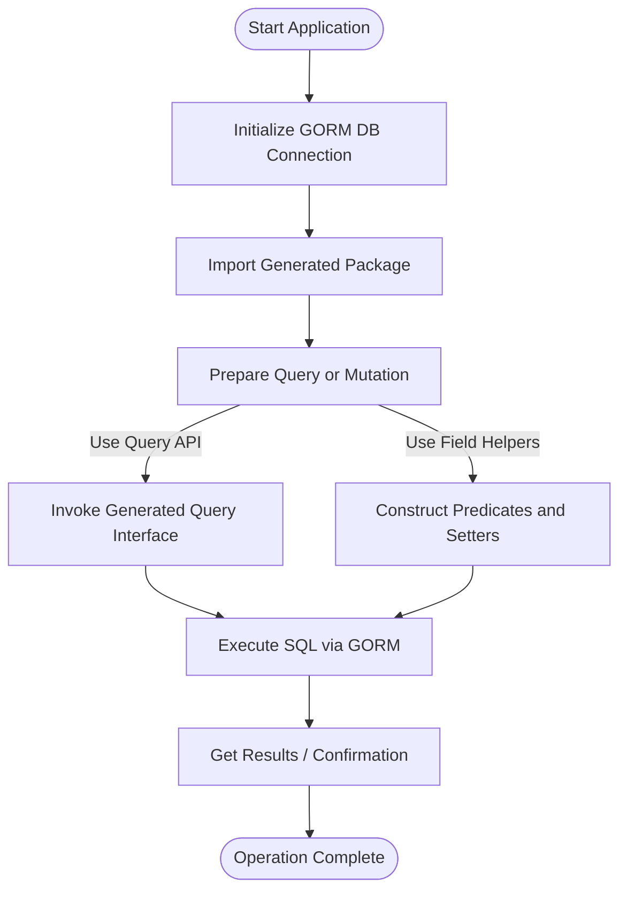

# Using the Generated APIs

Explore how to seamlessly integrate the code generated by GORM CLI into your Go application. This guide walks you through querying, filtering, updating, and managing data with type-safe, fluent APIs that eliminate boilerplate and ensure compile-time safety.

---

## 1. Introduction

Once you have generated code using GORM CLI, your next step is to incorporate the generated query interfaces and field helpers into your application logic. This enables you to leverage type-safe methods for CRUD operations, complex filtering, and sophisticated association management with confidence and clarity.


## 2. Accessing the Generated Query APIs

When you run `gorm gen`, GORM CLI produces two main artifacts:

- **Query APIs from interfaces:** Typed query methods generated from your annotated Go interfaces.
- **Field helpers from models:** Strongly typed predicates and setters for filtering and updates.

You use these in your code by importing the generated package and calling the factory functions.

### Example: Simple Query by ID

```go
import (
  "context"
  "gorm.io/gorm"
  "your_project/generated" // Adjust import path as needed
)

func getUserByID(ctx context.Context, db *gorm.DB, id int) (*generated.User, error) {
  user, err := generated.Query[generated.User](db).GetByID(ctx, id)
  if err != nil {
    return nil, err
  }
  return &user, nil
}
```

> The generator creates a `Query[T]` interface and its implementation. Use it by passing your GORM DB instance and calling the generated methods.


## 3. Filtering and Querying with Field Helpers

Beyond simple queries, you can build complex filters using the generated model field helpers. These helpers provide common comparison operations like `Eq()`, `Like()`, `Between()`, and more.

### Example: Finding Users Older Than 18

```go
users, err := gorm.G[generated.User](db).
  Where(generated.User.Age.Gt(18)).
  Find(ctx)
if err != nil {
  return nil, err
}
// users now contains all users with Age > 18
```

### Common Predicates

| Predicate | Usage                    | SQL Fragment         |
| --------- | ------------------------ | -------------------- |
| `Eq(v)`   | Equals                  | `field = v`          |
| `Gt(v)`   | Greater than            | `field > v`          |
| `Like(s)` | LIKE pattern matching    | `field LIKE s`       |
| `Between(a, b)` | Between two values   | `field BETWEEN a AND b` |
| `IsNull()`| Null check              | `field IS NULL`      |


## 4. Creating and Updating Records Using Setters

Use the generated field setters in conjunction with the fluent API to create or update records with zero values and expressions supported.

### Creating a New Record

```go
err := gorm.G[generated.User](db).
  Set(
    generated.User.Name.Set("alice"),
    generated.User.Age.Set(20),
    generated.User.IsAdult.Set(true),
  ).
  Create(ctx)
if err != nil {
  return err
}
```

### Updating Records Conditionally

```go
err := gorm.G[generated.User](db).
  Where(generated.User.ID.Eq(1)).
  Set(
    generated.User.Name.Set("alice_updated"),
    generated.User.Age.Incr(1),
  ).
  Update(ctx)
if err != nil {
  return err
}
```

> Use `Set()` to specify fields and their values or expressions, preserving readability and type safety.


## 5. Managing Associations with Generated Helpers

GORM CLI generates association helpers for any `has one`, `has many`, `belongs to`, and `many2many` relationships, enabling operations like creating, updating, unlinking, deleting, and batch creation on associated records with compile-time safety.

### Examples of Common Association Operations

#### Creating and Linking Related Records

```go
// Create a user and one pet (has many)
gorm.G[generated.User](db).
  Set(
    generated.User.Name.Set("alice"),
    generated.User.Pets.Create(generated.Pet.Name.Set("fido")),
  ).
  Create(ctx)
```

#### Updating an Associated Pet by Condition

```go
gorm.G[generated.User](db).
  Where(generated.User.ID.Eq(1)).
  Set(generated.User.Pets.Where(generated.Pet.Name.Eq("fido")).
    Update(generated.Pet.Name.Set("rex")),
  ).
  Update(ctx)
```

#### Unlinking and Deleting Associations

```go
// Unlink pets (removes association only)
gorm.G[generated.User](db).
  Where(generated.User.ID.Eq(1)).
  Set(generated.User.Pets.Unlink()).
  Update(ctx)

// Delete associated pets (removes pets as well)
gorm.G[generated.User](db).
  Where(generated.User.ID.Eq(1)).
  Set(generated.User.Pets.Delete()).
  Update(ctx)
```

> **Association Semantics:**
> - BelongsTo: Unlink nullifies parent FK.
> - HasOne/HasMany: Unlink nullifies child FK.
> - Many2Many: Unlink/Delete only affect join rows.


## 6. Using Template-Based Queries

If you defined interfaces with SQL template comments, use the generated methods to execute complex queries that incorporate dynamic filtering, conditional where/set clauses, and iteration.

### Example Usage

```go
// Select user by ID
user, err := generated.Query[generated.User](db).GetByID(ctx, 123)

// Filter multiple users by name and age
users, err := generated.Query[generated.User](db).
  FilterByNameAndAge("jinzhu", 25).
  Find(ctx)

// Update user info
err = generated.Query[generated.User](db).
  UpdateInfo(ctx, generated.User{Name: "jinzhu", Age: 20}, 1)
```

### Template DSL Highlights

| Directive  | Description                              | Example Usage                         |
|------------|------------------------------------------|-------------------------------------|
| `@@table`  | Model's table name                        | `SELECT * FROM @@table WHERE id=@id` |
| `@param`   | Bind Go parameter to SQL param            | `WHERE name=@user.Name`              |
| `{{where}}`| Conditional WHERE clause                   | `{{where}} age > 18 {{end}}`         |
| `{{set}}`  | Conditional UPDATE SET clause              | `{{set}} name=@name {{end}}`         |
| `{{if}}`   | Conditional fragment                       | `{{if age > 0}} AND age=@age {{end}}`|
| `{{for}}`  | Iterate over slice or map                  | Iterating over tags or parameters    |


## 7. Troubleshooting Common Issues

<AccordionGroup title="Common Issues When Using Generated APIs">
<Accordion title="Compilation Errors After Generation">
Ensure your imports are correctly set to the generated package. The generated code creates type-safe helpers that require consistent versioning between your models and generated files. Regenerate your code after model changes.
</Accordion>

<Accordion title="Query Methods Return No Results or Errors">
Verify that the DB instance passed to the factory functions is correctly initialized and connected. Check that query parameters match data in your database. Use `Debug()` on the DB to log SQL queries.
</Accordion>

<Accordion title="Association Operations Not Working Correctly">
Confirmation that foreign keys and associations are properly defined in your Go structs and GORM tags is crucial. Check that your associations comply with GORM’s conventions, or explicitly declare foreign keys.
</Accordion>
</AccordionGroup>

## 8. Next Steps

- Explore advanced filtering and updates using chained predicates.
- Use configurations to customize model field mappings and generation behavior.
- Refer to the [First Code Generation Guide](/getting-started/first-codegen-project/generate-code) to understand full CLI commands.
- Learn about [Association Helpers and Advanced Model Helpers](/guides/advanced-generation/advanced-model-helpers) for sophisticated use cases.

---

## Summary Diagram: Generated API Usage Flow

