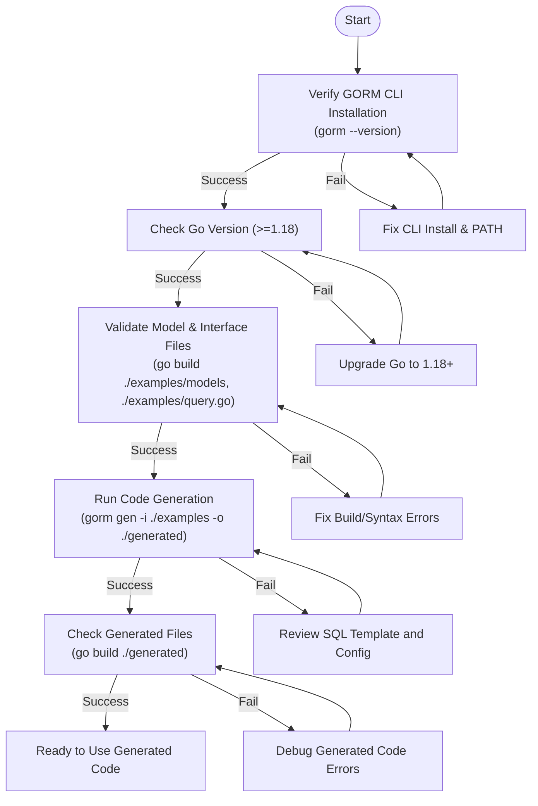

# Validation & Troubleshooting

This guide helps you quickly identify and resolve common issues encountered during setup and your first code generation with the GORM CLI tool. It covers missing dependencies, syntax errors in models or interfaces, output file issues, and includes practical validation steps to ensure your environment and code are correctly configured.

---

## 1. Quick Validation Steps
Before diving into code generation, confirm your environment is properly set up and ready to run the GORM CLI.

### Step 1: Verify CLI Installation
Run the following command to confirm the GORM CLI is installed and accessible in your system PATH:

```bash
gorm --version
```

- **Expected Outcome**: Displays the installed version number.
- **If you receive an error**: Check your PATH environment variable or reinstall using:

```bash
go install gorm.io/cli/gorm@latest
```

### Step 2: Check Go Version
The GORM CLI requires Go 1.18 or higher.

```bash
go version
```

- **Expected Outcome**: Output with Go version `go1.18` or above.
- **If lower version**: Upgrade Go to meet minimum requirements.

### Step 3: Confirm Input Files
Ensure your Go model files and query interface files are syntactically correct and accessible. For instance, your model structs in files like `examples/models/user.go` must compile without errors.

You can run:

```bash
go build ./examples/models/user.go
```

and similarly for your interface files (e.g., `examples/query.go`).


<Tip>
Ensure all your model and interface files are in the correct directories and have the required Go build tags or package declarations.
</Tip>

### Step 4: Run a Dry Code Generation
Run the generator with your input path to check for errors:

```bash
gorm gen -i ./examples -o ./generated
```

- **Expected Outcome**: No errors printed; generated code appears in the output folder.
- **Common Errors**: Parsing failures, missing files, or invalid SQL templates (see next section).

---

## 2. Common Issues and How to Fix Them

Here are the most frequent problems during setup and first generation, how to detect them, and recommended corrections.

### A. Missing or Incorrect Dependencies
- **Symptom**: Errors related to missing packages like `gorm.io/gorm` or `github.com/spf13/cobra`.
- **Cause**: Dependencies not added or modules not initialized.
- **Fix**: Initialize Go modules and run `go mod tidy` in your project root.

```bash
go mod init your/module/path
    
go mod tidy
```

Verify you have `gorm.io/gorm`, `gorm.io/cli/gorm/genconfig`, and other dependencies declared.

### B. Syntax Errors in Models or Interfaces
- **Symptom**: Compiler errors when parsing `examples/models/user.go` or your interface files.
- **Cause**: Invalid Go code, missing imports, or malformed struct tags.
- **Fix**:
  - Validate your Go source files compile cleanly.
  - Ensure struct tags conform to Go syntax.
  - Check that SQL template comments (in interfaces) use the correct DSL.

### C. SQL Template Parsing Errors
- **Symptom**: Errors during `gorm gen` referencing SQL syntax or template parsing.
- **Cause**: Invalid or malformed SQL annotations in interface method comments.
- **Fix**:
  - Use supported directives like `@@table`, `@param`, `{{where}}`, `{{set}}`, `{{if}}` properly.
  - Avoid typo or incorrect Go template syntax.
  - See examples in `examples/query.go` and the [Template DSL](https://github.com/go-gorm/cli#template-dsl) section.

### D. Generated Output File Issues
- **Symptom**: Output files missing, empty, or have invalid Go code.
- **Cause**: Misconfiguration of output path, filter excludes all interfaces/structs, or generator bugs.
- **Fix**:
  - Verify output folder is writable.
  - Check `genconfig.Config` overrides for `OutPath` and inclusion/exclusion filters.
  - Remove overly restrictive `IncludeInterfaces` or `ExcludeStructs` patterns.
  - Run the unit tests in `internal/gen/generator_test.go` for validation.

### E. File Level Configurations Filter Out Everything
- **Symptom**: No files generated or empty output.
- **Cause**: Per-file config with `FileLevel: true` may exclude all structs or interfaces unintentionally.
- **Fix**: Review your `genconfig.Config` settings (like in `examples/filters`) to ensure correct includes/excludes.

---

## 3. Troubleshooting Guide

Use this quick reference to identify and solve issues rapidly.

<AccordionGroup title="Common Troubleshooting Scenarios">
<Accordion title="GORM CLI Command Not Found">
- Confirm if you installed using `go install gorm.io/cli/gorm@latest`.
- Ensure `$GOPATH/bin` or `$HOME/go/bin` is added to your PATH.
- Run `which gorm` (Linux/macOS) or `where gorm` (Windows) to verify CLI path.
</Accordion>

<Accordion title="Parsing Errors in Interface Methods">
- Check that interface method comments use supported SQL template directives exactly.
- Validate that method signatures match the requirements: at least one return value, the last must be `error`, maximum two returns.
- Avoid invalid Go syntax within comments.
</Accordion>

<Accordion title="No Generated Files or Empty Output">
- Make sure the `-o` output directory exists or the CLI can create it.
- Check `include` and `exclude` filters in any `genconfig.Config` for overly restrictive patterns.
- Use verbose output or debug logging (if available) to see which files are processed.
</Accordion>

<Accordion title="Generated Code Fails to Compile">
- Use `go fmt` and `go build` on the generated code directory to identify syntax errors.
- Ensure your models and interfaces are valid and compatible with the generator version.
- Confirm that custom field helpers and tagged fields are correctly defined.
</Accordion>

<Accordion title="Errors Running Unit Tests in `internal/gen/generator_test.go`">
- These tests validate the generator logic on example files.
- Align your local environment with the example directory structure.
- Fix environment or path issues that prevent absolute file resolution.
</Accordion>
</AccordionGroup>

---

## 4. Tips for Successful Validation and Troubleshooting

- **Start Small:** Begin generating code from minimal, valid model and interface files before adding complexity.
- **Keep Dependencies Fresh:** Regularly run `go mod tidy` to keep your module dependencies clean.
- **Run Tests:** Use unit tests under `internal/gen` to catch errors early.
- **Consistent Config:** Avoid conflicting `Include*` and `Exclude*` in `genconfig.Config`s, especially with `FileLevel` set.
- **Debug Output:** Enable verbose output/logging if the CLI supports it to trace file processing.
- **Review Examples:** Follow working examples like those in `examples/query.go` and `examples/models/user.go` exactly to benchmark your inputs.

<Tip>
Leverage the CLI’s `--help` command for detailed usage and flags.
</Tip>

---

## 5. Additional Resources and Links

- [GORM CLI Quickstart and Installation](https://docs.gorm.io/getting-started/setup-installation/installation-cli)
- [SQL Template DSL Guide](https://docs.gorm.io/guides/advanced-patterns/templating-dsl)
- [Model and Interface Preparation Guide](https://docs.gorm.io/getting-started/first-codegen-workflow/prepare-models-interfaces)
- [Basic Configuration Options](https://docs.gorm.io/getting-started/first-codegen-workflow/basic-configuration-options)
- [Using Generated APIs](https://docs.gorm.io/getting-started/first-codegen-workflow/using-generated-code)
- [CLI Quick Validation](https://docs.gorm.io/getting-started/setup-installation/cli-quick-validation)

---

## 6. Summary Diagram: Validation & Generation Flow



This flow helps systematically validate your setup, identify points of failure, and correct issues early.

---

With this guide, you now have clear steps and resources to avoid or troubleshoot common pitfalls during your first interactions with GORM CLI. Always start with environment verification, validate your inputs, run generation carefully, and consult examples and unit tests to ensure success.
