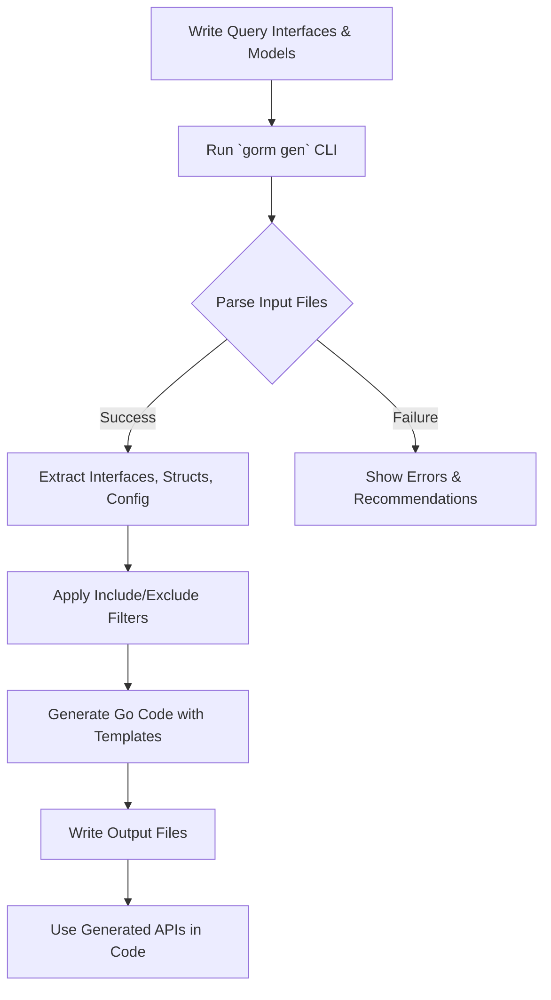

# Generating Code with GORM CLI

This guide walks you through invoking the GORM CLI code generator via the command line, choosing input and output locations, and making sense of the generator's output. You will perform a full code generation workflow using concrete commands and practical examples, enabling you to generate type-safe query APIs and model-driven field helpers for your Go projects.

---

## 1. Preparing to Generate Code

Before running the code generator, ensure you have:

- Installed GORM CLI correctly (see [Installing GORM CLI](../setup-basics/installation.md))
- Confirmed your Go project contains query interface definitions with raw SQL annotations and associated model structs (see [Setting Up Your Project](../first-codegen/project-setup.md))

### Input Path

The input path supplied to the generator must point to Go source files or directories that contain your interface definitions with raw SQL comments. You can use relative or absolute paths.

### Output Path

By default, generated code is written to `./g` relative to your current directory. You can set a custom output directory.

<Tip>
It's recommended to keep generated code separate from your source code by specifying an output folder such as `./generated` or `./output` to avoid confusion.
</Tip>

---

## 2. Running the Code Generator with CLI

Invoke the GORM CLI `gen` command with the required flags:

```bash
gorm gen -i <input-path> -o <output-directory>
```

Where:

- `-i, --input` (required) specifies the path to your Go interface files or directories.
- `-o, --output` specifies the directory for generated code (optional).

### Example - Generate Code from the Examples Directory

```bash
gorm gen -i ./examples -o ./examples/output
```

This command processes all Go files in the `./examples` folder, extracts interfaces with SQL templates and model structs, then generates corresponding type-safe query APIs and field helpers in `./examples/output`.

### Expected CLI Output

On success, you will see output lines like:

```
Generating file examples/output/query.go from /absolute/path/examples/query.go...
```

This confirms the generation of code files from your input source.

---

## 3. Understanding the CLI Command and Flags

| Flag          | Description                             | Required | Default    |
|---------------|-------------------------------------|----------|------------|
| `-i`, `--input`  | Path to Go interface file/directory   | Yes      | —          |
| `-o`, `--output` | Directory to place generated code     | No       | `./g`      |

You must provide the input path. The output path is optional; if omitted, output will go to the `./g` directory.

You can verify this with the following help command:

```bash
gorm gen --help
```

---

## 4. Step-by-Step Generation Workflow

Follow these actionable steps to perform code generation:

<Steps>
<Step title="Step 1: Prepare your query interfaces and models">
Ensure your Go package contains interfaces defining your queries annotated with raw SQL or templated SQL comments, and related Go structs representing your database models.

Example interface method:

```go
// SELECT * FROM @@table WHERE id=@id
GetByID(id int) (T, error)
```

Example struct:

```go
type User struct {
  ID   uint
  Name string
  Age  int
}
```
</Step>
<Step title="Step 2: Run the generation command">
Execute the command replacing `<input-path>` and `<output-directory>` with your paths:

```bash
gorm gen -i ./yourproject -o ./generated
```

The CLI will parse your input files and generate Go files containing the type-safe query APIs and field helpers.
</Step>
<Step title="Step 3: Inspect generated files">
Navigate to your output directory (`./generated` in the example). You will find Go files named after your input files or packages, with generated methods and helpers.

Each generated file includes:
- Query interface implementations
- Field helper variables and methods
- Type-safe method bodies following your SQL annotations
</Step>
<Step title="Step 4: Integrate generated code">
Import the generated package(s) in your project and instantiate generated query interfaces using:

```go
import generated "path/to/generated"

user, err := generated.Query[User](db).GetByID(ctx, 123)
```

Use this generated code to build safe, clear, and maintainable data queries.
</Step>
</Steps>

---

## 5. CLI Output Explanation

When you run the CLI, the tool will:

- Print which files it is generating
- Skip already generated files detected by presence of the generated code header comment
- Report errors if parsing fails or input files are missing

Success output looks like:

```
Generating file generated/query.go from /path/to/examples/query.go...
```

Warnings or error messages will guide you to fix invalid SQL templates or missing interface methods.

---

## 6. Common Pitfalls and Troubleshooting

<AccordionGroup title="Troubleshooting Code Generation Issues">
<Accordion title="Input path errors">
- **Symptom:** `error processing <path>: file not found` or `can't parse file`.
- **Cause:** Incorrect or missing `-i` input path.
- **Solution:** Ensure the path exists and contains Go source files. Use absolute paths if relative paths cause issues.
</Accordion>
<Accordion title="No code generated">
- **Symptom:** No new files appear in the output directory.
- **Cause:** Input files do not contain interfaces with SQL annotations, or filters exclude all interfaces/structs.
- **Solution:** Confirm your Go interfaces use SQL comments and are properly exported. Check config `Include`/`Exclude` lists if applicable.
</Accordion>
<Accordion title="Generated code has syntax errors">
- **Symptom:** Generated files fail to compile.
- **Cause:** Incorrect SQL template syntax or unsupported method signatures.
- **Solution:** Review your SQL annotations. Consult the [Template DSL Syntax](../../overview/intro-value-core/what-is-gorm-cli.md#template-dsl) and fix comment formatting.
</Accordion>
<Accordion title="File permission or directory creation issues">
- **Symptom:** Errors creating output folder or writing files.
- **Cause:** Insufficient permissions or non-existent directory hierarchy.
- **Solution:** Ensure you have write access and the output directory is creatable by the tool.
</Accordion>
</AccordionGroup>

---

## 7. Best Practices and Tips

- Keep interface definitions and models close but separate from generated code using dedicated folders.
- Use the package-level `genconfig.Config` to customize output paths and field mappings.
- Run code generation as part of your build or CI scripts to keep generated code in sync.
- Validate generated code with `go fmt` or `goimports` to maintain readability.

<Tip>
Automate your code generation with a simple script or Makefile target:

```bash
#!/bin/bash
set -e

gorm gen -i ./examples -o ./examples/output
```
</Tip>

---

## 8. Next Steps

- Use the generated query APIs in your application code (see [Using Your Generated APIs](../first-codegen/using-generated.md))
- Customize generation behavior with configuration files (see [Customizing Code Generation](../../guides/advanced/customizing-generation.md))
- Learn the SQL Template DSL for advanced query patterns (see [Mastering the SQL Template DSL](../../guides/advanced/sql-template-dsl.md))

---

## Summary Diagram of the Generation Workflow



---

For any support, consult the [Troubleshooting Common Setup Issues](../first-codegen/basic-troubleshooting.md) or visit the GORM community on GitHub.

---

# See Also
- [Installing GORM CLI](../setup-basics/installation.md)
- [Setting Up Your Project](../first-codegen/project-setup.md)
- [Using Your Generated APIs](../first-codegen/using-generated.md)
- [Template DSL Syntax](../../overview/intro-value-core/what-is-gorm-cli.md#template-dsl)
- [Customizing Code Generation](../../guides/advanced/customizing-generation.md)
