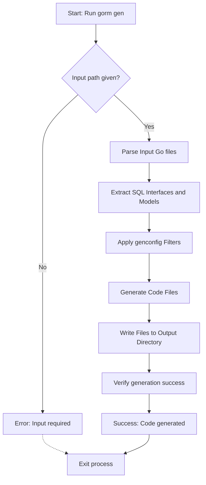

# Generate Code

Use the `gorm gen` CLI subcommand to generate type-safe query APIs and field helpers. This page guides you through supplying input parameters, understanding output location, and using command options for your first successful code generation.

---

## Overview

The `gorm gen` command transforms your Go interfaces annotated with SQL templates and Go model structs into fully type-safe, fluent query APIs and field helpers. This enables compile-time checking and discoverability in your database operations using GORM.

### What You Will Learn

- How to specify input interfaces and model files for generation
- How to set the output directory
- How to run the `gorm gen` command with required parameters
- Understand the expected results and verify success

---

## 1. Prerequisites & Setup

Before generating code, ensure:

- You have installed GORM CLI per the [Installation Guide](/getting-started/setup-basics/installation).
- Your Go interfaces contain raw SQL annotations as comments in the specified syntax.
- Your model structs are prepared in the input directories.
- Go environment variables and `$PATH` are configured such that `gorm` is runnable from your command line.

---

## 2. Running `gorm gen`

### Command Syntax

```bash
gorm gen -i <input-path> -o <output-path>
```

- `-i, --input` (required): The path to your Go interface file or directory containing the interfaces with SQL annotations.
- `-o, --output` (optional): The directory where generated Go source files will be saved. Defaults to `./g` if omitted.

### Example

Assuming your working directory contains the interfaces in `./examples` and you want outputs in `./generated`:

```bash
gorm gen -i ./examples -o ./generated
```

This command scans the `examples` folder, processes interfaces and models, and generates type-safe APIs in the `generated` folder, preserving the package structure.

### Important Flags

| Flag     | Description                                      | Required  | Default  |
|----------|------------------------------------------------|-----------|----------|
| `-i`     | Input path to Go file or directory with interfaces | Yes       | -        |
| `-o`     | Output directory for generated code             | No        | `./g`    |

### Best Practices

- Place interface and model files in the same package or directory for best results.
- Use a dedicated output directory to separate generated code from source code.
- Manage package naming conflicts by preserving input directory structures.

---

## 3. Understanding Code Generation

The generator performs the following:

- **Parse Go source files** in the input path to detect interfaces with SQL method annotations.
- **Extract SQL templates** from method comments.
- **Analyze models** referenced by interfaces for field helper generation.
- **Apply Configurations** if any `genconfig.Config` declarations are present.
- **Generate Go source files** with:
  - Type-safe interfaces implementing your SQL queries.
  - Model-driven field helper structs for predicates and setters.

### Output Structure

The output is organized under the specified output directory (`-o`). It mirrors your input package structure preserving namespaces. Each generated file includes:

- A notice: `// Code generated by 'gorm.io/cli/gorm'. DO NOT EDIT.`
- Generated structures for the interfaces and structs.
- Imports and type-safe methods corresponding to your SQL template methods.

### Command Execution Feedback

Upon successful generation, the CLI prints the paths and filenames generated, such as:

```
Generating file ./generated/query_gen.go from ./examples/query.go...
```

If no interfaces or structs match generator filters or inputs, no files are generated.

---

## 4. Common Errors and Troubleshooting

<Tip>
If you encounter an error like `error processing <input>: file not found` or permissions denied:
- Verify that the input path (`-i`) exists and is readable.
- Confirm you have write permissions on the output path (`-o`).
- Ensure `gorm` binary is installed and accessible.
</Tip>

<Tip>
If the generator runs but no code output appears:
- Confirm your interfaces include SQL templates in comment blocks.
- Check for `genconfig.Config` filters that might exclude your interfaces or structs.
- Make sure interface methods follow the required signature conventions (return values must include an error).
</Tip>

<Tip>
For formatting or import errors after generation:
- Ensure `goimports` or equivalent tools are installed, as the generator runs `imports.Process` automatically.
- Run `go mod tidy` to synchronize module dependencies.
</Tip>

---

## 5. Next Steps

Once code generation completes:

1. **Integrate generated code** into your project by importing the output package(s).
2. See [Using the Generated APIs](/getting-started/first-gen-workflow/using-generated-apis) for examples on how to execute queries.
3. Explore [Validate the Output](/getting-started/first-gen-workflow/validate-outputs) to confirm generated code correctness.
4. Review [Optional: Project Configuration](/getting-started/config-troubleshooting/optional-configuration) to customize generation behavior.

---

## Summary

- The `gorm gen` command generates type-safe query and field helper code from your annotated Go interfaces and models.
- You must specify `-i` input path and optionally `-o` for output directory.
- Generated code enables compile-time safety and fluent APIs in your GORM projects.
- Always place interfaces and model structs together; confirm method signatures.

<Check>
Successful generation is indicated by console logs showing generated files. Verify output directory contains `.go` files and inspect to confirm the generated methods match your interfaces.
</Check>

---

## Practical Example Walkthrough

```bash
# Step 1: Prepare your interfaces and models
# (e.g. in ./examples/query.go)

# Step 2: Run generator
gorm gen -i ./examples -o ./generated

# Step 3: Import and use generated code
# See corresponding usage guides for code examples
```

---

## Additional Resources

- [Define Models and Query Interfaces](/getting-started/first-gen-workflow/define-models-interfaces)
- [Using the Generated APIs](/getting-started/first-gen-workflow/using-generated-apis)
- [Validate the Output](/getting-started/first-gen-workflow/validate-outputs)
- [Optional Configuration and Troubleshooting](/getting-started/config-troubleshooting/optional-configuration)

---

For detailed reference on the CLI tool workings, visit the [GORM CLI GitHub repository](https://github.com/go-gorm/cli).


---

<AccordionGroup title="Command Flags Details">
<Accordion title="-i, --input (required)">
Specify the input path pointing to the directory or Go source file containing your SQL-annotated interfaces. This is mandatory.
</Accordion>
<Accordion title="-o, --output (optional)">
Define the output directory for the generated code. Defaults to `./g` if not provided.
</Accordion>
</AccordionGroup>


<Accordion title="Troubleshooting Common Errors">

### Input Path Errors
- Verify the input file/directory exists.
- Ensure proper read permissions.

### Output Path Errors
- Confirm write permissions for the target output directory.
- Use absolute paths if relative paths cause ambiguity.

### No Output Generated
- Check interface method comments contain valid SQL templates.
- Remove or adjust filters in `genconfig.Config` if excluding code unintentionally.

### Go Toolchain Issues
- Make sure Go 1.18+ is installed.
- Run `go install gorm.io/cli/gorm@latest` to update CLI.

</Accordion>

---

## Summary Diagram



This illustrates the step-by-step process from CLI invocation to successful code generation and writing to disk.

---

## Additional Tips

- Organize related query interfaces and models together to streamline generation.
- Use dedicated folders for generated code to keep your project clean.
- Regularly update `gorm.io/cli/gorm` to benefit from bug fixes and new features.

---

## See Also

- [Installation](/getting-started/setup-basics/installation)
- [Define Models and Query Interfaces](/getting-started/first-gen-workflow/define-models-interfaces)
- [Using the Generated APIs](/getting-started/first-gen-workflow/using-generated-apis)
- [Optional Configuration](/getting-started/config-troubleshooting/optional-configuration)
- [Troubleshooting Common Issues](/getting-started/config-troubleshooting/troubleshooting-common-issues)

---

End of guide for the `gorm gen` command usage and code generation process.
