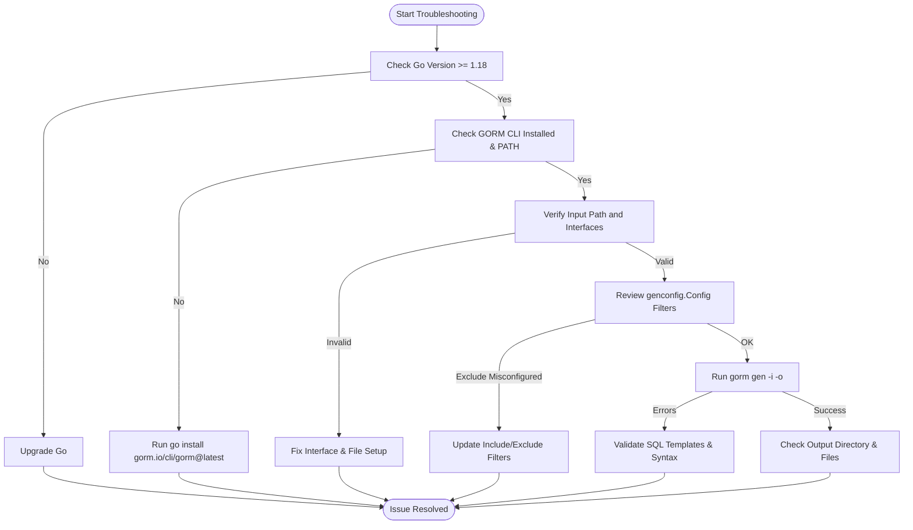

# Troubleshooting Common Issues

Quick solutions to frequent setup and code generation problems in GORM CLI. This guide helps you resolve typical issues such as Go version mismatches, missing dependencies, misconfigured output paths, or interface/model detection errors. Follow these steps to get unstuck and smoothly generate your first type-safe query APIs and field helpers.

---

## 1. Verify Your Go Environment and CLI Installation

Successful code generation requires a compatible Go environment and properly installed GORM CLI.

### Steps

1. **Check your Go version**. GORM CLI requires Go 1.18 or newer due to generics usage.

   ```bash
   go version
   ```

   - Output should be `go version go1.18 ...` or higher.

2. **Verify GORM CLI is installed and in your PATH**.

   ```bash
   gorm --version
   ```

   - If command not found, install it:

     ```bash
     go install gorm.io/cli/gorm@latest
     ```

3. **Confirm `$GOPATH/bin` or your Go bin directory is in your system PATH**.

   - On Unix-like systems:

     ```bash
     echo $PATH
     ```

   - On Windows, check environment variables.

### Common Pitfalls

- Having multiple Go versions installed and running an older one.
- Not adding the Go bin directory to your system PATH.

<Callout title="Tip" type="info">
Always use `go env GOPATH` to confirm where Go installs binaries, then ensure that directory is in your PATH.
</Callout>

---

## 2. Input File and Output Directory Configuration

Problematic input paths or misconfigured output directories can cause the generator to fail or silently produce no files.

### Steps to Fix

1. **Ensure the input path points to your Go interface file or directory with interface definitions.**

   - The `--input` (`-i`) flag is mandatory and must reference the correct location.

   Example:
   
   ```bash
   gorm gen -i ./examples -o ./generated
   ```

2. **Check your output directory is correctly specified or use the default `./g`.**

   - The output directory is where generated code files will be written.
   - Make sure you have write permissions for this directory.

3. **Verify your code files contain interfaces with SQL template annotations.**

   - If no valid interfaces are found, no code will be generated.

4. **Inspect your `genconfig.Config` if present in your packages:**

   - It can override output paths with `OutPath`.
   - Check for include/exclude filters that could skip interfaces or structs.

### Troubleshooting

- Run the command with verbose output or check for `Generating file` logs to confirm files are being written.
- If no files generate, confirm interfaces match include filters or no excludes eliminate them.

<Warning>
Relative paths can cause confusion. Prefer absolute paths or confirm your current working directory when running the CLI.
</Warning>

---

## 3. Resolving Go Version or Dependency Issues

Your environment must have valid Go modules and dependencies for the CLI and generated code.

### Resolution Steps

1. Run:

   ```bash
   go mod tidy
   ```

   - This ensures all required modules, including `gorm.io/gorm` and `github.com/spf13/cobra`, are downloaded.

2. If build errors mention missing packages, verify module replacements or proxy settings.

3. Ensure you are using module-aware mode (`GO111MODULE=on` or unset).

4. The generator internally depends on standard Go tooling, so your `go` command should be configured.

### Common Messages to Check

- Errors like "cannot find package" or "package not found"
- Module version conflicts

<Note>
GORM CLI requires Go 1.18+; older versions will fail with generics-related errors during build or generation.
</Note>

---

## 4. Interface and Model Detection Problems

Sometimes the generator reports errors like `error processing <input>: ...` or yields no generated code.

### Causes & Fixes

- **Missing or empty interface definitions:** Ensure your Go files include interfaces with SQL template comments.

- **Incorrect interface filtering:** Check your package-level `genconfig.Config` or CLI flags for filters excluding your interfaces.

- **Syntax or parsing errors:** Run `go vet` or `go build` in the input directory to detect syntax issues.

- **File naming and location issues:** The generator respects the Go package structure; files misplaced or out-of-package may cause detection failures.

### How to Validate

- Confirm interface declarations include properly formatted SQL template comments.
- Avoid empty interfaces; define at least one SQL-annotated method.

Example interface snippet:

```go
// UserQuery interface for user data
//
// SELECT * FROM @@table WHERE id=@id
GetByID(id int) (User, error)
```

- The CLI tool reads these annotations to convert into methods.

<Check>
Run `gorm gen -i your/interfaces/path -o output/path` and observe verbose error outputs or warnings.
</Check>

---

## 5. Dealing with Template Rendering and Output Errors

You may encounter errors during the template rendering phase such as "error render template got error: ...".

### Causes & Resolutions

- **Invalid SQL template syntax:** Double-check SQL templates in your interface comments for correct placeholders and balanced braces.

- **Misuse of directives:** For example, unclosed `{{if}}`, incorrect variable names, or unsupported Go syntax within SQL templates.

- **File permissions:** Ensure the output directory is writable.

- **Conflicting or incomplete configurations:** Make sure configs merging does not create conflicting filters.

### Troubleshooting

- Validate SQL comment blocks rigorously.
- Temporarily remove complex templates to isolate the issue.

---

## 6. Common Pitfalls and Tips

- **Go version mismatch:** Generator panics with generics-related errors means Go <1.18.
- **Forgetting to specify `-i` flag:** Always provide input path.
- **Incorrect usage of include/exclude filters:** Can lead to no code being generated.
- **Not running `go mod tidy`:** Causes missing dependencies.
- **Output path misunderstandings:** Confusing CLI flag `-o` and config `OutPath` behavior.

<Info>
If you see no generated files, verify all of the above carefully.
</Info>

---

## 7. Getting Help & Additional Support

- Review the [Quickstart Workflow](../quick-features/quickstart) and [Define Models & Query Interfaces](../first-generation/define-models-interfaces) to ensure the setup is correct.
- Consult the [Run the Code Generator](../first-generation/run-code-generator) for command usage.
- For unresolved issues, check the GitHub repository issues: https://github.com/go-gorm/cli/issues

---

## Summary Diagram of Common Troubleshooting Flow



---

Your success with GORM CLI depends on clear environment setup, valid interfaces, and proper configuration. Follow these troubleshooting steps methodically to identify and fix common blockers quickly.


---