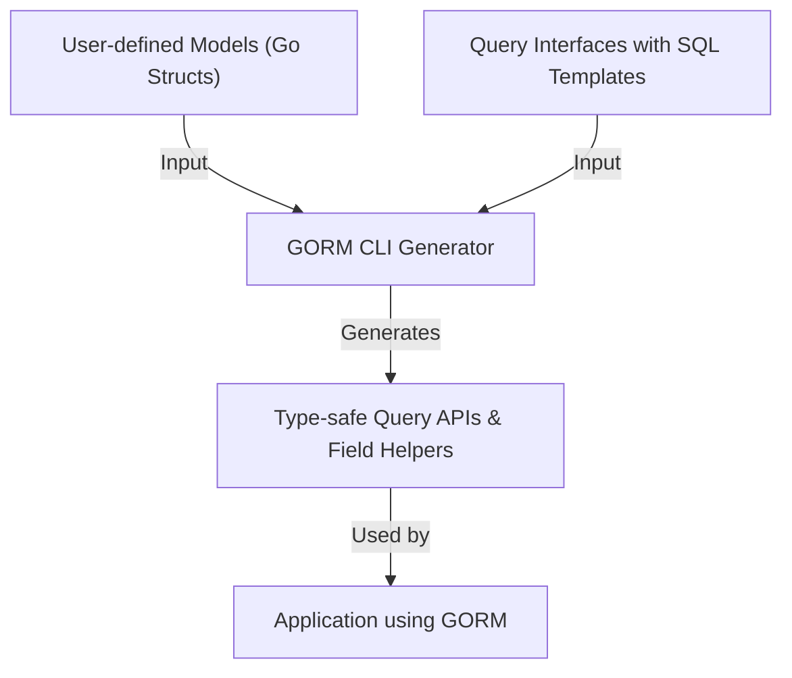

# Defining Models and Query Interfaces

Learn how to define Go structs for your models and interfaces for your query APIs with SQL templates. This forms the foundation for generating type-safe, fluent code with GORM CLI.

---

## 1. Introduction

The first step in leveraging GORM CLI is defining your data models as Go structs and your query APIs as Go interfaces annotated with SQL templates. This approach enables the tool to generate:

- **Type-safe query APIs** from your interface methods
- **Model-driven field helpers** for filters, updates, and associations

By following this pattern, you build a foundation for reliable, readable, and maintainable database interactions with strong compile-time guarantees.

---

## 2. Defining Your Models

Your models should be declared as Go structs, following idiomatic GORM patterns, enhanced with tags to assist code generation.

### 2.1 Basic Struct Definition

Define your structs with Go native types and GORM tags where needed.

```go
package models

import (
  "database/sql"
  "time"
  "gorm.io/gorm"
)

type User struct {
  gorm.Model
  Name      string
  Age       int
  Birthday  *time.Time
  Score     sql.NullInt64
  LastLogin sql.NullTime
}
```

### 2.2 Associations

Support for associations is extensive. Include standard GORM associations such as `has one`, `has many`, `belongs to`, and `many2many` with polymorphic variants.

```go
type User struct {
  gorm.Model
  Account   Account         // has one
  Pets      []*Pet          // has many
  Toys      []Toy           `gorm:"polymorphic:Owner"`
  CompanyID *int
  Company   Company         // belongs to
  ManagerID *uint
  Manager   *User           // self-referencing belongs to
  Languages []Language      `gorm:"many2many:UserSpeak"`
  Friends   []*User         `gorm:"many2many:user_friends"`
}

// Related models

type Account struct {
  gorm.Model
  UserID sql.NullInt64
  Number string
}

type Pet struct {
  gorm.Model
  UserID *uint
  Name   string
  Toy    Toy `gorm:"polymorphic:Owner"`
}

// ...
```

### 2.3 Field Mapping and Custom Types

Optionally, use struct tags like `gen:"json"` to map certain fields to custom field helpers like JSON helpers.

```go
type User struct {
  // ... other fields
  Profile string `gen:"json"`
}
```

For nullable types or custom SQL serializations, configure appropriate mapping in your generation config.

---

## 3. Defining Query Interfaces

Define Go interfaces with generic types and annotated SQL template comments to specify your query methods.

### 3.1 Basic Interface Syntax

Example of a generic query interface for any model `T`:

```go
package examples

type Query[T any] interface {
  // SELECT * FROM @@table WHERE id=@id
  GetByID(id int) (T, error)

  // SELECT * FROM @@table WHERE @@column=@value
  FilterWithColumn(column string, value string) (T, error)

  // ...
}
```

- Use `@@table` as a placeholder for the model's table.
- Use `@param` for binding Go method params to SQL parameters.
- Support dynamic SQL blocks with `{{where}}`, `{{set}}`, `{{if}}`, and `{{for}}` directives.

### 3.2 Complex Query Examples

```go
// SELECT * FROM @@table
// {{where}}
//   {{for _, user := range users}}
//     {{if user.Name != "" && user.Age > 0}}
//       (name = @user.Name AND age=@user.Age) OR
//     {{end}}
//   {{end}}
// {{end}}
Filter(users []User) ([]T, error)

// UPDATE @@table
// {{set}}
//   {{if user.Name != ""}} name=@user.Name, {{end}}
//   {{if user.Age > 0}} age=@user.Age, {{end}}
// {{end}}
// WHERE id=@id
UpdateInfo(user User, id int) error
```

### 3.3 Method Signature Rules

- Context parameter `ctx context.Context` is automatically added if omitted.
- Methods must return error on methods that perform updates or at least error alongside data.

---

## 4. Putting It All Together: Example

Here is a minimal example combining model and interface:

```go
// In models/user.go
package models

import "gorm.io/gorm"

type User struct {
  gorm.Model
  Name string
  Age int
}

// In examples/query.go
package examples

import "gorm.io/cli/gorm/examples/models"

type Query[T any] interface {
  // SELECT * FROM @@table WHERE id=@id
  GetByID(id int) (T, error)
}
```

Use these files as inputs for GORM CLI's generation tooling.

---

## 5. Best Practices for Defining Models and Interfaces

- Keep models close to your GORM project structure.
- Use pointers for nullable fields (e.g., `*time.Time`), or `sql.Null*` types for precise SQL NULL handling.
- Name interfaces starting with `Query` to leverage default inclusion filters.
- Annotate interfaces with SQL comments above methods clearly and concisely.
- Use clear parameter names matching SQL placeholders.
- Utilize `genconfig.Config` for mapping custom types and controlling output.

---

## 6. Troubleshooting Common Issues

<Tip>
- If your interface methods are not being generated, verify that your interface's name matches include filters or adjust configuration accordingly.
</Tip>
<Warning>
- Missing or malformed SQL templates in comments will cause generation errors. Ensure correct DSL syntax.
</Warning>
<Info>
- Use `{{where}}` and `{{set}}` correctly to conditionally generate dynamic SQL fragments.
</Info>

---

## 7. Next Steps

After defining your models and query interfaces:

1. Run the GORM CLI code generator on your input files.
2. Integrate the generated code into your GORM projects.
3. Explore usage through generated APIs for filtering, updating, and associating data.

Refer to the [Running the Code Generator](/getting-started/first-run-and-validation/run-code-generation) to continue.

---

## 8. References and Further Reading

- [GORM CLI README](https://github.com/go-gorm/cli/blob/main/README.md) - In-depth examples and quickstart
- [Model-Driven Field Helpers](https://docs.gorm.io/guides/core-workflows/field-helper-basics) - Work with generated field helpers
- [Template-Based Queries](https://docs.gorm.io/guides/advanced-patterns/template-sql-workflows) - Advanced templating guidance
- [Generation Configuration](https://docs.gorm.io/guides/advanced-patterns/customizing-generation) - Customize code generation

---

## Diagram: How Model and Interface Definitions Fit into GORM CLI Workflow



This diagram shows how your model structs and annotated query interfaces serve as inputs to the generator, which produces the code you use in your application.
