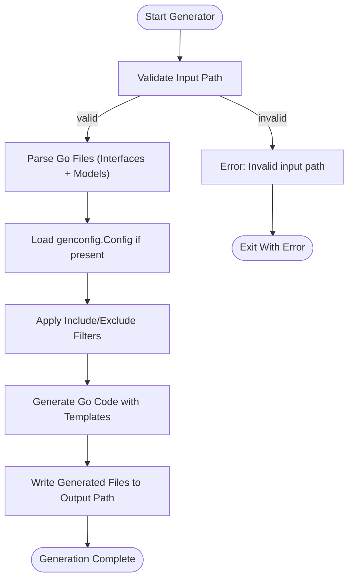

# Running the Code Generator

This guide shows you how to invoke the GORM CLI's code generator to transform your Go interfaces and model structs into fully functional, type-safe query APIs and field helpers. You'll learn the exact commands to run, understand the expected outputs, and see how to verify that the generator works correctly within a real project structure.

---

## 1. Overview

GORM CLI generates two complementary sets of code from your source files:

- **Interface-driven query APIs**: These are generated from Go interfaces that include SQL templates in method comments.
- **Model-driven field helpers**: These come from your Go structs representing database models, producing fluent helpers for fields and associations.

The generator runs as a command-line tool that processes your Go files or directories, analyzes AST metadata along with any package-level generation configuration, and outputs strongly typed Go code in your chosen output directory.


## 2. Prerequisites

- Ensure **Go 1.18+** is installed and properly set up in your environment.
- Have your project containing:
  - **Go interface files** annotated with SQL template comments.
  - **Model structs** representing your database entities.
- (Optional) Define a `genconfig.Config` package-level variable for customized generation behavior (output path override, include/exclude filters, type mappings).


## 3. Invoking the Generator

### Command Structure

The generator is exposed as a subcommand `gen` within the CLI tool. The primary flags you need are:

- `-i`, `--input`: Path to the Go interface file or directory to process. **Required.**
- `-o`, `--output`: Directory where generated code will be saved. Defaults to `./g` if not specified.

Example basic command:

```bash
gorm gen -i ./examples -o ./generated
```

This command will process all Go files recursively under `./examples` and place generated files into `./generated`.


### Detailed Command Flags

| Flag          | Shortcut | Description                                         | Required | Default       |
| ------------- | -------- | ---------------------------------------------------| -------- | ------------- |
| `--input`     | `-i`     | Path to Go interface file or directory to process  | Yes      | N/A           |
| `--output`    | `-o`     | Output directory for generated code files           | No       | `./g`         |


### How to Run

1. **Open your terminal** in your project root.
2. Run the command with your source interface path.
3. Wait for the generator output messages.

Example:

```bash
# Generate from interfaces and models in ./examples to ./generated
gorm gen -i ./examples -o ./generated
```


<Check>
Ensure your interface files include proper SQL annotations as documented in the SQL Template DSL.
</Check>


## 4. Understanding the Generator Output

- The generator preserves your package structure relative to the input path and mirrors it in the output directory.
- For each input file processed, an equivalent `.go` file is created in the output directory, containing:
  - Generated interface implementations with typed methods.
  - Strongly typed field helper constants based on your model structs.

The generator prints messages like this during execution:

```
Generating file ./generated/query.go from ./examples/query.go...
```


## 5. Example Project Structure

Given a source directory:

```
./examples
  ├── query.go       (query interfaces with SQL templates)
  └── models
      └── user.go    (model structs)
```

Running:

```bash
gorm gen -i ./examples -o ./generated
```

Produces:

```
./generated
  ├── query.go       (generated query API)
  └── models
      └── user.go    (generated field helpers)
```


## 6. Integration With Configurations

If you have package-level configuration variables (of type `genconfig.Config`) defined in your source files, the generator automatically picks them up and applies:

- Output directory overrides per package
- Filtering rules for which interfaces or structs to include/exclude
- Field type and name mappings for custom field helpers

This allows fine-grained control of what gets generated and where.


## 7. Verifying Successful Generation

After running the command:

- Confirm you see "Generating file" messages matching your input files.
- Inspect the output directory — generated `.go` files should be present with recently updated timestamps.
- Open these files to verify generated methods, structs, and constants correspond with your input interfaces and models.


## 8. Running Generated Code

Once generated, you can use the produced APIs immediately in your project:

```go
// Import the generated package
import "your_project/generated"

// Use generated query interface
user, err := generated.Query[models.User](db).GetByID(ctx, 123)

if err != nil {
    // handle error
}

fmt.Println(user.Name)
```


## 9. Common Issues and Troubleshooting

<AccordionGroup title="Common Troubleshooting Tips">
<Accordion title="No output files generated">
- Check if the input path really contains suitable Go files.
- Verify interfaces have SQL template comments.
- Ensure `input` flag is correct.
</Accordion>
<Accordion title="Errors about missing return values in methods">
- All SQL template-based methods that are 'finish' methods must return at least one value, and the last must be `error`.
- Methods returning two values must have error as second.
- Fix interface method signatures as per the error message.
</Accordion>
<Accordion title="Output files not appearing in expected directory">
- Confirm you set the `-o/--output` flag correctly.
- If you have `genconfig.Config` in your package, verify if it overrides the output path.
- Generated file paths mirror your source directory structure relative to input path.
</Accordion>
</AccordionGroup>


## 10. Next Steps

- Explore [Defining Models and Query Interfaces](/getting-started/first-run-and-validation/create-models-and-interfaces) to prepare your interfaces with best practices.
- Use [Quick Validation & Usage Test](/getting-started/first-run-and-validation/validate-usage) to test generated code integration.
- Customize generation with [Generation Configuration](/guides/advanced-patterns/customizing-generation).


---

## Reference: Command Entry Point Example

The generator command is implemented in the `internal/gen/gen.go` file as shown below (simplified):

```go
func New() *cobra.Command {
	var output string
	var input string

	cmd := &cobra.Command{
		Use:   "gen",
		Short: "Generate GORM query code from raw SQL interfaces",
		RunE: func(cmd *cobra.Command, args []string) error {
			g := Generator{
				Files:   map[string]*File{},
				outPath: output,
			}

			err := g.Process(input)
			if err != nil {
				return fmt.Errorf("error processing %s: %v", input, err)
			}

			err = g.Gen()
			if err != nil {
				return fmt.Errorf("error render template got error: %v", err)
			}

			return nil
		},
	}

	cmd.Flags().StringVarP(&output, "output", "o", defaultOutPath, "Directory to place generated code")
	cmd.Flags().StringVarP(&input, "input", "i", "", "Path to Go interface file with raw SQL annotations")
	cmd.MarkFlagRequired("input")

	return cmd
}
```

This confirms the available flags and mandatory requirements.


## Summary Diagram of Generator Workflow




---

**By following the steps in this guide, you will confidently run the GORM CLI generator and produce ready-to-use, type-safe query and field helper code to accelerate your Go + GORM development.**


<Source url="https://github.com/go-gorm/cli" paths='[{"path":"internal/gen/gen.go","range":"1-69"},{"path":"internal/gen/generator.go","range":"1-345"}]' branch="main" />