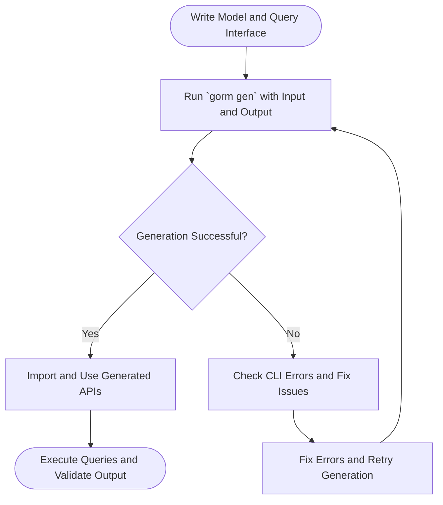

# Quick Start: Generate and Use APIs

Welcome to your first end-to-end journey with GORM CLI! This guide walks you through writing a minimal query interface and model, generating type-safe, interface-driven APIs, and using these APIs in your Go code. Follow the step-by-step flow with copy-paste-ready examples to build confidence and see immediate results.

---

## 1. Prepare Your Model and Query Interface

Your first step is to create a Go package or directory containing:
- A model struct representing your database table
- A query interface defining methods annotated with SQL templates

This approach lets GORM CLI generate concrete, type-safe query APIs tied directly to your model.

### Example Model: `User`

```go
package models

import "gorm.io/gorm"

type User struct {
    gorm.Model
    Name  string
    Age   int
}
```

### Example Query Interface: `Query`

```go
package examples

// Query[T] defines your SQL templated query methods.
type Query[T any] interface {
  // SELECT * FROM @@table WHERE id=@id
  GetByID(id int) (T, error)

  // Simple filter by name and age
  FilterByNameAndAge(name string, age int) ([]T, error)
}
```

<Tip>
Keep your method comments focused on clear SQL with placeholders:
- Use `@@table` for the model's table name
- Use `@param` to bind method parameters safely
- Keep SQL concise for easy debugging and maintenance
</Tip>

---

## 2. Run the Generator

With your model and query interface defined, generate the API code.

### Command

```bash
gorm gen -i ./examples -o ./generated
```

- `-i`: input directory or file containing your interfaces and models
- `-o`: output directory for the generated Go files

### What Happens Here
- The generator parses your interfaces and fixtures
- It produces concrete implementations for your interfaces
- Code is placed in `./generated` preserving package structure

<Check>
Ensure `gorm` CLI is installed and your Go environment is correctly set up before running.
</Check>

### Verification
Confirm the generation by checking:
- `generated/query_gen.go` (or equivalent)
- No errors reported during generation

---

## 3. Use the Generated APIs

Now you can import and use the generated API to safely execute your queries.

### Sample Usage

```go
package main

import (
  "context"
  "fmt"
  "log"

  "gorm.io/driver/sqlite"
  "gorm.io/gorm"
  
  "your_module_path/generated"  // replace with your actual module path
  "your_module_path/models"
)

func main() {
  ctx := context.Background()

  // Initialize GORM with your database
  db, err := gorm.Open(sqlite.Open("test.db"), &gorm.Config{})
  if err != nil {
    log.Fatalf("failed to connect database: %v", err)
  }

  // Use the generated Query API with User model
  query := generated.Query[models.User](db)

  // Fetch user by ID
  user, err := query.GetByID(ctx, 1)
  if err != nil {
    fmt.Printf("Error fetching user: %v\n", err)
  } else {
    fmt.Printf("User fetched: %+v\n", user)
  }

  // Filter users by name and age
  users, err := query.FilterByNameAndAge(ctx, "Alice", 30)
  if err != nil {
    fmt.Printf("Error filtering users: %v\n", err)
  } else {
    fmt.Printf("Filtered users: %+v\n", users)
  }
}
```

<Note>
Each generated method automatically injects `context.Context` if it's missing in your interface method parameters.
</Note>

---

## 4. Understanding the Generated Code

The generator creates:

- **Typed method implementations** for each query interface method
- **Model-driven field helpers** to safely build queries with fluent predicates
- **Extension functions** that integrate seamlessly with `gorm.io/gorm` core

### Key Highlights:
- Query interfaces become concrete types with methods that accept standard Go types and contexts.
- SQL annotated in comments is rendered and executed with safe parameter binding.
- The generated code respects your model structure and query definitions.

<Tip>
Explore `generated/query_gen.go` to see detailed method implementations and field helpers for your models.
</Tip>

---

## 5. Troubleshooting Common Issues

### Problem: Generation Fails with "flag needs an argument"
- _Cause_: Missing `-i` (input) flag with the interface source file or directory
- _Solution_: Always specify your input path with `-i`, e.g., `gorm gen -i ./examples`.

### Problem: Cannot find generated package in import
- _Cause_: Output path incorrect or module path mismatch
- _Solution_: Ensure `-o` matches your expected output directory and your Go module imports reflect the generated package location.

### Problem: Errors about missing context parameter
- _Cause_: Interface method parameters missing `context.Context`
- _Solution_: GORM CLI auto-injects `ctx` if missing, but the calling code must pass the context as the first argument.

---

## 6. Next Steps

- Explore [Configuration and Customization](/getting-started/first-run/configuration-setup) to override output paths, field mappings, and include/exclude filters.
- Use the [Field Helpers Guide](/guides/core-workflows/model-driven-helpers) to harness the full power of generated type-safe fields for filtering and updating.
- Debug with the [Troubleshooting Guide](/getting-started/first-run/troubleshooting) to resolve common pitfalls.
- Validate your generated code with [Quick Validation](/getting-started/first-run/quick-validation) to ensure correctness.

---

## Summary of the Quick Start Flow

1. Write model structs and query interfaces with SQL template comments.
2. Run `gorm gen -i ./path/to/interfaces -o ./generated`.
3. Import and use generated APIs in your Go code with confidence.

<Check>
This quick start empowers you to generate and run your first queries end-to-end, laying the foundation for safer, cleaner GORM database interactions.
</Check>

---

For detailed explanations and advanced usage, visit the [GORM CLI documentation homepage](/overview/introduction-concepts/what-is-gorm-cli).

---

# Appendix: Sample Query Interface with SQL Template Annotations

```go
package examples

type Query[T any] interface {
  // SELECT * FROM @@table WHERE id=@id
  GetByID(id int) (T, error)

  // SELECT * FROM @@table WHERE name=@name AND age=@age
  FilterByNameAndAge(name string, age int) ([]T, error)
}
```

# Appendix: Generated API Use Example

```go
// Inside your application code

user, err := generated.Query[models.User](db).GetByID(ctx, 123)
if err != nil {
  // handle error
}

users, err := generated.Query[models.User](db).FilterByNameAndAge(ctx, "Alice", 25)
if err != nil {
  // handle error
}
```

---

Happy coding with GORM CLI!

---

## Additional Resources

- [System Requirements & Prerequisites](/getting-started/setup-basics/prerequisites-requirements)
- [Installation Guide](/getting-started/setup-basics/installation)
- [Configuration & Customization](/getting-started/first-run/configuration-setup)
- [Troubleshooting Tips](/getting-started/first-run/troubleshooting)


---

## Diagram: Quick Start Workflow



---