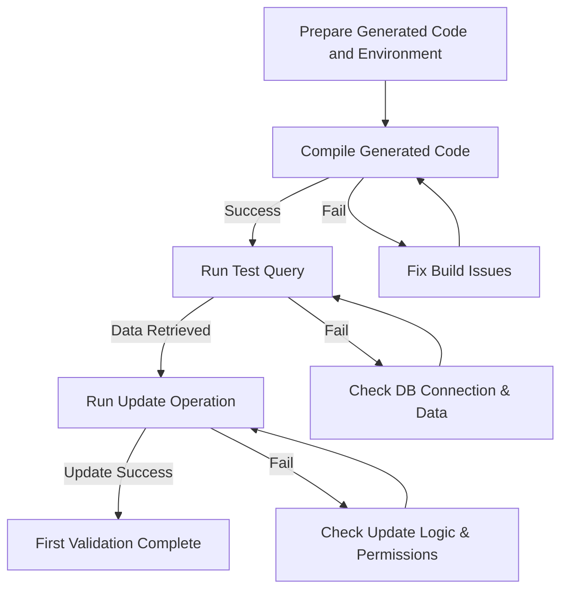

# Quick Validation & First Query

This guide walks you through running your first real-world operation using GORM CLI generated code to verify your setup. You will compile and run the generated Go code, execute a type-safe query or update, and troubleshoot common issues such as incorrect paths, missing models, or permission problems. This hands-on validation ensures your generator configuration is correct and your project is ready for development.

---

## 1. Prerequisites

Before you begin, ensure:

- You have successfully installed GORM CLI and generated code (see [Installing GORM CLI](../setup-installation/installing-gorm-cli) and [Generating Code with GORM CLI](generating-code)).
- Your Go development environment is set up, with Go 1.18+ and your `GOPATH` and `GOROOT` configured correctly.
- You have a database running and accessible; your `DSN` connection string is set properly.
- The generated code is located in the output directory specified during generation.

<Tip>
Always double-check your package import paths and module references in your project to ensure generated files are recognized correctly.
</Tip>

---

## 2. Compile the Generated Code

Compile your generated code to ensure the generator created valid Go source files and dependencies are intact.

### Step-by-Step

1. Navigate to your generated code output directory.

```bash
cd ./generated
```

2. Run the Go build command to compile.

```bash
go build ./...
```

3. Confirm the build succeeds without errors.

<Tip>
If you encounter "package not found" or import errors, verify your module file (`go.mod`) includes the generated package correctly and that your working directory is inside the Go module.
</Tip>

### Troubleshooting

- **Missing package or model detection errors**: Make sure your models package is accessible and that model files are in the paths expected by your import statements.
- **Permission errors**: Check file system permissions on generated source files.

---

## 3. Run a Type-Safe Query Using the Generated APIs

Now that your code compiles, perform a quick test query to validate end-to-end correctness.

### Example: Querying User by ID

Assuming your model includes a `User` struct and your generated package provides type-safe query APIs, follow:

1. Create a Go test file `quick_validation_test.go` next to your generated code with the following example:

```go
package generated_test

import (
	"context"
	"testing"

	"gorm.io/driver/mysql"
	"gorm.io/gorm"

	"your_module_path/generated"
	"your_module_path/models"
)

func TestGetUserByID(t *testing.T) {
	// Setup your database connection
	dsn := "gorm:gorm@tcp(127.0.0.1:9910)/gorm?parseTime=true&charset=utf8mb4&loc=Local"
	db, err := gorm.Open(mysql.Open(dsn), &gorm.Config{})
	if err != nil {
		t.Fatalf("Failed to connect database: %v", err)
	}

	ctx := context.Background()
	// Use generated Query API
	user, err := generated.Query[models.User](db).GetByID(ctx, 1)
	if err != nil {
		t.Fatalf("Query failed: %v", err)
	}

	if user.ID != 1 {
		t.Errorf("Expected user ID 1, got %d", user.ID)
	}
}
```

2. Replace `your_module_path` with your actual Go module path.
3. Run the test:

```bash
go test -v ./...
```

4. Observe output confirming the query ran successfully.

<Tip>
If you face "record not found" errors, verify your database has the expected data or insert a test record first.
</Tip>

---

## 4. Run a Type-Safe Update Operation

You can also test updating a record using generated update methods.

### Example: Update User Name

Add to your test file:

```go
func TestUpdateUserName(t *testing.T) {
	dsn := "gorm:gorm@tcp(127.0.0.1:9910)/gorm?parseTime=true&charset=utf8mb4&loc=Local"
	db, err := gorm.Open(mysql.Open(dsn), &gorm.Config{})
	if err != nil {
		t.Fatalf("Failed to connect database: %v", err)
	}

	ctx := context.Background()
	// Update user name example
	err = generated.Query[models.User](db).UpdateInfo(ctx, models.User{Name: "NewName"}, 1)
	if err != nil {
		t.Fatalf("Update failed: %v", err)
	}

	// Verify update
	user, err := generated.Query[models.User](db).GetByID(ctx, 1)
	if err != nil {
		t.Fatalf("Query after update failed: %v", err)
	}

	if user.Name != "NewName" {
		t.Errorf("Expected name 'NewName', got '%s'", user.Name)
	}
}
```

Run tests again by executing:

```bash
go test -v ./...
```

---

## 5. Common Pitfalls & Troubleshooting

<AccordionGroup title="Troubleshooting Common Issues">
<Accordion title="Build fails due to missing interfaces or models">
Verify the generation input path was correct and models are in the same package or properly imported in interfaces.

Use absolute or relative path carefully when running the generator.
</Accordion>
<Accordion title="Generated code not found or not imported">
Check your Go module path and imports. Ensure your project includes generated code folder and it's compiled in your module.
</Accordion>
<Accordion title="Database connection errors">
Confirm your DSN credentials and network firewall allow database access. Test your connection externally if needed.
</Accordion>
<Accordion title="Query returns no results or unexpected data">
Populate test data in your database. Confirm table names and schemas match what GORM expects.
</Accordion>
<Accordion title="Permission denied on generated files">
Check file system user permissions. Run build commands as the user owning your Go workspace.
</Accordion>
</AccordionGroup>

---

## 6. Next Steps

- Investigate [Using the Generated APIs in Your Project](using-generated-apis) to expand your queries and mutations.
- Explore advanced templating and configuration with [Writing Your First Models and Query Interfaces](writing-models-interfaces) and [Tailoring Code Generation](../../guides/advanced-patterns/configuring-generation).
- Review [Avoiding Common Pitfalls and Troubleshooting](../../guides/core-workflows/common-pitfalls) for real-world problem solutions.

<Check>
Confirm your first queries and updates run successfully before moving on to complex workflows.
</Check>

---

## Summary Diagram: Quick Validation Flow


