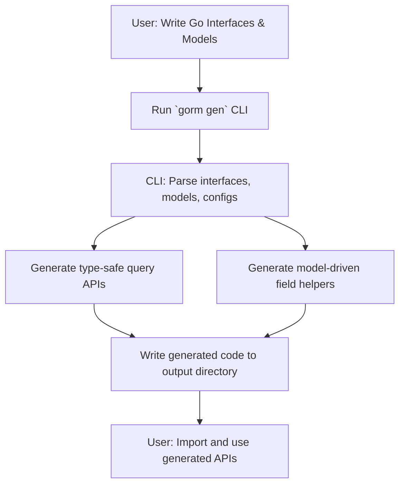

# Generating Type-Safe APIs with GORM CLI

Step through the core workflow of running the GORM CLI code generator to produce type-safe query APIs. This guide explains how to specify input and output directories, use command-line options, and interpret the generated code. You’ll learn how to use the CLI’s `gen` command to transform your annotated interfaces and models into robust, developer-friendly APIs that seamlessly integrate with GORM.

---

## 1. Understanding the Generation Workflow

GORM CLI reads your Go interface files annotated with SQL templates and your Go model structs. It generates two complementary outputs:

- **Type-safe query APIs**: Concrete implementations of your query interfaces with SQL query code safely bound to Go method parameters.
- **Model-driven field helpers**: Typed fields and association helpers derived from your structs to support filters, updates, and database operations with compile-time safety.

This process saves you from writing repetitive and brittle query code, ensuring you have strongly typed, discoverable APIs.

---

## 2. Preparing Your Interfaces and Models

Before running the generator, structure your Go project for smooth discovery:

- **Write query interfaces** in Go, adding SQL templates inside method comments. Example:

```go
// examples/query.go
package examples

type Query[T any] interface {
  // SELECT * FROM @@table WHERE id=@id
  GetByID(id int) (T, error)

  // SELECT * FROM @@table WHERE @@column=@value
  FilterWithColumn(column string, value string) (T, error)

  // Conditional and dynamic SQL supported
  QueryWith(user User) (T, error)
}
```

- **Define your models** in Go structs, using tags and types for fields. Example:

```go
// examples/models/user.go
package models

import "gorm.io/gorm"

type User struct {
  gorm.Model
  Name string
  Age  int
  Profile string `gen:"json"` // triggers JSON helper mapping
}
```

- Optionally configure generation via a `genconfig.Config` package-level variable to customize generated output paths, type mappings, and inclusion/exclusion rules.

---

## 3. Running the Generator

The entry point for code generation is the `gorm gen` CLI command.

### 3.1 Installation Check

Make sure you have installed the CLI tool:

```bash
go install gorm.io/cli/gorm@latest
```

Verify installation:

```bash
gorm gen --help
```

### 3.2 Running the Generation Command

Run the command with:

- `-i` or `--input`: Path to the directory or file containing your query interfaces and models
- `-o` or `--output`: Directory to write the generated code (defaults to `./g`)

Example:

```bash
gorm gen -i ./examples -o ./generated
```

This performs the following actions:

1. Parses all Go files under `./examples` (or the specified input path), discovering interfaces and models.
2. Processes package-level configuration and collects import dependencies.
3. Generates source files under `./generated`, preserving the relative directory structure.
4. Formats the generated code using `golang.org/x/tools/imports` for consistent imports and style.

### 3.3 Expected Output

Each input interface with SQL template annotations results in a concrete Go source file implementing type-safe methods. Model structs yield typed field helpers to express queries and updates semantically.

Upon success, you will see console messages similar to:

```
Generating file ./generated/examples/query.go from /abs/path/examples/query.go...
```

---

## 4. Command-Line Options Summary

| Flag       | Description                                      | Default    | Required |
|------------|------------------------------------------------|------------|----------|
| `-i`, `--input`  | Input file or directory with Go interfaces and models | None       | Yes      |
| `-o`, `--output` | Output directory for generated code             | `./g`      | No       |

Try `gorm gen --help` for detailed CLI usage.

---

## 5. Using the Generated APIs

After generation:

- Import the generated package into your Go project.
- Use the provided query interfaces to build and execute queries with compile-time type safety.

Example:

```go
import (
  "context"
  "generated"
  "gorm.io/gorm"
)

func main() {
  ctx := context.Background()
  db, _ := gorm.Open(...)

  // Query user by ID using generated API
  user, err := generated.Query[models.User](db).GetByID(ctx, 123)
  if err != nil {
    panic(err)
  }
  fmt.Println(user.Name)
}
```

---

## 6. Advanced Configuration

GORM CLI can be customized via a `genconfig.Config` variable for the package:

- Override output paths
- Map Go types or field tags to custom field helper types
- Include or exclude interfaces or structs with patterns
- Enable file-level configuration instead of package-wide

Example config snippet:

```go
var _ = genconfig.Config{
  OutPath: "examples/output",
  FieldTypeMap: map[any]any{
    sql.NullTime{}: field.Time{},
  },
  FieldNameMap: map[string]any{
    "json": JSON{},
  },
  IncludeInterfaces: []any{"Query*"},
}
```

---

## 7. Understanding the Generated Code

Generated source code includes:

- Implementations of your query interfaces with methods parsing the SQL template comments.
- Use of a builder pattern (`strings.Builder`) to safely construct SQL with bound parameters.
- Injection of `context.Context` to methods for request scoping.
- Typed field variables corresponding to model fields with appropriate SQL operators.

Each SQL template comment is parsed with a specialized SQL template engine supporting directives like `{{where}}`, `{{set}}`, `{{if}}`, and `{{for}}` that conditionally build the query string and parameters.

---

## 8. Troubleshooting Common Issues

- **No output files generated**: Verify input path correctness and that interfaces have valid SQL comments.
- **Invalid Go code in generated files**: Check your SQL template syntax for unsupported directives or malformed placeholders.
- **Permissions errors writing output**: Confirm write permissions on the output directory.
- **Excessive or missing imports**: Use configuration filters to control inclusion/exclusion of interfaces and structs.

For all issues, review logs printed during generation and consult the troubleshooting guide under Getting Started > Troubleshooting Your First Run.

---

## 9. Next Steps and Resources

- Review the [Project Setup & Structure guide](../../getting-started/first-steps-with-gorm-cli/project-setup) to optimize your code layout.
- Learn how to [Use Your First Generated APIs](../../getting-started/first-steps-with-gorm-cli/basic-usage-validation) effectively.
- Explore [Customizing Code Generation](../../guides/advanced-patterns/customizing-generation-output) for advanced control.
- Automate generation with [CI integration](../../guides/integration-and-best-practices/automation-with-ci).

---

## 10. Visual Guide: Generation Workflow



---

## Summary
This page guided you through generating type-safe query APIs with GORM CLI, covering input requirements, running the CLI command, expected output, usage, advanced configuration, and troubleshooting. It bridges your raw Go interfaces and models to powerful, safe, and maintainable query implementations.


---

<Check>
Ensure you have Go 1.18+ installed and GORM CLI installed via `go install gorm.io/cli/gorm@latest`.
Use the `gen` command with proper `-i` and optionally `-o` flags.
Verify your interfaces have SQL template comments to enable code generation.
</Check>

---