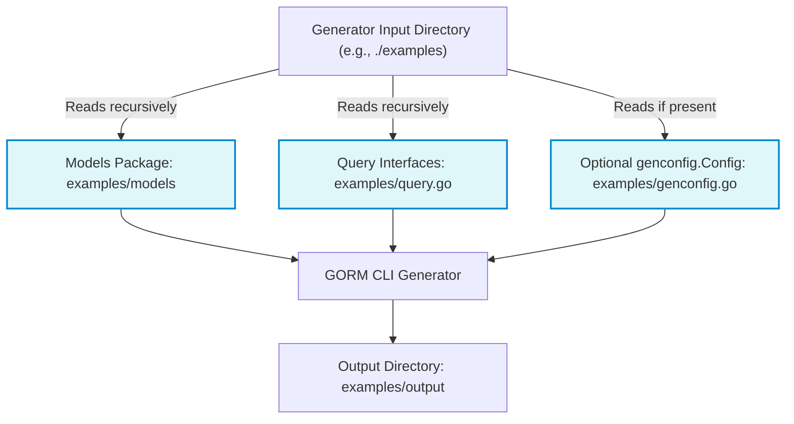

# Project Setup & Structure

Organizing your Go project effectively is crucial for smooth integration with GORM CLI. This guide walks you through structuring your project to enable seamless discovery and generation of query interfaces and model-driven field helpers. We'll cover where to define your models and query interfaces, how the generator processes these files, and best practices illustrated with real-world examples.

---

## 1. Project Organization Overview

To leverage GORM CLI fully, your project code must be laid out so that:

- **Model definitions and query interfaces coexist logically** — typically in the same package or directory.
- **A package-level configuration (optional) can customize generation behavior.**
- **The generator identifies all relevant files automatically from a single input path.**

This structure helps GORM CLI locate your Go structs (models) and interfaces (queries) which contain raw SQL templates, then generate type-safe APIs and helpers accordingly.


## 2. Where to Define Your Models

Your models should be defined as Go structs within a dedicated package, for example `examples/models`. These structs represent your database tables and are the foundation for generating field helpers used for filtering, updating, and association management.

Here's a minimal example:

```go
// examples/models/user.go
package models

type User struct {
	ID     uint
	Name   string
	Age    int
	Role   string
	// Add GORM tags and other fields as needed
}
```

### Best Practices

- Place related models together in one package to simplify generation.
- Use conventional Go naming and struct tags (`gorm:""`) to define schema.
- Keep models clean of query logic—queries go separately in interfaces.

## 3. Defining Query Interfaces

Define raw SQL template-driven query interfaces in the same package or subpackage alongside models. These interfaces declare methods with annotated SQL in comments, which the generator parses to create concrete implementations.

Example from `examples/query.go`:

```go
package examples

type Query[T any] interface {
	// SELECT * FROM @@table WHERE id=@id
	GetByID(id int) (T, error)

	// SELECT * FROM @@table WHERE @@column=@value
	FilterWithColumn(column string, value string) (T, error)

	// UPDATE @@table
	// {{set}}
	//   {{if user.Name != ""}} name=@user.Name, {{end}}
	//   {{if user.Age > 0}} age=@user.Age, {{end}}
	// {{end}}
	// WHERE id=@id
	UpdateInfo(user models.User, id int) error
}
```

### Key Points

- Interfaces are generic (`[T any]`) for flexibility.
- SQL templates use directives like `@@table` (auto table resolution), `@param` (parameter binding), `{{set}}` and `{{where}}` blocks for dynamic conditions.
- Keep query logic expressive yet clear to produce accurate generated methods.

## 4. Generator Configuration

You can optionally provide a package-level `genconfig.Config` variable to customize generation behavior. This config is automatically discovered by the generator when processing the package.

Example configuration snippet:

```go
package examples

import (
	"database/sql"
	"gorm.io/cli/gorm/field"
	"gorm.io/cli/gorm/genconfig"
)

var _ = genconfig.Config{
	OutPath: "examples/output",

	// Custom field type mappings
	FieldTypeMap: map[any]any{
		sql.NullTime{}: field.Time{},
	},

	FieldNameMap: map[string]any{
		"date": field.Time{},
		"json": JSON{},
	},

	// Optional interface and struct filters
	IncludeInterfaces: []any{"Query*"},
	ExcludeInterfaces: []any{"*Deprecated*"},
	IncludeStructs: []any{"User"},
}
```

### Tips

- Use `OutPath` to set the output directory for generated code per package.
- Use wildcards and patterns to include or exclude interfaces and structs.
- Map custom Go types to field helper types as needed.


## 5. How the Generator Discovers Files

When running the generator using the CLI command, you specify an input path that points to the directory containing your interfaces and models (e.g., `./examples`).

The generator recursively scans the input directory for:

- Go files containing interfaces with SQL templates.
- Package-level `genconfig.Config` for overrides.
- Model struct definitions.

It then processes all matched files collectively, applying the configuration.

**Example command:**

```bash
gorm gen -i ./examples -o ./examples/output
```


## 6. Recommended Project Layout Example

```
{project-root}/
├── examples/
│   ├── models/
│   │   └── user.go         # model structs
│   ├── query.go            # query interfaces with SQL templates
│   ├── genconfig.go        # optional generator config
│   └── output/             # generated code output
│       ├── models_gen.go
│       └── query_gen.go
├── main.go                 # CLI entry or app
└── ...
```

## 7. Realistic Example

Given the file `examples/query.go` with:

```go
package examples

type Query[T any] interface {
	// SELECT * FROM @@table WHERE id=@id
	GetByID(id int) (T, error)

	// SELECT * FROM @@table WHERE @@column=@value
	FilterWithColumn(column string, value string) (T, error)
}
```

and the models defined in `examples/models/user.go`:

```go
package models

type User struct {
	ID   uint
	Name string
	Age  int
}
```

plus the optional config in `examples/genconfig.go`:

```go
package examples

import "gorm.io/cli/gorm/genconfig"

var _ = genconfig.Config{
	OutPath: "examples/output",
	IncludeInterfaces: []any{"Query*"},
	IncludeStructs: []any{"User"},
}
```

Running:

```bash
gorm gen -i ./examples -o ./examples/output
```

will generate a type-safe implementation of `Query[User]`, including field helpers for `User`.

## 8. Best Practices & Common Pitfalls

- **Keep query interfaces focused:** Avoid mixing unrelated querying logic in one interface.
- **Consistent model location:** Define all models in a dedicated package or directory for easier maintenance.
- **Use configuration for customization:** Override defaults to handle special types or naming conventions.
- **Watch for naming collisions:** Ensure interface and struct names are unique and meaningful.
- **Avoid complex logic in SQL comments:** Use GORM CLI's templating features for dynamic queries rather than embedding raw SQL strings.

## 9. Troubleshooting Tips

<AccordionGroup title="Troubleshooting Project Setup">
<Accordion title="Generator can't find my interfaces or models">
Verify your `-i` (input) path points correctly to the directory containing both your model structs and query interfaces. Ensure all .go files are syntactically correct and properly imported.
</Accordion>
<Accordion title="Generated code is missing some fields or methods">
Check your `genconfig.Config` for `IncludeInterfaces` and `IncludeStructs` filters. They might be excluding files unintentionally.
</Accordion>
<Accordion title="Conflicts in output directory">
Set a dedicated output path in config and CLI (`-o`) different from your source input directory to avoid overwriting or build-loop issues.
</Accordion>
<Accordion title="Errors due to Go module paths or imports">
Ensure your project is set up as a Go module (`go.mod`) and all imports in your files use module-aware paths consistent with your project layout.
</Accordion>
</AccordionGroup>

---

## 10. Summary

By organizing your Go project with:

- Separately defined models and query interfaces in logical packages
- Optional but helpful package-level configuration
- Dedicated output directories

you enable GORM CLI to find, parse, and generate powerful, type-safe APIs that streamline your GORM usage.

This solid foundation ensures seamless code generation and integration, letting you focus on building data-driven applications with confidence.

---

## Related Links

- [Getting Started: Installing GORM CLI](../setup-installation/installing-gorm-cli)
- [Generating Type-Safe APIs](../first-steps-with-gorm-cli/generating-code)
- [Using Your First Generated APIs](../first-steps-with-gorm-cli/basic-usage-validation)
- [Core Concepts & Terminology](../../architecture-and-concepts/core-concepts-and-terminology)
- [Configuration & Customization](../../concepts/features-integration/customization-configuration)


---

## Diagram: GORM CLI Project Structure Discovery Flow



---


---