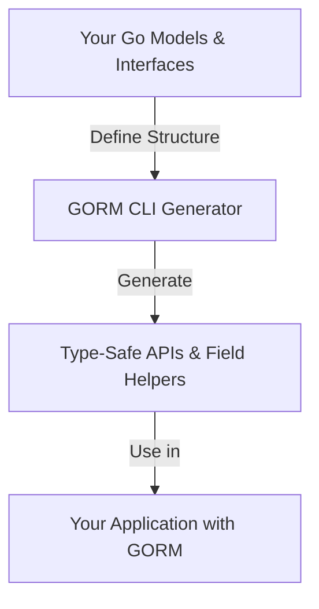

# Quickstart Overview

This guide introduces you to the core workflow of GORM CLI: how to define your models and query interfaces, run the generator, and immediately use the generated code. You’ll gain a clear understanding of how GORM CLI’s key pieces connect to deliver type-safe APIs and field helpers for your Go projects.

---

## 1. Define Your Models and Query Interfaces

The first step is to structure your Go code with model structs representing your database tables and interfaces that describe your queries using SQL templates.

### Define Models
Your models represent database tables. They must be plain Go structs with exported fields. GORM CLI uses these to generate strongly typed field helpers.

```go
package models

type User struct {
    ID      uint
    Name    string
    Age     int
    Role    string
    IsAdult bool
}
```

### Write Query Interfaces with SQL Templates
Interfaces define your custom queries, updates, or filters. Use Go interface methods with annotated comments containing SQL templates. The GORM CLI will parse these and generate type-safe implementations.

```go
package examples

// Query[T any] defines query interfaces with SQL templates
// to be generated into type-safe methods.
type Query[T any] interface {
    // SELECT * FROM @@table WHERE id=@id
    GetByID(id int) (T, error)

    // SELECT * FROM @@table WHERE @@column=@value
    FilterWithColumn(column string, value string) (T, error)

    // UPDATE @@table
    // {{set}}
    //   {{if user.Name != ""}} name=@user.Name, {{end}}
    //   {{if user.Age > 0}} age=@user.Age, {{end}}
    // {{end}}
    // WHERE id=@id
    UpdateInfo(user models.User, id int) error
}
```

> The special placeholders like `@@table` and `@param` allow automatic binding to your models and method parameters.

<Tip>
Keep your model and interface in the same package or directory to simplify generation and ensure GORM CLI picks up all necessary code.
</Tip>

---

## 2. Run the Generator

With your models and interfaces defined, it’s time to generate the code using the GORM CLI.

### Install the CLI (if not already done)

```bash
go install gorm.io/cli/gorm@latest
```

### Run the Generate Command

```bash
gorm gen -i ./examples -o ./generated
```

- `-i` points to the folder or file containing your interface definitions.
- `-o` specifies where to save the generated code. Defaults to `./g`.

This command will parse all relevant Go files, extract interfaces and models, apply any configuration, and create your query APIs and field helpers.

<Check>
If your output directory is empty or the generator outputs nothing, verify that your interfaces contain properly formatted SQL comments.
</Check>

---

## 3. Use the Generated Code

After generation completes, integrate the generated APIs and helpers into your application.

### Import the Generated Package

In your Go code, import the generated package:

```go
import "your/project/generated"
```

### Example Usage

Use the generated query interface methods to perform type-safe database operations.

```go
ctx := context.Background()

// Instantiate your GORM DB connection e.g., db

// Use the generated Query interface for User
u, err := generated.Query[models.User](db).GetByID(ctx, 123)
if err != nil {
    // handle error
}

// Filter users
users, err := generated.Query[models.User](db).FilterWithColumn(ctx, "name", "alice")

// Update user info
err = generated.Query[models.User](db).UpdateInfo(ctx, models.User{Name: "alice", Age: 30}, 123)

```

### Field Helpers

You can also create expressive filters and updates using generated field helpers:

```go
// Query users where age > 18
users, err := gorm.G[models.User](db).Where(
    generated.User.Age.Gt(18),
).Find(ctx)
```

<Tip>
Generated APIs automatically add `context.Context` if missing in your method signatures. You don’t have to manually include it.
</Tip>

---

## 4. Understand How the Pieces Connect

Here is a simplified view of the workflow:



- **Models and interfaces** serve as the source.
- The **generator** reads and parses Go AST and SQL templates.
- It outputs **concrete code** with type-safe query methods and helpers.
- Your **application** uses this generated code to perform database operations confidently and fluently.

---

## 5. Practical Tips and Best Practices

- Maintain your query interfaces near their models to ensure generation picks both up.
- Use the `genconfig.Config` to customize output paths, include/exclude filters, or field mappings if your project requires.
- Write SQL templates clearly and use placeholders to keep code safe and readable.
- Regenerate your code after any interface or model update to keep APIs in sync.
- Leverage generated association helpers for managing relations with compile-time safety.

<Warning>
Always verify your SQL templates have matching return types and param usage to avoid generation errors.
</Warning>

---

## 6. Troubleshooting Common Issues

<AccordionGroup title="Common Generator Issues">
<Accordion title="No Code Generated">
- Ensure the interface has methods with SQL comments.
- Confirm that `-i` input path points correctly to your interfaces.
- Check `genconfig.Config` filters aren’t excluding your interfaces or structs mistakenly.
</Accordion>
<Accordion title="Method Signature or Return Type Errors">
- Generated methods requiring SQL templates must return compatible types (e.g., last return value should be `error`).
- If you see panics during generation about return values, double-check your interface definitions.
</Accordion>
<Accordion title="Import or Package Path Problems">
- Models and interfaces should belong to the same or proximate package to ensure imports resolve correctly.
- Use `OutPath` in `genconfig.Config` if you want to separate generated code into a different module or folder.
</Accordion>
</AccordionGroup>

---

## 7. Next Steps

- Explore [Generating Your First API and Field Helpers](../guides/getting-started/first-code-generation) for a detailed walkthrough.
- Customize your generation through [Customizing Generation with genconfig.Config](../guides/core-workflows/customizing-generation).
- Learn how to manage complex associations with [Managing Associations: Create, Update, Unlink, Delete](../guides/core-workflows/associations-management).
- Review the [System Architecture](../../overview/architecture-and-core-concepts/system-architecture) for an in-depth understanding of the internals.

---

## Additional References

- [What is GORM CLI?](../../overview/introduction-and-core-value/what-is-gorm-cli)
- [Quick Feature Overview](../../overview/architecture-and-core-concepts/feature-overview)
- [Prerequisites & Requirements](../../getting-started/setup-basics/prerequisites)
- [Installation Guide](../../getting-started/setup-basics/installation)
- [Template DSL Examples](../guides/advanced-use-cases/template-dsl-examples)

---

By following this quickstart overview, you align your project setup with GORM CLI’s workflow, enabling rapid generation of safe, fluent, and expressive query APIs that improve your development productivity and code quality.