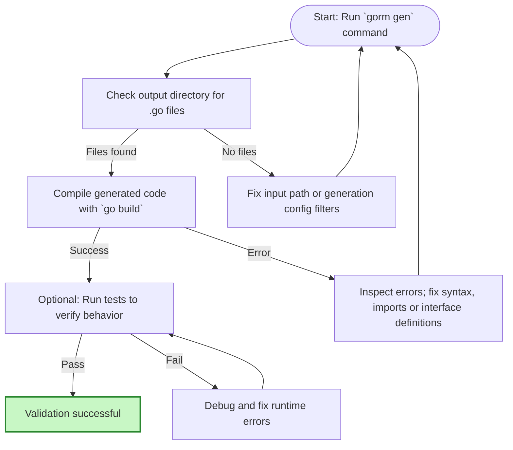

# Validate Generated Code

Ensuring your generated code builds correctly and functions as intended is the critical next step after running your first code generation with GORM CLI. This guide walks you through practical verification steps, essential quick tips, and troubleshooting strategies so you can confidently proceed to integrate the generated APIs and field helpers into your development workflow.

---

## 1. Why Validate Generated Code?

After running the `gorm gen` command, you receive Go source code files that contain your type-safe query interfaces and model-driven field helpers. Validating these files guarantees:

- Syntax correctness: The generated Go code compiles without errors.
- Functional integrity: The generated APIs behave as expected with your models.
- Configuration effectiveness: Your filters, include/exclude rules, and custom helpers are correctly applied.

Successful validation enables you to move forward with implementing queries and operations in your application with full confidence.

---

## 2. Quick Validation Steps

Follow these immediate steps after your first generation to verify your output.

### Step 1: Confirm Generated Files Exist

After running generation (e.g., `gorm gen -i ./examples -o ./generated`), inspect your output directory.

```bash
ls ./generated
```

You should see `.go` files corresponding to your input interfaces and models, preserving package structure.


### Step 2: Compile the Generated Code

Use Go tooling to ensure the generated files compile without error.

```bash
go build ./generated/...
```

If compilation fails, the error output will indicate where to focus your troubleshooting (e.g., missing imports, syntax errors).


### Step 3: Run Basic Unit Tests (if available)

If your project provides tests covering generated code, running them helps verify runtime correctness.

```bash
go test ./generated/...
```


### Step 4: Manually Inspect Key Generated Interfaces and Helpers

Open generated interface files using your editor and verify:

- Methods correspond to your raw SQL interface methods.
- Field helpers for models are present and typed correctly.

Search for method names or helper structs to confirm presence.


### Example: Using `go/parser` to Check Syntax Programmatically

If you want to programmatically verify generation, you can parse generated files to catch syntax issues early:

```go
package main

import (
	"go/parser"
	"go/token"
	"log"
)

func main() {
	fset := token.NewFileSet()
	_, err := parser.ParseFile(fset, "./generated/query.go", nil, parser.AllErrors)
	if err != nil {
		log.Fatalf("Syntax error in generated code: %v", err)
	}
	log.Println("Generated code parses correctly.")
}
```

---

## 3. Common Validation Pitfalls and How to Fix Them

### Issue: No Files Generated

- **Cause**: Input path incorrect or filters exclude all interfaces and structs.
- **Fix**: Check your `-i` input path and generation configuration filters in `genconfig.Config`. Make sure your interfaces and models are not filtered out.

### Issue: Generated Code Fails to Compile

- **Cause**: Missing imports, incorrect Go version, or template errors.
- **Fix**:
  - Verify you use Go 1.18+ (required for generics).
  - Check your dependencies and import aliases.
  - Inspect raw SQL templates for syntax errors.

### Issue: Expected Methods or Helpers Are Missing

- **Cause**: Filters exclude them or your interfaces/models are not defined properly.
- **Fix**: Review `IncludeInterfaces`, `ExcludeInterfaces`, `IncludeStructs`, and `ExcludeStructs` settings to adjust filtering behavior.

### Issue: Generated Helpers Have Unexpected Types

- **Cause**: `FieldTypeMap` or `FieldNameMap` misconfiguration.
- **Fix**: Define your configuration mappings carefully to ensure custom field helpers or type mappings are correctly applied (see `Optional: Configuration Setup` guide).

---

## 4. Tips for Confident Validation

- Always run `go fmt` or use `goimports` to format generated code and detect formatting issues early.
- Keep your interface and model files free of compilation errors before generating code.
- Use package-level `genconfig.Config` declarations to control output paths and filtering, reducing accidental exclusions.
- Regularly commit your golden generated code to version control to detect unwanted changes.

---

## 5. Next Steps After Validation

Once your generated code passes validation:

- Integrate generated query interfaces and helpers into your business logic.
- Explore writing type-safe queries using generated APIs.
- Use association management helpers for relational operations.
- Customize generation for your project by editing and extending `genconfig.Config`.

Refer to these essential guides:

- [Generate Code: Your First Run](./run-first-generation) — For detailed code generation steps.
- [Optional: Configuration Setup](./config-setup) — To customize generation via user configuration.
- [Troubleshooting Your First Run](./troubleshooting-first-run) — For resolving issues after initial generation.
- [Quickstart Overview](./quickstart-overview) — For overall workflow context.

---

## 6. Troubleshooting Common Validation Errors

<AccordionGroup title="Common Validation Issues & Solutions">
<Accordion title="1. No Generated Files Found">
Likely caused by incorrect input directory or excessive filtering.

**Check:**
- Run `gorm gen -i` with correct relative or absolute path.
- Remove or adjust `Include*` and `Exclude*` filters in config.
</Accordion>

<Accordion title="2. Generated Code Fails To Compile">
Check Go version (`go version`) and update to 1.18 or above.

Inspect logs from `go build` to pinpoint missing imports or syntax errors.

Revisit interface SQL comments for correctness.
</Accordion>

<Accordion title="3. Missing Methods Or Struct Helpers">
Filters via `IncludeInterfaces` or `ExcludeStructs` might exclude these.

Modify or clear filters; verify interfaces and structs are named as expected.
</Accordion>

<Accordion title="4. Map Custom Field Helpers Not Applied">
Review the `FieldTypeMap` and `FieldNameMap` fields in `genconfig.Config` to ensure correct mappings.

Example: Mapping `sql.NullTime` to `field.Time{}`.
</Accordion>
</AccordionGroup>

---

_Validating your generated code bridges initial setup and productive development. Follow these recommendations to gain assurance your GORM CLI outputs meet your expectations and are ready for immediate use._


---

## References & Related Guides

- [Installation and Setup Basics](../setup-basics/prerequisites) — Confirm environment readiness
- [Generate Code: Your First Run](../first-steps/run-first-generation) — Core generation instructions
- [Optional: Configuration Setup](../first-steps/config-setup) — Advanced generation customization
- [Troubleshooting Your First Run](../first-steps/troubleshooting-first-run) — Common generation issues
- [Quickstart Overview](../first-steps/quickstart-overview) — Complete initial workflow overview

For community support and issue tracking, visit the [GORM CLI GitHub repository](https://github.com/go-gorm/cli).

---

## Summary Diagram: Validation Workflow


