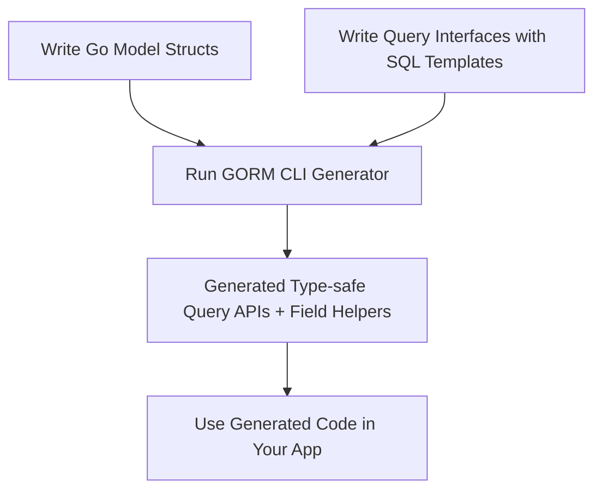

# Writing Models and Query Interfaces

Welcome to your first step in unlocking GORM CLI’s power. This guide walks you through declaring your data models as Go structs and authoring query interfaces that use SQL templates. Together, these source files become the foundation for generating fluent, type-safe query APIs and rich model-driven field helpers.

## 1. Understanding Your Goal

Before diving into code, it's important to grasp what you want to achieve here:

- Define **GORM model structs** that represent your database entities, including basic fields and associations.
- Write **Go interfaces** with SQL query templates embedded in method comments that describe the queries you need.
- Prepare source code ready for GORM CLI’s generator to convert these into efficient, type-safe query APIs.

This structure dramatically reduces boilerplate and helps catch bugs at compile time.

---

## 2. Writing GORM Model Structs

Your model structs express tables and relationships exactly as you want GORM to interpret them.

### Basic Tips for Model Declaration:
- Use standard Go struct syntax.
- Embed `gorm.Model` for common fields like ID, CreatedAt, etc., or define custom fields.
- Add tags for JSON, GORM, or generator hints (like `gen:"json"` for special field helpers).
- Declare associations using struct fields with pointers, slices, or embedded structs.

### Example: A Rich User Model

```go
package models

import (
	"database/sql"
	"time"

	"gorm.io/gorm"
)

// User illustrates various field types and associations
// including polymorphic and many2many relationships.
type User struct {
	gorm.Model
	Name      string
	Age       int
	Birthday  *time.Time
	Score     sql.NullInt64
	LastLogin sql.NullTime

	// One-to-one
	Account   Account

	// One-to-many
	Pets      []*Pet
	Toys      []Toy `gorm:"polymorphic:Owner"`

	// Belongs to
	CompanyID *int
	Company   Company

	// Self-referential single manager
	ManagerID *uint
	Manager   *User
	Team      []User `gorm:"foreignkey:ManagerID"`

	// Many to many
	Languages []Language `gorm:"many2many:UserSpeak"`
	Friends   []*User    `gorm:"many2many:user_friends"`

	Role    string
	IsAdult bool   `gorm:"column:is_adult"`

	// Custom JSON helper directive
	Profile string `gen:"json"`
}

// ... other related structs like Account, Pet, Toy, Company, Language ...

```

### Key Points:
- Associations become specialized field helpers in generated code (e.g., `generated.User.Pets`).
- Using tags like `gen:"json"` instructs the generator to treat the field with a custom helper.

---

## 3. Writing Query Interfaces with SQL Templates

Interfaces describe your queries using Go method signatures augmented with SQL templates in comments.

### What This Achieves

- The generator parses your method signatures and SQL templates.
- It creates concrete implementations that provide type-safe query methods bound to your models.
- You get compile-time checked and discoverable query APIs.

### Interface Writing Guidelines:
- Put SQL statements in method doc comments.
- Use GORM CLI template directives and placeholders (`@@table`, `@param`, `{{where}}`, etc.).
- Parameters map directly to SQL template variables.
- Keep return types to either data plus error (e.g., `(User, error)`) or just error.

### Simple Example Interface

```go
package examples

import (
	"time"

	"gorm.io/cli/gorm/examples/models"
)

type Query[T any] interface {
	// SELECT * FROM @@table WHERE id=@id
	GetByID(id int) (T, error)

	// WHERE name=@name AND age=@age
	FilterByNameAndAge(name string, age int)

	// SELECT * FROM @@table
	// {{where}}
	//   {{if !start.IsZero()}} created_at > @start {{end}}
	//   {{if !end.IsZero()}} AND created_at < @end {{end}}
	// {{end}}
	FilterWithTime(start, end time.Time) ([]T, error)
}
```

### Template DSL Highlights:
- `@@table` dynamically resolves to the model’s database table.
- `@param` binds Go parameters directly.
- `{{where}}` and `{{set}}` build conditional clauses.
- Control flow directives like `{{if}} ... {{end}}` enable dynamic SQL.

This approach offers flexibility for complex queries without writing raw SQL everywhere.

---

## 4. Example Workflow

### Organize Your Files

Create your models and interfaces in the same package or directory for best results:

```text
/examples
	models/user.go
	query.go
```

### user.go (simplified snippet)

```go
package models

import "gorm.io/gorm"

type User struct {
	gorm.Model
	Name string
	Age  int
}
```

### query.go

```go
package examples

import "gorm.io/cli/gorm/examples/models"

type Query[T any] interface {
	// SELECT * FROM @@table WHERE id=@id
	GetByID(id int) (T, error)
}
```

After declaring these, you’re ready to run the generator which converts these definitions into usable APIs.

---

## 5. Best Practices & Tips

- **Keep models clean and idiomatic:** Use embedded `gorm.Model` for IDs and timestamps unless you require custom fields.
- **Favor small, focused query interfaces:** Write one interface per logical query set or use case.
- **Use SQL templates for flexibility:** Leverage the DSL for conditional logic and reusable SQL fragments.
- **Annotate custom JSON or special fields:** Use `gen:"` tags for custom field helpers.
- **Name conventions:** Ensure method names clearly indicate their purpose (e.g., `GetByID`, `FilterByNameAndAge`).
- **Avoid mixing interface generations across unrelated packages:** Keep the generator scope focused for easier maintenance.

---

## 6. Troubleshooting Common Issues

<AccordionGroup title="Common Challenges Writing Models and Interfaces">
<Accordion title="Model Fields Not Generating Helpers">
Ensure:
- The field's type is supported or properly mapped in your generator config.
- You’re not excluding the struct or field unintentionally via config.
- Tags like `gen:"json"` are correctly placed for custom helper generation.
</Accordion>
<Accordion title="SQL Templates Not Parsing or Generating">
Check:
- SQL template syntax errors, especially unclosed `{{if}}` or `{{end}}`.
- Correct use of placeholders like `@@table` and `@param`.
- That methods return either `(T, error)` or `error` matching generation requirements.
</Accordion>
<Accordion title="Associations Not Appearing in Generated Fields">
Make sure:
- Associations are declared with correct GORM tags.
- Your model structs include the associated struct or slice with proper types.
- Association helpers require recognized association types: has one, has many, belongs to, many2many.
</Accordion>
</AccordionGroup>

<Check>
If you encounter issues, reviewing the [Troubleshooting & Common Issues](getting-started/first-steps/troubleshooting) page can help resolve them efficiently.
</Check>

---

## 7. Next Steps

Once you have your models and interfaces declared:

- Run the GORM CLI generator with your source path (covered in the ‘Generating Code for the First Time’ guide).
- Explore the rich generated APIs to perform queries and updates safely.
- Consult the [Testing and Using Generated Code](getting-started/first-steps/validate-usage) page to learn how to validate and integrate the generated code.

---

## Summary Diagram



---

By carefully crafting your models and query interfaces in this way, you prepare the ground for powerful, safe, and productive database access with GORM CLI. Happy coding!

---

# See Also

- [Prerequisites & System Requirements](getting-started/setup-basics/requirements) to confirm environment setup
- [Installation Instructions](getting-started/setup-basics/installation) to install GORM CLI
- [Generating Code for the First Time](getting-started/first-steps/run-generator) to learn running the generator
- [Troubleshooting & Common Issues](getting-started/first-steps/troubleshooting) for resolving common pitfalls
- [Template-based Queries Guide](guides/real-world-patterns/template-dsl) to deep dive into SQL templates
- [Associations and Operations](concepts/data-models-behaviors/associations-and-operations) for mastering relationships

---

_This page is part of the Getting Started series guiding you through the initial setup and effective use of GORM CLI._
