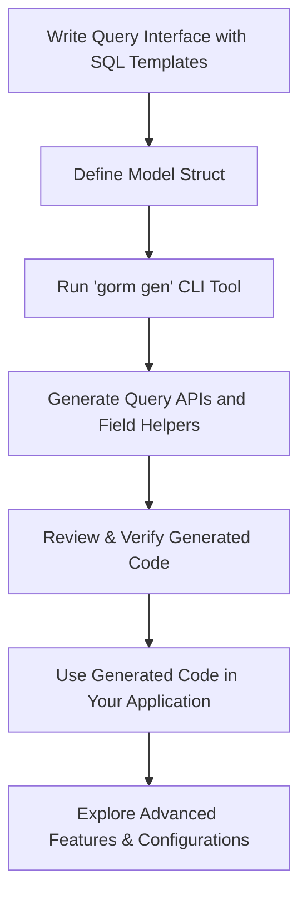

# First Code Generation

Step-by-step guide to writing your first query interface and model, then generating code with GORM CLI. This guide helps you create your initial query API and model struct, run the CLI generation tool, and verify the generated code and project structure.

---

## 1. Prepare Your Query Interface and Model

Before generating code, you need to define:

- **A Go interface** with SQL template comments describing your queries
- **A model struct** representing your database table

These must reside in the same package or directory to enable seamless generation.

### Example Query Interface

Create a file `examples/query.go` with a generic interface describing your queries. Here is a real example from the standard GORM CLI example:

```go
package examples

import (
  "database/sql"
  "time"

  "gorm.io/cli/gorm/examples/models"
  "gorm.io/cli/gorm/field"
  "gorm.io/cli/gorm/genconfig"
)

var _ = genconfig.Config{
  OutPath: "examples/output",
  FieldTypeMap: map[any]any{
    sql.NullTime{}: field.Time{},
  },
  FieldNameMap: map[string]any{
    "date": field.Time{},
    "json": JSON{},
  },
  IncludeStructs: []any{},
}

type Query[T any] interface {
  // GetByID query data by id and return it as struct
  //
  // SELECT * FROM @@table WHERE id=@id AND name = "\@name"
  GetByID(id int) (T, error)

  // SELECT * FROM @@table WHERE @@column=@value
  FilterWithColumn(column string, value string) (T, error)

  // SELECT * FROM users
  //   {{if user.ID > 0}}
  //       WHERE id=@user.ID
  //   {{else if user.Name != ""}}
  //       WHERE name=@user.Name
  //   {{end}}
  QueryWith(user models.User) (T, error)

  // UPDATE @@table
  //  {{set}}
  //    {{if user.Name != ""}} name=@user.Name, {{end}}
  //    {{if user.Age > 0}} age=@user.Age, {{end}}
  //    {{if user.Age >= 18}} is_adult=1 {{else}} is_adult=0 {{end}}
  //  {{end}}
  // WHERE id=@id
  UpdateInfo(user models.User, id int) error

  // SELECT * FROM @@table
  // {{where}}
  //   {{for _, user := range users}}
  //     {{if user.Name != "" && user.Age > 0}}
  //       (name = @user.Name AND age=@user.Age AND role LIKE concat("%",@user.Role,"%")) OR
  //     {{end}}
  //   {{end}}
  // {{end}}
  Filter(users []models.User) ([]T, error)

  // where("name=@name AND age=@age")
  FilterByNameAndAge(name string, age int)

  // SELECT * FROM @@table
  //  {{where}}
  //    {{if !start.IsZero()}}
  //      created_at > @start
  //    {{end}}
  //    {{if !end.IsZero()}}
  //      AND created_at < @end
  //    {{end}}
  //  {{end}}
  FilterWithTime(start, end time.Time) ([]T, error)
}
```

### Example Model Struct

Define your model struct alongside the interface in, for example, `examples/models/user.go`:

```go
package models

import (
  "time"
)

type User struct {
  ID        uint
  CreatedAt time.Time
  UpdatedAt time.Time
  Name      string
  Age       int
  Role      string
}
```

This model maps to a database table `users` by default.

## 2. Configure Generation (Optional)

Add a package-level variable with type `genconfig.Config` to customize generation.

In `examples/query.go`, you can set output path and field mappings:

```go
var _ = genconfig.Config{
  OutPath: "examples/output",
  FieldTypeMap: map[any]any{
    sql.NullTime{}: field.Time{},
  },
  FieldNameMap: map[string]any{
    "date": field.Time{},
    "json": JSON{},
  },
  IncludeStructs: []any{},
}
```

This step is optional and can be deferred until you are comfortable with basic generation.

## 3. Run the GORM CLI Generator

Use the CLI tool to generate code for your interface and model.

### Installation (if not done yet)

Install the GORM CLI tool:

```bash
go install gorm.io/cli/gorm@latest
```

### Generate Code

Navigate to your project root, then run:

```bash
gorm gen -i ./examples -o ./examples/output
```

- `-i` specifies your input directory containing the query interface and models.
- `-o` specifies the output directory for generated code.

The CLI scans your interfaces, parses SQL templates in comments, and generates concrete, type-safe query API implementations, plus field helpers for your models.

### Expected Output

The generated source files will appear in `examples/output`, preserving package structure. For example:

```
examples/
  query.go          # Your source interface
  models/
    user.go         # Your model
  output/
    query.go        # Generated query API implementation
    models/
      user.go       # Generated field helpers for User model
```

## 4. Verify Generated Code

Open generated files and check that:

- Query interface methods are implemented with your SQL templates
- Field helpers for model fields are generated, enabling typed filters and setters

### Example Usage of Generated APIs

Here is how you use your generated query interface and field helpers in application code:

```go
// Use generated Query interface
user, err := generated.Query[models.User](db).GetByID(ctx, 123)

// Use field helpers to build queries
users, err := gorm.G[models.User](db).
  Where(generated.User.Age.Gt(18)).
  Find(ctx)
```

This confirms that generation succeeded and the code integrates seamlessly with GORM.

## 5. Common Pitfalls and Troubleshooting

<AccordionGroup title="Troubleshooting First Code Generation">
<Accordion title="The generator does not detect my query interface or model">
Make sure your interface and model are in the same Go package or directory. The generator scans input directories and relies on Go package structure.

Also ensure the interface has proper SQL template comments directly above method declarations.
</Accordion>
<Accordion title="Generated code is missing or empty">
Verify that your interface methods include SQL templates in comments. Empty or missing templates cause the generator to skip those methods.

Check if your `genconfig.Config` excludes your types unintentionally.
</Accordion>
<Accordion title="Template parsing errors during generation">
Ensure your SQL templates use the supported GORM CLI DSL with placeholders like `@@table`, `@param`, and directives like `{{where}}`.

Refer to the SQL Template DSL guide for syntax correctness.
</Accordion>
<Accordion title="Installation issues with gorm CLI tool">
Make sure you have Go 1.18+ installed and your GOPATH/bin is in your system PATH.

Try reinstalling the tool with `go install gorm.io/cli/gorm@latest` and confirm with `gorm version`.
</Accordion>
</AccordionGroup>

## 6. Next Steps

- Explore [Using the Generated APIs](./using-generated-apis.md) to integrate these codes in your applications.
- Learn the [SQL Template DSL](../guides/advanced-patterns-integration/template-sql-dsl) to write dynamic queries.
- Customize your generation with configurations; see [Configuration Essentials](../getting-started/installation-setup/initial-configuration).

---

## Diagram: How First Code Generation Fits into Your Project Workflow



This workflow embodies your journey from writing source code to practical usage of generated functionalities.

---

For detailed examples and live references, consult the [GORM CLI GitHub Repository](https://github.com/go-gorm/cli).


---

# References

- [Getting Started Installation](../../getting-started/installation-setup/installation.md)
- [Configuration Essentials](../../getting-started/installation-setup/initial-configuration.md)
- [Using Generated APIs](../../getting-started/first-usage/using-generated-apis.md)
- [SQL Template DSL](../../guides/advanced-patterns-integration/template-sql-dsl.md)


