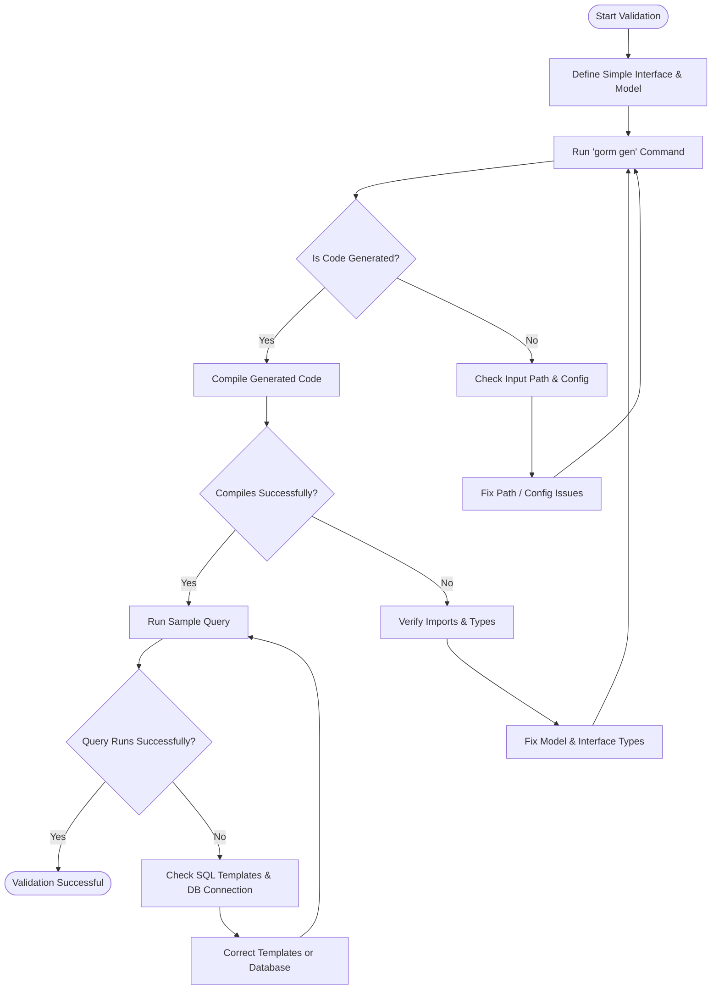

# Quick Validation & Troubleshooting

Ensure your GORM CLI setup is working perfectly by running a sample query and addressing common issues you may encounter during installation, generation, or use. This guide helps you verify your environment, identify typical problems, and apply practical fixes to make your workflow production-ready.

---

## 1. Validate Your Setup with a Sample Query

Before building complex queries, confirm your basic setup is functional by generating code from a simple interface and running a test query against your database.

### Step 1: Define a Simple Query Interface and Model

Create a Go source file (e.g., `examples/query.go`) with the following content:

```go
package examples

type Query[T any] interface {
  // SELECT * FROM @@table WHERE id=@id
  GetByID(id int) (T, error)
}

type User struct {
  ID   int
  Name string
}
```

This defines a generic query interface with a single method and a basic model struct.

### Step 2: Run the Code Generator

Use the `gorm` CLI tool to generate the code. From your project root or the directory containing your sources, run:

```bash
gorm gen -i ./examples -o ./generated
```

Replace `./examples` with your input directory or file path and `./generated` with your desired output directory.

> This command generates type-safe query APIs and field helpers based on your interfaces and models.

### Step 3: Write a Basic Usage Test

In your application, try this minimal code snippet to test the generated API:

```go
package main

import (
  "context"
  "fmt"

  "gorm.io/gorm"
  "your_project/generated" // adjust import path to your generated package
)

func testQuery(db *gorm.DB) {
  ctx := context.Background()

  user, err := generated.Query[User](db).GetByID(ctx, 1)
  if err != nil {
    fmt.Println("Query error:", err)
    return
  }
  fmt.Println("Fetched user:", user)
}
```

Run the test with a connected, configured GORM database instance.

---

## 2. Common Issues & How to Fix Them

Even a smooth setup can face common pitfalls. Here are frequent problems and practical solutions:

<AccordionGroup title="Common Troubleshooting Topics">
<Accordion title="Installation Command Not Found">

If running `gorm gen` returns a command not found error:

- Verify Go is installed and on your PATH.
- Confirm `go install gorm.io/cli/gorm@latest` completed successfully.
- Restart your terminal session or shell to refresh PATH.

Use `which gorm` or `gorm --version` to verify executable presence.

</Accordion>

<Accordion title="Input Path Errors or No Generated Files">

- Make sure the input path (`-i`) points to Go files with your interfaces and models.
- Check your interface and struct names match filters or inclusions/exclusions in any `genconfig.Config` present.
- If your config uses file-level scope, verify it is set correctly.

Run `gorm gen` with verbose logs (currently by observing console output) to confirm file processing.

</Accordion>

<Accordion title="Generated Code Does Not Compile">

Common causes:

- Missing or incorrect import paths in your project.
- Type mismatches between model definitions and interface SQL parameters.
- Context parameter missing in method signatures—GORM CLI automatically injects it if absent.

Verify your model and interface declarations and regenerate.

</Accordion>

<Accordion title="Runtime SQL Errors or Empty Result Sets">

- Ensure the database schema matches the model fields and table names.
- Check SQL templates in interface comments are correctly written (e.g., use `@@table` and `@param` properly).
- Validate your database connection settings.

Enable GORM debug logs to inspect generated SQL queries.

</Accordion>

<Accordion title="Field Type Mapping Issues">

If generated field helpers do not align with your field types:

- Use `genconfig.Config` to map Go field types or struct tags to custom field helpers.
- For example, map `sql.NullTime` or custom `gen:"json"` tags.

Refer to the Configuration Essentials guide for detailed mapping instructions.

</Accordion>

</AccordionGroup>

---

## 3. Tips for Effective Troubleshooting

- **Run small incremental tests:** Generate and test one interface or model at a time.
- **Check Go module versions:** Using Go modules ensures dependency compatibility.
- **Use consistent naming:** Match interface and model names clearly with your generated code imports.
- **Review generated files:** Examine generated `.go` files for clues on issue locations.
- **Consult verbose CLI logs:** Watch the console output during generation for warnings or errors.

<Tip>
If you encounter obscure errors, regenerate with a clean output directory by deleting previously generated files to avoid stale code conflicts.
</Tip>

---

## 4. Next Steps & Resources

Once your quick validation passes:

- Explore the [First Code Generation](../first-usage/first-code-generation) guide to expand your queries and models.
- Learn how to effectively use the generated APIs in the [Using Generated APIs](../first-usage/using-generated-apis) page.
- Deepen your understanding of field helpers and associations in the guides section.

---

## Appendix: Troubleshooting Flow Diagram



This flow guides your troubleshooting step by step.

---

## 5. Getting Help

- Review the official GitHub repository for examples and issues: [go-gorm/cli](https://github.com/go-gorm/cli)
- Access the full documentation website for deep dives and configuration details.
- Join GORM community forums or Stack Overflow for discussions.

<Tip>
Ensure your Go environment and database connections are correctly set up independently of GORM CLI before integrating.
</Tip>

---

With these steps and guidance, you’ll quickly diagnose and resolve setup issues, enabling smooth generation and usage of GORM CLI in your projects.

---