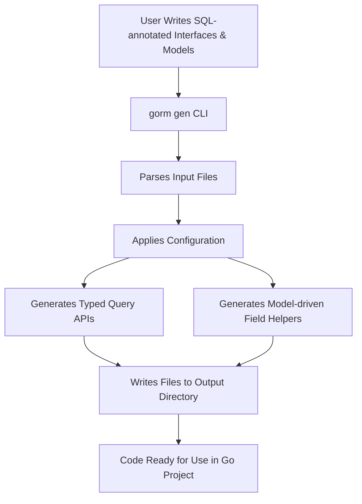

# Generating Your First Code

Welcome to the first step in harnessing the power of GORM CLI’s code generation. This guide walks you through running the CLI for the very first time to generate type-safe query APIs and model-driven field helpers from your Go interfaces and models. You will learn how to specify input and output paths, invoke the typical `gorm gen` command, and understand the structure and expectations around the generated code.

---

## 1. Prerequisites

Before generating code, ensure you have completed the following setup steps:

- Your Go environment is installed and configured (version 1.18+).
- Your model structs and query interfaces are defined with SQL templates and annotations in your project (see the [Initial Project Configuration](../setup-installation/cli-configuration) guide).
- You have installed the GORM CLI tool (`gorm`) as per the [Installing GORM CLI](../setup-installation/cli-installation) instructions.

If you have not yet installed or prepared your codebase, please visit those pages first to avoid common pitfalls.

<Check>
Be sure your interfaces contain SQL templates as comments on methods. These templates define the SQL operations GORM CLI generates code for.
</Check>

---

## 2. Typical Command Workflow

The GORM CLI code generation is controlled by the `gorm gen` subcommand. The core requirement is to specify the `--input` (`-i`) path where your Go interfaces with raw SQL annotations reside, and optionally a `--output` (`-o`) path where you want the generated code to be placed.

### Basic Command Structure

```bash
gorm gen -i PATH_TO_YOUR_INTERFACES -o PATH_TO_OUTPUT_DIR
```

- `-i, --input`: Required. Path to the directory or Go source file containing your interfaces with SQL templates.
- `-o, --output`: Optional. Directory to place generated code. Defaults to `./g` if omitted.

### Example

Assuming your SQL-annotated interfaces are in the `./examples` directory and you want generated code in `./generated`:

```bash
gorm gen -i ./examples -o ./generated
```

This command scans the specified input directory recursively, finds interfaces and model structs, applies any `genconfig.Config` overrides if present, and generates type-safe query APIs and field helpers into the output directory.

<Info>
If you omit the `--output` flag, generated files will go to the default `g` folder in your current working directory.
</Info>

---

## 3. What Happens During Generation

Upon execution, GORM CLI does the following:

1. **Parse Input:** Walks through all Go source files in the input path.
2. **Extract Interfaces and Structs:** Reads the Go interfaces, their methods’ SQL templates, and model structs.
3. **Apply Config:** If you have any configuration declared via `genconfig.Config` (for output paths, type mappings, inclusion/exclusion filters), the generator uses those during processing.
4. **Generate Code:** Creates Go source files implementing the interfaces with type-safe, idiomatic GORM APIs. Also generates strongly typed field helpers for your models.
5. **Format and Save:** The generated code is formatted automatically and written to the specified output directory, retaining original input directory structures.

### Typical Console Output

When running the command, you will see lines like:

```
Generating file generated/query.go from examples/query.go...
```

This confirms the generator identified input files and output destination.

---

## 4. Understanding Generated Code Output

The files created by GORM CLI represent:

- **Query API Implementations:** Concrete implementations of your query interfaces with methods executing the embedded SQL templates, returning typed results.
- **Field Helpers:** Typed constants and structs corresponding to your model fields, which enable expressive query building and updates.

### Example: Generated Interface Usage

Suppose your interface had a method with SQL:

```go
// SELECT * FROM @@table WHERE id=@id
GetByID(id int) (T, error)
```

The generated method allows:

```go
user, err := generated.Query[User](db).GetByID(ctx, 123)
if err != nil {
  // handle error
}
fmt.Println(user.Name)
```

This ensures your queries are **type-safe** and leverage GORM’s underlying capabilities seamlessly.

---

## 5. Step-by-Step: Running Your First Generation

<Steps>
<Step title="Step 1: Locate Your SQL-annotated Interfaces">
Confirm the Go files containing your query interfaces and models. Typically, interfaces are defined with SQL comments describing queries on your models.

Example file: `examples/query.go`
</Step>

<Step title="Step 2: Run the GORM CLI Generation Command">
Open your terminal and execute:

```bash
gorm gen -i ./examples -o ./generated
```

Replace paths with your actual directories.
</Step>

<Step title="Step 3: Monitor the Output">
You should see console output indicating which files are being processed, such as:

```
Generating file generated/query.go from examples/query.go...
```

Errors or panics will halt generation and display messages for troubleshooting.
</Step>

<Step title="Step 4: Verify Generated Files">
Check inside your output directory (e.g., `./generated`). You should see Go files corresponding to your inputs, containing generated code.

Open these files to ensure code was created and formatted properly.
</Step>

<Step title="Step 5: Use Generated Code in Your Project">
Import the generated package into your Go project and access the generated APIs and helpers.

Example:

```go
import "your/module/generated"

u, err := generated.Query[models.User](db).GetByID(ctx, 1)
```

This confirms your generation workflow is complete.
</Step>
</Steps>

---

## 6. Troubleshooting Common Issues

<AccordionGroup title="Troubleshooting Code Generation">
<Accordion title="The generator reports 'no interfaces found'">
- Verify your input path actually contains Go source files with interfaces annotated by SQL templates in method comments.
- Ensure your interfaces and structs use exported types.
- Check for typos or misplaced comments preventing parsing.
</Accordion>

<Accordion title="Output directory is empty after running generation">
- Confirm `-o` path is writable.
- Check for any errors or panics in the terminal output during generation.
- Validate that `genconfig.Config` (if any) does not exclude all interfaces or structs.
</Accordion>

<Accordion title="Generated code has compile errors">
- Inspect generated source to see if invalid Go code was produced.
- Make sure your input interfaces and types are valid Go code before generation.
- If using custom field mappings, confirm the types exist in accessible packages.
</Accordion>
</AccordionGroup>

<Tip>
Use the `--help` flag with `gorm gen` to review command options at any time:

```bash
gorm gen --help
```
</Tip>

---

## 7. Next Steps

- **Validate and test generated code:** Follow the [Validating Generated APIs](../first-use-validation/validate-generated-code) guide.
- **Configure generation:** Learn how to customize with `genconfig.Config` in [Initial Project Configuration](../setup-installation/cli-configuration).
- **Explore advanced code generation:** Dive deeper with guides on generating type-safe queries and field helpers.

---

## Summary Diagram of the Generation Workflow



---