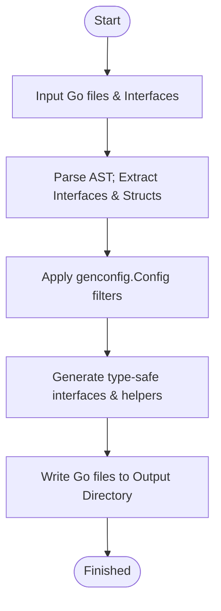

# Running Your First Generation with GORM CLI

Welcome to your journey using GORM CLI to generate type-safe, fluent Go query APIs and model field helpers. This guide leads you step-by-step through running the GORM CLI code generator for the first time, with practical command examples and expected outputs. By following these instructions, you will build confidence in your setup and produce ready-to-use generated files for seamless integration into your Go projects.

---

## 1. Prepare Your Project

Before running the generator, ensure your project is structured with the following components:

- **Go interfaces with SQL templates:** Place your query interfaces that define raw SQL in method comments.
- **Model structs:** Define your GORM models (regular Go structs) in the same or referenced packages.

For example, you might have files similar to these in your project:

```go
// examples/query.go
package examples

type Query[T any] interface {
  // SELECT * FROM @@table WHERE id=@id
  GetByID(id int) (T, error)

  // Additional interface methods...
}
```

```go
// examples/models/user.go
package models

type User struct {
  ID   uint
  Name string
  Age  int
}
```

If you plan to customize generation behavior, optionally add a `genconfig.Config` variable in your source package defining output paths, field mappings, or whitelist/blacklist rules.

---

## 2. Run the GORM CLI Generator

The main code generation command is `gorm gen`. It scans your specified input files or directories, processes your interfaces and models, and outputs generated Go code with query APIs and field helpers.

### Step-by-Step Execution

<Steps>
<Step title="Install GORM CLI">
If you haven't already, install the GORM CLI tool:

```bash
go install gorm.io/cli/gorm@latest
```

Verify installation:

```bash
gorm help gen
```
</Step>

<Step title="Prepare Your Input and Output Paths">
Decide your input path where your interfaces and models reside, e.g., `./examples`.
Choose your output path for the generated code, e.g., `./generated`.

The CLI flags are:
- `-i` or `--input`: path to your Go interface file or directory
- `-o` or `--output`: directory to write generated code (defaults to `./g`)
</Step>

<Step title="Run the Generator">
Execute the CLI command:

```bash
gorm gen -i ./examples -o ./generated
```

*Explanation:* This processes your source files in `./examples` and writes generated Go files into `./generated` maintaining package structure.
</Step>

<Step title="Monitor Command Output">
You will see lines like:

```
Generating file ./generated/query.go from ./examples/query.go...
```

This confirms files are being generated successfully.
</Step>
</Steps>

---

## 3. What to Expect After Generation

### Generated Files
- Query interfaces with method implementations for your SQL templates
- Model field helpers with typed predicates, setters, and association helpers

The output directory structure mirrors your input package layout, preserving organization.

### Example Generated Usage
After generation, you can start calling your generated APIs:

```go
// query.go sample usage
import "generated"

user, err := generated.Query[models.User](db).GetByID(ctx, 123)
if err != nil {
    panic(err)
}
fmt.Println(user.Name)
```

### Verifying Success
- Check that generated files compile without error.
- Confirm methods correspond to your interface signatures.
- Test queries against your database to ensure correctness.

<Tip>
Run `go build` or your usual build/test command inside your generated module to verify code integrity.
</Tip>

---

## 4. Troubleshooting Common Issues

### Error: No Input Path Provided
- Ensure you specify the `-i` flag with the path to your interface file or directory.

### Output Files Missing or Empty
- Confirm your interfaces have properly formatted SQL templates in comments.
- Check any `genconfig.Config` filters to prevent excluding all files unintentionally.

### Permissions or Write Failures
- Verify your output directory exists or can be created.
- Ensure you have write permissions to the output path.

### Syntax or Parsing Errors
- Make sure all Go files are valid and parsable.
- Check that SQL templates in interface comments are well-formed and use correct placeholders.

<Tip>
Run the generator with verbose or debug logs (if supported) to get detailed error messages.
</Tip>

---

## 5. Next Steps

- **Validate Your Output & First Query:** Test generated code integration and confirm correct query execution.
- **Explore Quickly:** Use field helpers and generated APIs to build queries fluently.
- **Customize Generation:** Define `genconfig.Config` to customize output paths and field mappings.
- **Learn Template DSL:** Apply the SQL template language to build dynamic and conditional queries.

Explore detailed documentation:

- [Validating Your Output & First Query](../validating-output)
- [Basic Configuration](../basic-configuration)
- [Quick Start: From Models to Queries](../../overview/quickstart-features/quickstart-workflow)

---

## Summary Diagram: Generation Workflow



This high-level flow highlights the GORM CLI code generation process you have just run.

---

## References & Links

- [GORM CLI Official GitHub Repository](https://github.com/go-gorm/cli)
- [Installing GORM CLI](../prerequisites-system) - prerequisites and installation
- [Basic Configuration](../basic-configuration) - customize your generation process
- [SQL Template DSL Guide](../../guides/query-and-model-helpers/template-dsl-tutorial) - learn templating for your queries
- [Troubleshooting Installation & Validation](../../getting-started/troubleshooting-and-common-issues/troubleshooting-install-validate) - common errors and solutions

---

Your first generation marks the starting point in harnessing GORM CLI’s powerful code automation. With your generated code in place, you’re now ready to build strongly typed database operations confidently and efficiently.