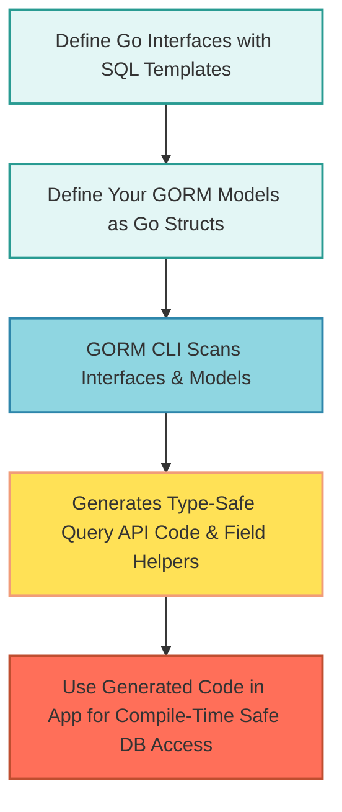

# What is GORM CLI?

GORM CLI is a powerful code generation tool designed specifically for Go projects using the GORM ORM framework. It transforms your Go interfaces and struct models into **type-safe, interface-driven query APIs and model-based field helpers**, enabling compile-time safety and significantly improving developer productivity.

By generating fluent, discoverable APIs that integrate seamlessly with GORM, GORM CLI helps you avoid runtime errors, reduces boilerplate code, and makes your data access layer more maintainable and easier to evolve.

---

## Why Use GORM CLI?

Imagine you are building a sophisticated Go application that relies heavily on database queries and updates. Writing raw SQL or generic ORM calls can lead to type errors, inconsistent APIs, and complex, hard-to-maintain code scattered throughout your codebase.

GORM CLI addresses these pain points by generating **compile-time safe query interfaces and helpers based directly on your models and interfaces**. This means:

- **Errors caught before application runs** — saving debugging time and preventing critical failures.
- **Clear, fluent, and discoverable APIs** — making your queries easy to read and write.
- **Consistent coding patterns** — improving maintainability and onboarding for new team members.

In practical terms, GORM CLI empowers you to write queries and updates like this:

```go
// Fetch user with ID 123 in a type-safe manner
user, err := generated.Query[User](db).GetByID(ctx, 123)

// Update a user's pet name based on conditions, safely
err = gorm.G[User](db).Where(generated.User.ID.Eq(1)).Set(
  generated.User.Pets.Where(generated.Pet.Name.Eq("fido")).Update(generated.Pet.Name.Set("rex")),
).Update(ctx)
```

All the above come from code automatically generated by GORM CLI from your own declared interfaces and models.

---

## Core Capabilities

1. **Type-safe Query APIs from Interfaces**

   Define Go interfaces with methods containing SQL templates in comments. GORM CLI generates concrete implementations that offer fluent, type-checked methods for querying your data.

2. **Model-driven Field Helpers**

   From your declared Go structs (GORM models), the CLI generates field helpers for filters, updates, and associations, tailored by data types and relationships.

3. **Association Management**

   Operations like Create, Update, Unlink, Delete for related records are generated with compile-time safety, supporting all common GORM association types such as has one, has many, belongs to, and many2many.

4. **Template-based SQL DSL**

   Write SQL snippets using a concise templating system to handle dynamic where clauses, dynamic columns, conditional updates, and loops—all parsed into safe, idiomatic Go code.

5. **Configurable Generation**

   Customize output paths, type mappings, included/excluded structs or interfaces and more with `genconfig.Config` in your source code.

---

## How It Works — At a Glance



This simple pipeline highlights how your existing code serves as the source for rich generated helpers and APIs.


---

## Product Value Summary

- **Compile-Time Safety**: Prevent SQL and type errors at build time rather than runtime.
- **Reduced Boilerplate**: Eliminate tedious, repetitive code for common queries and updates.
- **Strong Integration**: Leverages GORM's features while adding powerful type-safe abstractions.
- **Maintainability**: Generated code stays in sync with interfaces and models, reducing drift.
- **Developer Efficiency**: Focus on business logic, writing less code and catching errors early.

---

## Quick Start Example

1. **Write your interface and model:**

```go
// examples/query.go
package examples

// Query interface with SQL templates in comments
// Each method has its own SQL templated query

type Query[T any] interface {
  // SELECT * FROM @@table WHERE id=@id
  GetByID(id int) (T, error)

  // where("name=@name AND age=@age")
  FilterByNameAndAge(name string, age int)
}

// examples/models/user.go
package models

type User struct {
  gorm.Model
  Name string
  Age  int
}
```

2. **Run the generator:**

```bash
gorm gen -i ./examples -o ./generated
```

3. **Use the generated code:**

```go
// SELECT * FROM users WHERE id = 123
user, err := generated.Query[User](db).GetByID(ctx, 123)

// SELECT * FROM users WHERE age > 18
users, err := gorm.G[User](db).Where(generated.User.Age.Gt(18)).Find(ctx)
```

---

## Next Steps

Explore the following topics to deepen your understanding and get the most from GORM CLI:

- [Key Features at a Glance](/overview/feature-spotlight/feature-highlights)
- [How Code Generation Works](/overview/feature-spotlight/generation-process)
- [Writing Interfaces & Models](/getting-started/first-run-generation/configuration-basics)
- [Using Generated APIs](/getting-started/first-run-generation/first-usage)

---

## Tips & Best Practices

- Keep your query interfaces and model structs in the same package or directory to streamline scanning.
- Use the provided SQL templating DSL for flexible, safe dynamic queries.
- Define `genconfig.Config` when you need to customize type mappings or output locations.
- Take advantage of the comprehensive association helpers to simplify complex relationship management.


## Troubleshooting Notes

- Ensure your interface methods return the correct error signatures as expected by GORM CLI.
- Review compiler errors from generated code carefully; they usually indicate typing mismatches from interface/model misalignment.
- Use the CLI `-i` input flag to point to the directory or files containing your interfaces and models precisely.


---

GORM CLI revolutionizes how you interact with your database in Go — shifting from error-prone manual SQL to a robust, type-safe, and maintainable code generation approach.

Get started today to boost your development confidence and productivity.

---

For more details on usage, configuration, and advanced topics, visit the [Getting Started](../getting-started/introduction-setup/about-gorm-cli) and [Core Concepts](../overview/core-concepts-architecture/core-concepts-terminology) sections of this documentation.