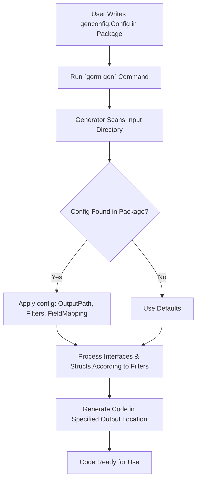

# Basic Configuration

This page introduces you to the minimal and optional configuration setup for GORM CLI's code generation using the `genconfig.Config` struct. It explains how to place configuration files within your Go packages, outlines the basic configuration structure, and demonstrates how to customize output paths and field type mappings. While configuration is optional for your first generation run, understanding it empowers you to tailor the generation behavior to your project’s needs.

---

## 1. Why Configure?

GORM CLI works out of the box without any manual configuration, generating code based on your Go interfaces and models. However, configuration allows you to:

- Customize where generated files are placed, organizing your project output.
- Map specific Go types or field tags to custom field helpers, extending functionality.
- Filter which interfaces or structs get processed via inclusion or exclusion patterns.

This page focuses on setting up this configuration in the simplest way.


## 2. Configuration File Placement

To configure generation for a package or directory, declare a package-level `genconfig.Config` variable directly in any `.go` file inside that package. The generator will automatically detect and apply these settings when processing files.

Example:

```go
package examples

import (
    "database/sql"
    "gorm.io/cli/gorm/field"
    "gorm.io/cli/gorm/genconfig"
)

var _ = genconfig.Config{
    OutPath: "examples/output",

    FieldTypeMap: map[any]any{
        sql.NullTime{}: field.Time{},
    },

    FieldNameMap: map[string]any{
        "date": field.Time{}, // map fields tagged `gen:"date"` to Time helper
        "json": JSON{},       // map fields tagged `gen:"json"` to custom JSON helper
    },

    IncludeInterfaces: []any{"Query*"},
    ExcludeInterfaces: []any{"*Deprecated*"},

    IncludeStructs: []any{"User", "Order*"},
    ExcludeStructs: []any{"*DTO"},
}
```

Place this configuration code inside your package source files to influence generation for that package.


## 3. Basic Configuration Structure

The key fields of `genconfig.Config` you can customize are:

- `OutPath` (string): Overrides the default output directory (`./g`) for all generated files in the package.

- `FieldTypeMap` (map[any]any): Maps a Go field type (specified via an instance of that type) to a custom field helper (also an instance). This enables you to wrap fields with specialized helpers, e.g., mapping `sql.NullTime{}` to `field.Time{}` for better handling.

- `FieldNameMap` (map[string]any): Maps the field tag name (the value used in `gen:"tagname"`) to a helper, allowing tag-based type customization.

- `IncludeInterfaces` / `ExcludeInterfaces` ([]any): Whitelist or blacklist interfaces for generation by string pattern or by Go type. Inclusion takes precedence over exclusion.

- `IncludeStructs` / `ExcludeStructs` ([]any): Whitelist or blacklist model structs for field helper generation, using similar pattern or type-based selectors.

- `FileLevel` (bool): When true, applies the config only to the current file instead of the whole package. Default is false.


## 4. Customizing Output Paths

By default, generated code is placed under `./g` relative to the project or input path.

Set `OutPath` to change this globally for all generated files in the package:

```go
var _ = genconfig.Config{
    OutPath: "generated/myfeature",
}
```

This redirects output to the specified directory, letting you organize generated files with your project structure.


## 5. Mapping Field Types and Tags

You can customize how the generator wraps certain Go types or tagged fields with helper types.

### Map with `FieldTypeMap`:

```go
FieldTypeMap: map[any]any{
    sql.NullTime{}: field.Time{},
    mypackage.CustomID{}: field.String{},
},
```

This instructs the generator to treat `sql.NullTime` fields with the `field.Time` helper and your own custom types as a string.

### Map with `FieldNameMap`:

```go
FieldNameMap: map[string]any{
    "json": JSON{},
    "date": field.Time{},
},
```

Use this when you tag struct fields using the `gen` struct tag, for example:

```go
type User struct {
    Profile string `gen:"json"`
    Birthday time.Time `gen:"date"`
}
```
The generator will apply the mapped helpers based on the tag.


## 6. Interface and Struct Filtering

You can limit generation to specific parts of your code by specifying include/exclude lists.

- Include lists are prioritized: if non-empty, only matching interfaces or structs are generated.
- If include lists are empty, exclude lists filter out unwanted types.

### Examples:

```go
IncludeInterfaces: []any{"Query*"},
ExcludeInterfaces: []any{"*Deprecated*"},

IncludeStructs: []any{"User", "Order*"},
ExcludeStructs: []any{"*DTO"},
```

Selectors are shell-style patterns or Go type expressions (e.g., `models.Query(nil)` or `models.User{}`).


## 7. Quick Minimal Config Example

The fastest first run requires no configuration, but here is a minimal example to customize output and field type mapping:

```go
package examples

import (
    "database/sql"
    "gorm.io/cli/gorm/field"
    "gorm.io/cli/gorm/genconfig"
)

var _ = genconfig.Config{
    OutPath: "generated",
    FieldTypeMap: map[any]any{
        sql.NullTime{}: field.Time{},
    },
}
```

Place this code inside a Go file in the package you want to generate.


## 8. How the Generator Uses Configuration

When you run the generation command (e.g., `gorm gen -i ./examples -o ./generated`):

- The CLI tool scans your input directory recursively.
- For each package/directory, it detects the presence of `genconfig.Config` literals.
- It applies the closest applicable config to the files being processed.
- It respects filters (`Include*`, `Exclude*`) to narrow down generation targets.
- It re-routes output to the specified `OutPath`.
- It applies the field type mappings to generate field helpers correctly.


## 9. Tips & Best Practices

- **Start without config:** Run the generator once with no config to get a feel for the generated output.
- **Add configs gradually:** Introduce mappings and filters only as your project complexity demands.
- **Use full Go type instances:** For `FieldTypeMap`, specify concrete empty instances (e.g., `sql.NullTime{}`) so the generator infers import paths.
- **Prefer `FieldNameMap` for tagging:** It's cleaner to use struct tags for special cases instead of modifying every type.
- **Keep configs close:** Define configs in the same package as your models or interfaces for clarity.
- **Use `Include*` filters sparingly:** Filtering interfaces to generate only what you need both speeds generation and reduces noise.


## 10. Common Pitfalls

- **Config in wrong package:** The config literal must be in the package you want to affect, or it won’t be applied.
- **Misusing patterns:** Patterns are shell-style (e.g., `Query*`), not regex. Improper patterns lead to unexpected filtering.
- **Mixing `Include*` and `Exclude*`:** Remember includes have priority and exclude lists are ignored if includes are set.
- **Neglecting imports:** For custom types in mappings, ensure your package imports them properly in the config file.


## 11. Troubleshooting Configuration

<AccordionGroup title="Troubleshooting Basic Configuration">
<Accordion title="Config Not Being Applied">
- Confirm the `genconfig.Config` literal is declared in the correct package.
- Check the package path in your source files matches the folder being generated.
- Verify that the config variable is a package-level variable (not inside a function).
- Run `gorm gen` with verbose output to see which configs are detected.
</Accordion>

<Accordion title="Filter Patterns Not Working as Expected">
- Remember patterns are glob-style, e.g., `Query*` or `*Deprecated*`.
- Ensure string selectors include package prefix if needed (e.g., `models.Query*`).
- Confirm that `Include*` filters override `Exclude*`. To exclude, leave includes empty.
</Accordion>

<Accordion title="Custom Field Helper Mapping Fails">
- Ensure your field helper type is imported and correctly referenced.
- Check that instances are properly declared (empty instances, e.g., `field.Time{}`).
- Confirm `FieldNameMap` keys match the `gen` struct tags exactly.
</Accordion>
</AccordionGroup>


## 12. Next Steps

Now that you understand the basic configuration, you can:

- Proceed to [Your First Code Generation](/getting-started/onboarding-core/first-code-generation) to generate actual query code using your configured setup.
- Explore the [Configuring Code Generation: genconfig.Config](/guides/customization-advanced/generator-configuration) guide for advanced configuration options.
- Learn about writing query interfaces and using generated APIs to harness the full power of GORM CLI.


---

## References

- [GORM CLI Installation](/getting-started/onboarding-core/installing-gorm-cli)
- [First Code Generation](/getting-started/onboarding-core/first-code-generation)
- [Configuring Code Generation Guide](/guides/customization-advanced/generator-configuration)


## Summary Diagram
Here's a conceptual flow of how basic configuration fits into the generation workflow:




---

This completes the Basic Configuration page overview, empowering you to get the most efficient and customized GORM CLI experience.
