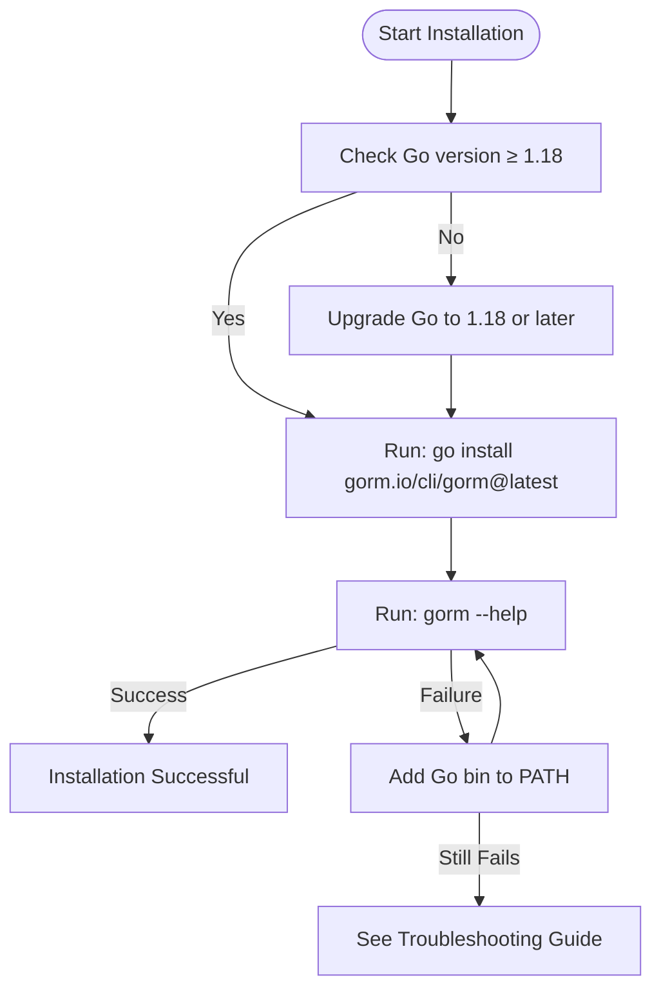

# Installation Guide

This guide provides you with clear, actionable steps to install **GORM CLI** using Go's tooling. GORM CLI is a command-line tool for generating type-safe query APIs and model-driven helpers for GORM-based Go applications, enhancing your productivity and code reliability.

---

## 1. Prerequisites & System Requirements

Before proceeding, ensure your environment meets the following minimum requirements:

- **Go Version:** Go 1.18 or higher (due to generics usage)
- **Supported Operating Systems:** Linux, macOS, Windows
- **Network Access:** Ability to download Go packages from the internet

<Tip>
Make sure your Go environment variables ($GOPATH, $PATH) are correctly set so that installed binaries can be run from the command line.
</Tip>

---

## 2. Installing GORM CLI

Installation is straightforward with Go’s `go install` command, which fetches the latest version and installs the binary in your Go bin directory.

### Step-by-step Installation Steps

<Steps>
<Step title="Run Installation Command">
Open your terminal and execute the following command:

```bash
go install gorm.io/cli/gorm@latest
```

This downloads and installs GORM CLI at the latest available version.
</Step>

<Step title="Verify Installation">
Once installed, verify the installation by running:

```bash
gorm --help
```

You should see the CLI usage options and commands, confirming a successful install.
</Step>

<Step title="Add Go Bin To PATH (If Needed)">
If `gorm` is not recognized as a command, ensure your Go bin directory (`$(go env GOPATH)/bin`) is added to your system PATH.

- **Linux/macOS:**

```bash
export PATH="$PATH:$(go env GOPATH)/bin"
```

- **Windows (PowerShell):**

```powershell
$env:PATH += ";$(go env GOPATH)/bin"
```

Then retry `gorm --help`.
</Step>
</Steps>

<Note>
This installation method fetches the latest stable release automatically. To install a specific version, replace `@latest` with the version tag.
</Note>

---

## 3. Platform-Specific Notes

- **Linux/macOS:**
  - Requires a working Go toolchain and permissions to write to the Go bin directory.
  - Typical Go bin path: `$HOME/go/bin`

- **Windows:**
  - PowerShell or Command Prompt can be used.
  - Ensure the Go bin directory is part of the Windows PATH environment variable for command line usage.

<Tip>
On Windows, if you use Git Bash or WSL, confirm which shell you are in and add the Go bin path accordingly.
</Tip>

---

## 4. Post-Installation Quick Validation

Validate your installation with a simple version check and test generation command.

```bash
gorm --version
```

You should see output confirming the CLI version.

Next, try running a dry run of code generation (assuming you have Go interface files ready):

```bash
gorm gen -i ./examples -o ./generated
```

This should process your input interfaces and display generation logs.

---

## 5. Troubleshooting Installation Issues

<AccordionGroup title="Common Installation Problems and Solutions">
<Accordion title="Command Not Found After Installation">
If after installation the `gorm` command is not found:

- Verify Go bin directory is in your PATH.
- Run `echo $(go env GOPATH)/bin` and ensure it exists.
- Restart your terminal session or source your shell’s profile file.
</Accordion>

<Accordion title="Permission Denied or Write Errors">
You may lack permissions to write to the Go bin directory.

- Use a user with write permissions or elevate privileges.
- Consider setting a custom GOPATH directory where you have write access.
</Accordion>

<Accordion title="Go Version Too Low">
Ensure you are running Go 1.18 or newer:

```bash
go version
```

If older, upgrade your Go installation.
</Accordion>
</AccordionGroup>

---

## 6. Next Steps: Start Using GORM CLI

- Define your query interfaces and models: see [Defining Your Models and Query Interfaces](/getting-started/your-first-generation/writing-models-interfaces)
- Generate code: see [Generating Code](/getting-started/your-first-generation/running-the-generator)
- Use your generated APIs confidently: see [Using Generated APIs](/getting-started/your-first-generation/using-generated-apis)

<Tip>
With GORM CLI installed, you are equipped to streamline your query code generation with type-safe APIs, eliminating boilerplate and enhancing maintainability.
</Tip>

---

## Additional Resources

- [System Requirements]( /getting-started/prerequisites-installation/system-requirements) for detailed environment preparation.
- [Troubleshooting Common Issues]( /getting-started/configuration-and-troubleshooting/troubleshooting) for advanced help.
- GORM CLI GitHub Repository: https://github.com/go-gorm/cli

---

You are now ready to start coding with the GORM CLI tool at your fingertips.

---

# Summary Diagram: Installation Workflow


