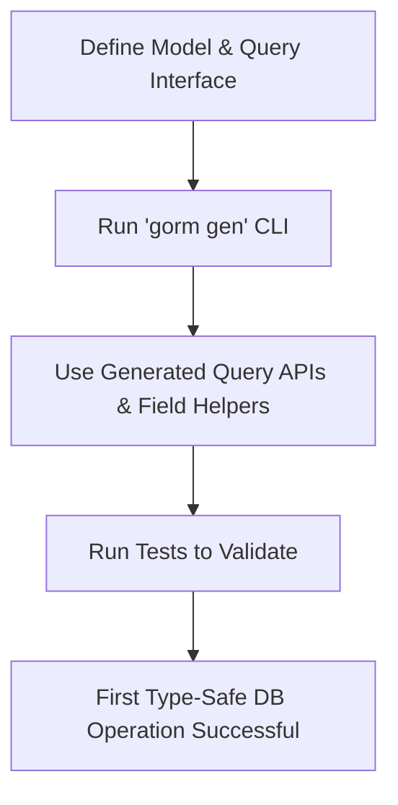

# Quickstart: Your First Workflow

This guided walkthrough takes you through the essential steps to create your initial model and query interface, generate code with GORM CLI, and execute your first type-safe database operations. By the end, you'll see firsthand how GORM CLI accelerates your productivity with type-safe query APIs and model-driven helpers.

---

## 1. Define Your Model and Query Interface

Start by defining your Go model struct(s) and writing a query interface with annotated methods that describe your database queries using SQL templates.

### Example Model `User`
Create a Go struct reflecting your database schema:

```go
package models

import "gorm.io/gorm"

type User struct {
    gorm.Model
    Name    string
    Age     int
    Role    string
    IsAdult bool
}
```

### Example Query Interface
Define an interface describing the queries you want, annotating them with SQL templates in comments above each method:

```go
package examples

type Query[T any] interface {
    // SELECT * FROM @@table WHERE id=@id AND name = "\@name"
    GetByID(id int) (T, error)

    // SELECT * FROM @@table WHERE @@column=@value
    FilterWithColumn(column string, value string) (T, error)

    // UPDATE @@table
    // {{set}}
    //   {{if user.Name != ""}} name=@user.Name, {{end}}
    //   {{if user.Age > 0}} age=@user.Age, {{end}}
    //   {{if user.Age >= 18}} is_adult=1 {{else}} is_adult=0 {{end}}
    // {{end}}
    // WHERE id=@id
    UpdateInfo(user models.User, id int) error
}
```

#### Key Points
- Use placeholders like `@@table` for the current model's table name.
- Bind method parameters to SQL via `@param` syntax.
- Use DSL directives (`{{set}}`, `{{where}}`, `{{if}}`) for dynamic query parts.

<Tip>
Your query interfaces serve as blueprints for generating type-safe, fluent APIs. Writing clear, parameterized SQL templates here is essential for getting productive code.
</Tip>

---

## 2. Generate Code with GORM CLI

Once your models and interfaces are ready, run the GORM CLI code generator.

### Installation (if not done yet)

```bash
go install gorm.io/cli/gorm@latest
```

### Run the Generation Command

Execute the following in your project root or where your interfaces reside:

```bash
gorm gen -i ./examples -o ./generated
```

- `-i`: Input directory or file containing your query interfaces
- `-o`: Output directory for generated code (defaults to `./g`)

### What Happens?
- GORM CLI reads your Go interfaces and models.
- It parses SQL templates and generates Go code with type-safe query methods and model field helpers.

<Check>
Run this command after making any changes to query interfaces or models to refresh generated APIs.
</Check>

---

## 3. Using the Generated APIs

After generation, your output directory contains Go files exposing APIs directly usable in your application.

### Example Usage of Generated Query API

```go
import (
    "context"
    "gorm.io/gorm"
    "your_project/generated"
    "your_project/examples/models"
)

func main() {
    db, err := gorm.Open(...)
    if err != nil {
        panic(err)
    }

    ctx := context.Background()

    query := generated.Query[models.User](db)

    // Fetch user by ID with hardcoded aspect from template
    user, err := query.GetByID(ctx, 1)
    if err != nil {
        panic(err)
    }
    fmt.Printf("Fetched User: %+v\n", user)

    // Filter users with column and value
    filteredUser, err := query.FilterWithColumn(ctx, "role", "admin")
    if err != nil {
        panic(err)
    }
    fmt.Printf("Filtered User: %+v\n", filteredUser)

    // Update user info
    err = query.UpdateInfo(ctx, models.User{Name: "Alice", Age: 30}, 1)
    if err != nil {
        panic(err)
    }
    fmt.Println("Updated user info successfully")
}
```

### Understanding Results
- Methods return typed structs or slices, with errors if the queries fail.
- Generated APIs use method comments and DSL templates to map params to SQL safely.

<Tip>
Use context for cancellation and timeout controls. All generated methods expect a `context.Context` as the first parameter by default.
</Tip>

---

## 4. Validation: Run Tests to Verify Setup

Ensure your environment is solid by running automated tests included in the examples.

### Running Tests

Execute:

```bash
./scripts/test_all.sh
```

This will run:
- Root module tests
- Examples module tests

Expected output ends with `Done.`

<Tip>
Tests verify the generated code behaves as intended. Adapt and extend tests for your models and queries to maintain confidence.
</Tip>

---

## 5. Tips, Best Practices & Common Pitfalls

- **Keep models and interfaces in sync**: Changes to struct fields require regenerating code.
- **Use SQL templates wisely**: Avoid raw concatenation; use placeholders to prevent SQL injection.
- **Use the config package (`genconfig.Config`) for fine-tuning**: control output paths, exclusions, custom field mappings.
- **Run generation often**: Integrate into your build or CI pipeline for consistency.
- **Debug with verbose GORM logs**: set GORM to debug mode if queries don't behave as expected.

<Warning>
Ensure your Go version is >=1.18 as generics are fundamental for this CLI.
</Warning>

---

## 6. Next Steps

- Explore [Basic Configuration & Structure](/getting-started/project-configuration-run/basic-config-setup) to customize generation.
- Read [Running Code Generation CLI Commands](/getting-started/project-configuration-run/generation-cli-commands) for advanced usage.
- Use [Validating Generated APIs](/getting-started/project-configuration-run/validating-generated-code) to test your new workflow deeply.
- Check [Common Errors & Solutions](/getting-started/troubleshooting-faq/common-errors-solutions) if you run into issues.

---

## Summary Diagram of Your First Workflow



---

This workflow will get you from zero to a fully functional type-safe query API in minutes, empowering you to write safer, faster data access code with GORM CLI.


---

# References

- [GORM CLI Installation Guide](/getting-started/setup-installation/installing-cli)
- [Code Generation Configuration](/guides/advanced-usage-patterns/generation-config-best-practices)
- [Template DSL and SQL Templates](/guides/advanced-usage-patterns/template-dsl-and-sql-templates)
- [Using Generated APIs](/guides/getting-started/using-generated-apis)


<Source url="https://github.com/go-gorm/cli" paths={[{"path":"examples/query.go","range":"1-65"},{"path":"examples/output/query_test.go","range":"1-86"},{"path":"README.md","range":"15-190"}]} />