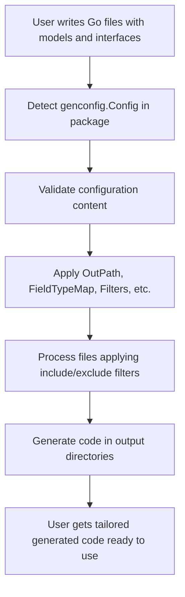

# Configuration Basics

Understand how to quickly set up and customize GORM CLI for your project. Learn the role of `genconfig.Config`, how to specify output directories, and optional ways to tailor generation to your codebase.

---

## 1. Understanding `genconfig.Config`

The core way to customize GORM CLI is by declaring a package-level `genconfig.Config` composite literal in your Go source code. This configuration lets you control key aspects of code generation, including output location, type mappings, and what interfaces or structs to include or exclude.

### What `genconfig.Config` Controls:

- **OutPath**: Override the default directory where generated code is saved for files in the same package.
- **FieldTypeMap**: Map Go types to specific GORM CLI field helper types.
- **FieldNameMap**: Map struct field tags (`gen:"..."`) to custom field helpers.
- **FileLevel**: Determines if the config applies at the file level or package level.
- **IncludeInterfaces/ExcludeInterfaces**: Whitelist or blacklist interfaces to generate.
- **IncludeStructs/ExcludeStructs**: Whitelist or blacklist structs to generate.

### Example Configuration:

```go
package examples

import (
  "database/sql"
  "gorm.io/cli/gorm/field"
  "gorm.io/cli/gorm/genconfig"
)

var _ = genconfig.Config{
  // Override CLI output directory for generated files in this package
  OutPath: "examples/output",

  // Map Go types to GORM CLI field helpers
  FieldTypeMap: map[any]any{
    sql.NullTime{}: field.Time{},
  },

  // Map `gen:"tag"` in struct fields to custom helpers
  FieldNameMap: map[string]any{
    "date": field.Time{},
    "json": JSON{}, // assuming you have a custom JSON helper
  },

  // Optional: include or exclude specific interfaces and structs
  IncludeInterfaces: []any{"Query*"},
  ExcludeInterfaces: []any{"*Deprecated*"},
  IncludeStructs:    []any{"User", "Account*"},
  ExcludeStructs:    []any{"*DTO"},

  // Apply config at package (false) or per file (true) level
  FileLevel: false,
}
```

<Tip>
Declaring your `genconfig.Config` in the same package where your query interfaces and models reside allows GORM CLI to automatically discover and apply it during generation.
</Tip>

---

## 2. Specifying Output Directories with `OutPath`

By default, GORM CLI generates all code under `./g` (relative to where you run it). Using `OutPath` in `genconfig.Config` allows you to specify a custom output directory for files within that package.

### How Output Paths Work

- When you run `gorm gen -i ./pkg -o ./generated`:
  - The CLI uses your provided `-o` directory as a base.
  - If any `genconfig.Config` specifies `OutPath` in a package under `./pkg`, that directory overrides the CLI `-o` value for files in that package.

### Configuring `OutPath`

```go
var _ = genconfig.Config{
  OutPath: "examples/output",
}
```

This ensures files found in this package are generated into `examples/output` rather than the CLI default output.

<Note>
If multiple configs apply due to nested directories or files, the most specific matching config's `OutPath` takes precedence.
</Note>

---

## 3. Tailoring Generation with Interface and Struct Filters

You can precisely control which interfaces and structs are fed into the generator.

### Interface Filtering

- **IncludeInterfaces**: If set, only interfaces matching these patterns or selectors will be generated.
- **ExcludeInterfaces**: If set (and IncludeInterfaces is empty), interfaces matching these patterns are excluded.

### Struct Filtering

- Same behavior applies with **IncludeStructs** and **ExcludeStructs**.

### Patterns Supported

- Shell-style wildcards: e.g., `Query*`, `*Repo`
- Full package selectors: e.g., `models.Query`
- Type literals: e.g., `models.User{}` (struct), `pkg.Query(nil)` (interface)

### Example

```go
var _ = genconfig.Config{
  IncludeInterfaces: []any{"Query*", models.Query(nil)},
  ExcludeInterfaces: []any{"*Deprecated*"},
  IncludeStructs:    []any{"User", "Account*", models.User{}},
  ExcludeStructs:    []any{"*DTO"},
}
```

<Tip>
Whitelist filters (`Include*`) take precedence over blacklist filters (`Exclude*`). When a whitelist is present, exclude lists for the same filter are ignored.
</Tip>

---

## 4. File-Level vs Package-Level Configuration

- **FileLevel = true** means the `genconfig.Config` applies only to the file where it is declared.
- **FileLevel = false** (default) means it applies to the entire package (all files in that directory).

Most users should keep `FileLevel` set to false for broader configuration.

---

## 5. Using Field Type and Name Mappings

GORM CLI uses different field helpers for various Go types and struct field tags to generate fluent query expressions.

### FieldTypeMap

- Maps Go type **instances** (like `sql.NullTime{}`) to field helper instances (like `field.Time{}`)
- Takes precedence for type-based mapping

### FieldNameMap

- Maps field tags from the `gen:"tag"` struct tag to custom field helper instances
  - E.g., tag `gen:"json"` mapped to a custom JSON helper
- Has higher priority than FieldTypeMap for fields with tags

### Example

```go
FieldTypeMap: map[any]any{
  sql.NullTime{}: field.Time{},
},
FieldNameMap: map[string]any{
  "date": field.Time{},
  "json": JSON{},
},
```

<Tip>
Use typed struct literals in the maps to ensure the generator records the appropriate import paths and generates correct wrapper calls.
</Tip>

---

## 6. Declaring Configuration Step-by-Step

Use the following flow to create and apply a configuration:

<Steps>
<Step title="Create a Go File for Config">
Create a Go source file (e.g., `genconfig.go`) in the package where your models and interfaces live.
</Step>
<Step title="Import Required Packages">
Import `genconfig`, `field`, and any Go types you want to map.
</Step>
<Step title="Declare `var _ = genconfig.Config{}`">
Define the configuration struct literal with the desired overrides and maps.
</Step>
<Step title="Run the Generator">
When you run `gorm gen -i ./yourpackage`, it automatically detects this Config and applies it.
</Step>
</Steps>

---

## 7. Common Configuration Scenarios

### Custom Output Directory

```go
var _ = genconfig.Config{ OutPath: "internal/generated" }
```

### Include Only Specific Query Interfaces

```go
var _ = genconfig.Config{ IncludeInterfaces: []any{"Query*"} }
```

### Map `sql.NullTime` to `field.Time`

```go
var _ = genconfig.Config{
  FieldTypeMap: map[any]any{ sql.NullTime{}: field.Time{} },
}
```

### Map Custom JSON Field Helper (using `gen:"json"` tag)

```go
var _ = genconfig.Config{
  FieldNameMap: map[string]any{ "json": JSON{} },
}
```

---

## 8. Troubleshooting Configuration Issues

<AccordionGroup title="Common Configuration Issues and Solutions">
<Accordion title="Config Not Being Applied">
- Ensure the configuration file is in the same package as your models/interfaces.
- Confirm `var _ = genconfig.Config{}` syntax for correct export.
- Check that your generation input path matches the package directory.
</Accordion>
<Accordion title="Output Path Ignored">
- Remember CLI `-o` sets the base output dir.
- Per-package `OutPath` in config overrides CLI `-o` only for that package's files.
- Nested configs may override each other; more specific config wins.
</Accordion>
<Accordion title="Field Mappings Not Working">
- Use struct literal instances (e.g., `sql.NullTime{}`, not just type names).
- Verify import paths are properly resolved.
- Map tags carefully with matching `gen:"tag"` in struct fields.
</Accordion>
</AccordionGroup>

---

## 9. Additional Resources

- [Installation Guide](/getting-started/setup-and-installation/installation-guide) to set up GORM CLI
- [Defining Models and Query Interfaces](/getting-started/first-run-and-validation/create-models-and-interfaces) for creating your inputs
- [Running the Code Generator](/getting-started/first-run-and-validation/run-code-generation) to execute generation with your configuration
- [Customizing Code Generation with genconfig.Config](/guides/advanced-patterns/customizing-generation) for deeper customization

---

## Summary Diagram: Configuration Application Flow



---