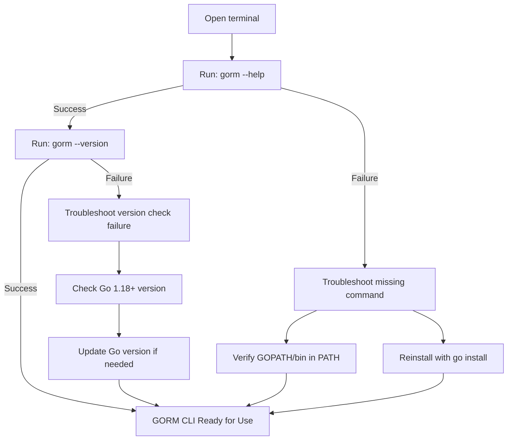

# Validating the Installation

This guide walks you through your very first interaction with the GORM CLI after installation. It ensures that the CLI tool is correctly installed, accessible on your system, and ready for generating type-safe query code. You will learn how to display the command help screen, check the version to verify your install, and perform basic troubleshooting if the CLI command is not recognized or fails.

---

## 1. Confirm GORM CLI Installation

After installing GORM CLI (using `go install gorm.io/cli/gorm@latest`), your first task is to verify the installation succeeded and the CLI executable is accessible.

### Step-by-Step Instructions

<Steps>
<Step title="Open your terminal or command prompt">Launch your system's terminal (Linux/macOS) or command prompt/PowerShell (Windows) where you can run shell commands.</Step>
<Step title="Run the help command">Type the following command and press Enter:

```bash
gorm --help
```
This command displays the CLI usage, available commands, flags, and descriptions.</Step>
<Step title="Verify displayed output">Confirm the output:
- You should see a list of commands including "gen" for generation, and flags like --help and --version.
- The help screen verifies the CLI binary is installed and callable.

</Step>
<Step title="Check CLI version">Run:

```bash
gorm --version
```

This confirms the installed CLI version and helps verify it meets your expectations (latest version or specific release).</Step>
</Steps>

### Expected Outcome
- The CLI help text prints successfully.
- Version information outputs a valid version string, e.g., `gorm version vX.Y.Z`.

---

## 2. Troubleshooting Common Installation Issues

If the above commands fail or the CLI is not recognized, follow these troubleshooting tips.

### Common Issues & Solutions

<AccordionGroup title="Installation Troubleshooting">
<Accordion title="Command Not Found or Not Recognized">
- Confirm your Go binary path (typically `$GOPATH/bin` or `$HOME/go/bin`) is included in your system's PATH environment variable.
- Restart your terminal session after installation to refresh environment variables.
- Verify you installed with the correct command: `go install gorm.io/cli/gorm@latest`.
</Accordion>
<Accordion title="Wrong or Missing Go Version">
- GORM CLI requires Go 1.18 or higher.
- Check your Go version using `go version` and update if necessary.
</Accordion>
<Accordion title="Permission Denied or Execution Errors">
- Ensure the CLI executable has execution permissions.
- On Unix-like OS, run `chmod +x $(which gorm)` if needed.
- Run with appropriate user permissions or try installing with sudo if appropriate.
</Accordion>
<Accordion title="Unexpected Errors or Panic Messages">
- Reinstall the CLI to fix corrupted binaries: 
  ```bash
  go clean -modcache
  go install gorm.io/cli/gorm@latest
  ```
- Check for conflicting Go modules or environment issues.

</Accordion>
</AccordionGroup>

---

## 3. Next Steps After Validation

Once you have confirmed that the GORM CLI is installed and responding correctly, proceed to your first code generation step.

- Define your query interfaces and models as described in the [Setting Up Your Project](https://docs.example.com/getting-started/first-codegen/project-setup) guide.
- Run your first generation command as explained in [Generating Code with GORM CLI](https://docs.example.com/getting-started/first-codegen/generating-code).
- Apply your generated type-safe APIs following the [Using Your Generated APIs](https://docs.example.com/getting-started/first-codegen/using-generated) walkthrough.

<Tip>
If you encounter issues during code generation or usage, consult [Troubleshooting Common Setup Issues](https://docs.example.com/getting-started/first-codegen/basic-troubleshooting) for practical fixes.
</Tip>

---

## Overview Diagram



This flowchart guides you through the key validation and resolution steps to confirm your GORM CLI installation.

---

## Summary
- Run `gorm --help` to see the usage details.
- Run `gorm --version` to verify the installed version.
- Troubleshoot command not found by checking PATH and Go installation.
- Prepare for your first code generation once validation completes.

---

For full onboarding, see:
- [Prerequisites & System Requirements](https://docs.example.com/getting-started/setup-basics/prerequisites)
- [Installing GORM CLI](https://docs.example.com/getting-started/setup-basics/installation)
- [Setting Up Your Project](https://docs.example.com/getting-started/first-codegen/project-setup)
- [Generating Code with GORM CLI](https://docs.example.com/getting-started/first-codegen/generating-code)
- [Troubleshooting Common Setup Issues](https://docs.example.com/getting-started/first-codegen/basic-troubleshooting)

If you need further support, visit the official [GORM CLI GitHub repository](https://github.com/go-gorm/cli) or community forums.
