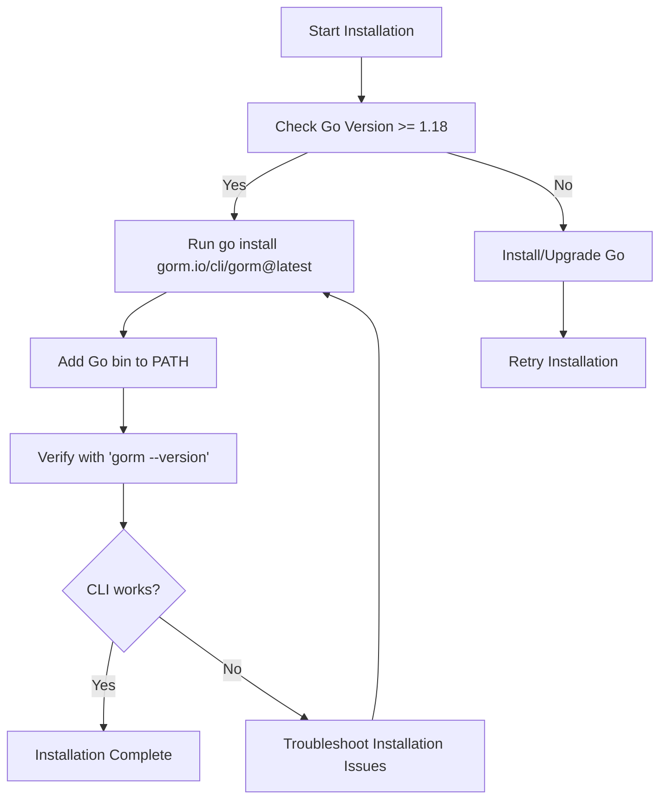

# Installation Guide for GORM CLI

This guide provides clear, step-by-step instructions to install GORM CLI using the standard Go toolchain. You will learn how to download, install, verify, and troubleshoot GORM CLI effectively on your platform.

---

## 1. Prerequisites & System Requirements

Before installing GORM CLI, ensure your system meets the following requirements:

- **Go Version:** You must have Go 1.18 or higher installed, as GORM CLI requires Go generics support.
- **Supported Platforms:** Installation is supported across Windows, macOS, and Linux.
- **Network Access:** Internet connectivity is needed to download the package with `go install`.
- **Go Environment Setup:** Ensure your GOPATH and GOBIN (if set) are properly configured so that installed binaries are accessible.

<Check>
Verify your Go version by running:
```bash
go version
```
You should see output indicating Go version 1.18 or above.
</Check>


## 2. Installation Instructions

The primary recommended method to install GORM CLI is via the Go module install command.

### Step 1: Run the Go Install Command

Open your terminal or command prompt and execute:

```bash
go install gorm.io/cli/gorm@latest
```

- This downloads the latest tagged release and builds the CLI tool.
- By default, the Go toolchain installs executables into `$GOPATH/bin` or `$GOBIN` if it's set.


### Step 2: Add the Executable to Your PATH

Ensure that your PATH environment variable includes the folder where Go places binaries. For example, if installed in `~/go/bin`, add this to PATH.

For Linux/macOS (bash):
```bash
export PATH=$PATH:$(go env GOPATH)/bin
```

For Windows (PowerShell):
```powershell
setx PATH "$($env:PATH);$(go env GOPATH)\bin"
```


### Step 3: Verify Installation

Check that the `gorm` command is available and returns its version:

```bash
gorm --version
```

Expected output should show the installed version and confirm the CLI is properly installed.


## 3. Troubleshooting Common Installation Issues

### Issue: `go` Command Not Found

- Ensure Go is installed and properly added to your system PATH.
- Visit https://golang.org/dl/ for installation instructions if Go is missing.

### Issue: GORM CLI Binary Not Found After Installation

- Confirm your Go binaries directory is added to your system PATH as described above.
- Run `echo $(go env GOPATH)` or `go env GOBIN` to locate the binary folder.

### Issue: Version Mismatch or Old Version Installed

- The `@latest` option installs the most recent release. If you see an old version:
  - Run `go clean -modcache` to clear the module cache.
  - Retry install.

### Issue: Permission Denied When Writing to GOPATH/bin

- You might need elevated privileges to install binaries globally, or alternatively configure Go to use a user-writable directory:

```bash
mkdir -p $HOME/go/bin
export GOPATH=$HOME/go
export PATH=$PATH:$GOPATH/bin
```
- Then rerun the `go install` command.


<Warning>
Do NOT attempt to install GORM CLI by cloning the repository and building manually unless you require development builds. The `go install` command ensures version integrity and compatibility.
</Warning>


## 4. Verifying Your Installation

After installation, confirm the CLI tool works as expected.

### Step 1: Check CLI Command Help

Run:

```bash
gorm --help
```

You should see usage instructions and available commands, including the `gen` subcommand for code generation.

### Step 2: Run a Simple Version Check

```bash
gorm --version
```

Expected output: confirms installed version number.

### Step 3: Optional - Run a Test Generation Command

If you have a sample Go interface package ready (see Quick Start guides), invoke:

```bash
gorm gen -i ./examples -o ./generated
```
This tests that the CLI binary runs and generates output.


## 5. Additional Tips and Best Practices

- Always use the `go install gorm.io/cli/gorm@latest` command to get the latest stable release.
- Keep your Go installation up-to-date for best compatibility.
- Add your Go binaries path to PATH permanently for convenience.
- If you manage multiple Go versions, ensure you use the correct Go version context when installing.


## 6. Next Steps

- After successful installation, proceed to [Quick Start: Generate and Use APIs](/getting-started/first-run/quickstart-sample) to start generating code using GORM CLI.
- Review [System Requirements & Prerequisites](/getting-started/setup-basics/prerequisites-requirements) for deeper environment setup.
- Visit the [Troubleshooting & Common Issues](/getting-started/first-run/troubleshooting) page if you encounter problems later.


---

## Reference Links

- [GORM CLI GitHub Repository](https://github.com/go-gorm/cli)
- [Official Go Download and Installation](https://golang.org/dl/)
- [GORM CLI README](https://github.com/go-gorm/cli#installation)


## Summary Diagram: Installation Flow




---

This completes your installation preparation and setup for GORM CLI. Once installed, enjoy building type-safe, maintainable data access code with ease.


<Check>
For detailed usage after installation, see the [Quick Start Guide](https://gorm.io/cli/gen) and the [Getting Started Guide](https://gorm.io/cli/getting-started/setup-basics/prerequisites-requirements).
</Check>


---

*End of Installation Guide*
