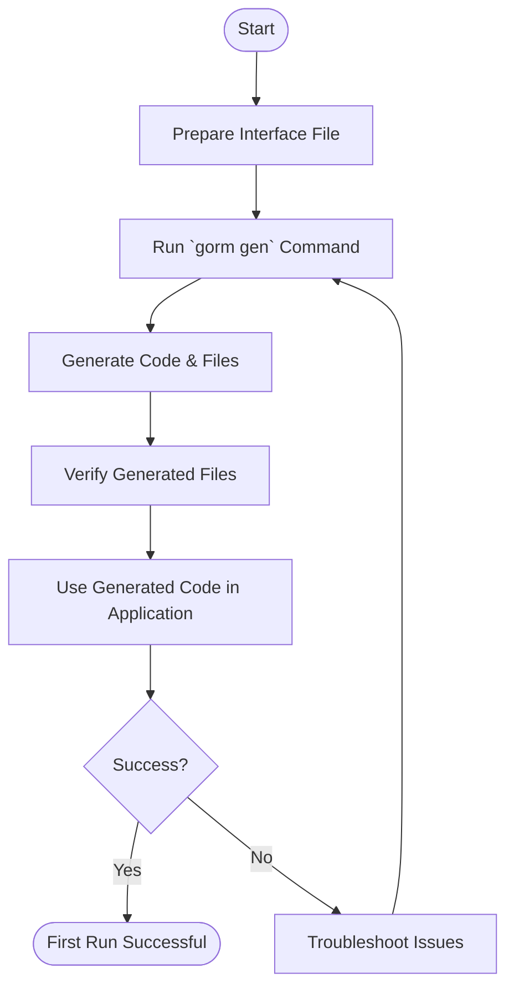

# First Run & Validation

Successfully executing your first GORM CLI command is a crucial step to confirm that your installation is correct and that code generation works as expected. This guide walks you through running a simple generation task and understanding its output to ensure everything is functioning properly.

---

## 1. Prerequisites Recap

Before you begin the first run, ensure:

- You have installed GORM CLI (requires Go 1.18+).
- You have a Go interface file with annotated SQL templates ready for generation.
- Basic Go environment setup and `go.mod` initialized in your project directory.

If you haven’t installed the CLI yet, please follow the [Installing GORM CLI guide](../setup-installation/installing-gorm-cli).

---

## 2. Prepare a Simple Interface File

You need a Go source file defining query interfaces with SQL template comments. Here's a minimal example you can create as `examples/query.go`:

```go
package examples

import "gorm.io/gorm"

type User struct {
  gorm.Model
  Name string
  Age  int
}

type Query[T any] interface {
  // SELECT * FROM @@table WHERE id=@id
  GetByID(id int) (T, error)

  // SELECT * FROM @@table WHERE age > @age
  FilterByAge(age int) ([]T, error)
}
```

This interface defines two simple queries with SQL annotations in comments.

---

## 3. Run the GORM CLI Code Generation Command

Open your terminal and navigate to the directory containing your source files (e.g., `./examples`).

Execute the following command:

```bash
gorm gen -i ./examples -o ./generated
```

- `-i ./examples` specifies the input directory or file with your query interface.
- `-o ./generated` defines where the generated code will be saved.

The CLI will parse your interface, generate type-safe query implementations, and produce field helpers for models.

---

## 4. Confirm the Command Output

When the command runs successfully, you will see logging output like:

```
Generating file ./generated/query.go from ./examples/query.go...
```

This confirms the generator processed your input and wrote generated files to `./generated`.

 Navigate and verify the files exist,

```bash
ls generated/
```
You should see Go files representing your query APIs and field helpers.

---

## 5. Integrate Generated Code and Run a Simple Query

In your Go application, import the generated package and use the query APIs like this:

```go
package main

import (
  "context"
  "fmt"

  "gorm.io/driver/sqlite"
  "gorm.io/gorm"
  "yourmodule/generated" // Replace with your actual module/path
)

func main() {
  db, err := gorm.Open(sqlite.Open("file::memory:?cache=shared"), &gorm.Config{})
  if err != nil {
    panic(err)
  }

  // AutoMigrate your model before querying
  if err := db.AutoMigrate(&generated.User{}); err != nil {
    panic(err)
  }

  ctx := context.Background()
  q := generated.Query[generated.User](db)

  // Run a query using generated code
  user, err := q.GetByID(ctx, 1)
  if err != nil {
    fmt.Printf("Query error: %v\n", err)
  } else {
    fmt.Printf("Got user: %+v\n", user)
  }
}
```

This demonstrates how the generated APIs enable compile-safe, fluent querying.

---

## 6. Troubleshooting Common Issues

<AccordionGroup title="Common First Run Issues">
<Accordion title="Command Not Found or Permission Errors">
Check that your `$GOPATH/bin` or `$GOBIN` is in your `PATH` environment variable. You may need to restart your shell after installation.
</Accordion>
<Accordion title="Input File Not Specified or Invalid">
Make sure the `-i` input path points to a valid Go file or directory containing interfaces annotated with SQL templates.
</Accordion>
<Accordion title="Output Directory Not Created">
The CLI attempts to create the output directory. Ensure you have write permissions to the specified `-o` location.
</Accordion>
<Accordion title="Syntax or Parsing Errors in Interfaces">
Ensure your Go interfaces use correct syntax. The CLI expects SQL template comments formatted as described.
</Accordion>
</AccordionGroup>

---

## 7. Best Practices and Tips

- **Use a dedicated directory for generated code** to keep your project organized.
- Use descriptive SQL comments in your interfaces for clarity and maintainability.
- Run the generator regularly after interface or model changes.
- Leverage the generated field helpers for type-safe query building.

---

## 8. Next Steps

- Explore [Defining Query Interfaces & Models](../project-bootstrapping/writing-query-interfaces) to improve your interfaces.
- Learn about [Running the Generator](../project-bootstrapping/basic-generation-workflow) for more complex workflows.
- Validate generated code usage in [Validating Generated Code](../project-bootstrapping/quick-usage-validation).

---

For more details, consult the full [Quickstart & Configuration guide](../../overview/features-quicktour/configuration-quickstart) and the [Installation](../setup-installation/installing-gorm-cli) documentation.


<Tip>
Running your first generation command successfully is your gateway to leveraging GORM CLI’s powerful, type-safe APIs. Validate early, iterate often.
</Tip>

---

### Reference

- GORM CLI repository: [https://github.com/go-gorm/cli](https://github.com/go-gorm/cli)
- CLI command definition source: `internal/gen/gen.go` ([source](https://github.com/go-gorm/cli/blob/main/internal/gen/gen.go))
- Example interface and model definitions from README reviewed for illustration


---

### Summary Diagram of First Run Workflow



This diagram shows your step-by-step journey through a successful GORM CLI first run and validation process.

---

**You're now ready to confidently proceed with generating and integrating your first type-safe query APIs using GORM CLI.**