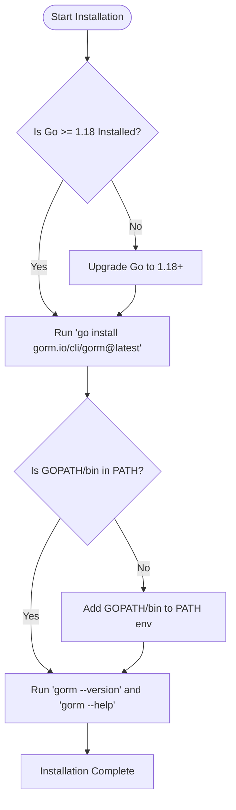

# Installing the GORM CLI

This guide provides clear, step-by-step instructions for installing the GORM CLI tool on all major platforms using Go tooling. You'll learn how to pick the correct version, upgrade the CLI, and validate the installation to get started quickly and confidently.

---

## 1. Prerequisites & System Requirements

Before installing the GORM CLI, ensure your development environment meets these requirements:

- **Go version**: Go 1.18 or higher (generics support required).
- **Supported platforms**: Linux, macOS, Windows.
- **Environment setup**: Properly configured `$GOPATH` and `$PATH` variables so `go` commands and installed binaries are accessible.

<Tip>
Verify your Go installation by running:

```bash
go version
```

Ensure the reported version is 1.18 or newer.
</Tip>

---

## 2. Installation Instructions

The GORM CLI is installed via the standard Go installation command using `go install`:

<Steps>
<Step title="Select the Version">
Decide which version of the GORM CLI you want to install. Using `latest` fetches the most recent release:

```bash
go install gorm.io/cli/gorm@latest
```

If you need a specific version, replace `latest` accordingly (e.g., `@v1.0.0`).
</Step>
<Step title="Run the Installation Command">
Run the installation command in your terminal:

```bash
go install gorm.io/cli/gorm@latest
```

This downloads, compiles, and installs the CLI binary to your `$GOPATH/bin`.
</Step>
<Step title="Add binary to PATH">
Ensure your Go bin directory is on your system `$PATH` so you can run `gorm` from anywhere.

Example for Unix/Linux/macOS:

```bash
export PATH=$PATH:$(go env GOPATH)/bin
```

Add this line to your shell startup file (`~/.bashrc`, `~/.zshrc`, etc.) to persist.

For Windows PowerShell:

```powershell
$env:PATH += ";$(go env GOPATH)\bin"
```
</Step>
<Step title="Verify Installation">
Check the installed version to confirm successful installation:

```bash
gorm --version
```

You should see the current CLI version printed.

Alternatively, running:

```bash
gorm
```

should display CLI usage and commands.
</Step>
</Steps>

---

## 3. Upgrading the GORM CLI

To upgrade the CLI to a newer version, rerun the installation command:

```bash
go install gorm.io/cli/gorm@latest
```

This fetches and installs the latest CLI, replacing the existing binary.

<Tip>
If you encounter permission errors on Linux/macOS, you may need to run with appropriate user rights or check directory permissions for `$GOPATH/bin`.
</Tip>

---

## 4. Quick Validation of Your Installation

After confirming the binary is installed, perform a quick test:

1. Run the CLI help to ensure commands respond:

```bash
gorm --help
```

2. Run the built-in `gen` command without arguments to check for command load:

```bash
gorm gen -h
```

3. Optionally, install a sample project to generate code, following the first code generation workflow.

<Tip>
If executing `gorm` results in "command not found", double-check your PATH includes `$GOPATH/bin`.
</Tip>

---

## 5. Common Installation Issues & Troubleshooting

<AccordionGroup title="Troubleshooting Installation Problems">
<Accordion title="Command Not Found After Installation">
- Verify your Go binary path is included in your system's `$PATH`.
- Run `echo $(go env GOPATH)/bin` to locate where binaries are installed.
- Add the output directory to your PATH as described.
</Accordion>
<Accordion title="Go Version Is Below 1.18">
- Upgrade your Go installation to at least version 1.18.
- Follow official Go installation guides for your OS at [https://golang.org/doc/install](https://golang.org/doc/install).
</Accordion>
<Accordion title="Permission Denied During Installation">
- Check write permissions on `$GOPATH` and `$GOPATH/bin`.
- On Linux/macOS, avoid running `go install` as root.
- Correct permissions or use alternate GOPATH locations.
</Accordion>
<Accordion title="Binary Installed but Old Version Runs">
- Possibly multiple Go versions or binaries installed.
- Run `which gorm` or `where gorm` to find which CLI runs.
- Remove or update conflicting installs.
</Accordion>
</AccordionGroup>

---

## 6. Next Steps & References

- After installation, continue to:
  - [Quick CLI Validation](/getting-started/setup-installation/cli-quick-validation) for verifying functionality.
  - [Preparing Models & Query Interfaces](/getting-started/first-codegen-workflow/prepare-models-interfaces) to define the inputs for code generation.
  - [Running the Code Generator](/getting-started/first-codegen-workflow/generate-code) to produce your type-safe APIs.

- For detailed architecture and usage, see:
  - [What is GORM CLI?](/overview/product-intro-core-concepts/what-is-gorm-cli)
  - [Integration & Workflow with GORM](/overview/architecture-and-integrations/integration-workflow)
  - [Feature Overview](/overview/feature-highlights/feature-overview)

---

## 7. Summary Diagram of Installation Flow



---

## Additional Tips

- The CLI is tightly coupled with the Go ecosystem; keeping your Go version current ensures smooth operation.
- Running `go install` with the `@latest` tag always fetches the newest release but pin versions for stability in production.
- Use the CLI help (`gorm --help`) to explore available commands and verify readiness.

---

For further help, consult [GORM CLI Official GitHub Repository](https://github.com/go-gorm/cli).

---

### End of Guide for Installing the GORM CLI
