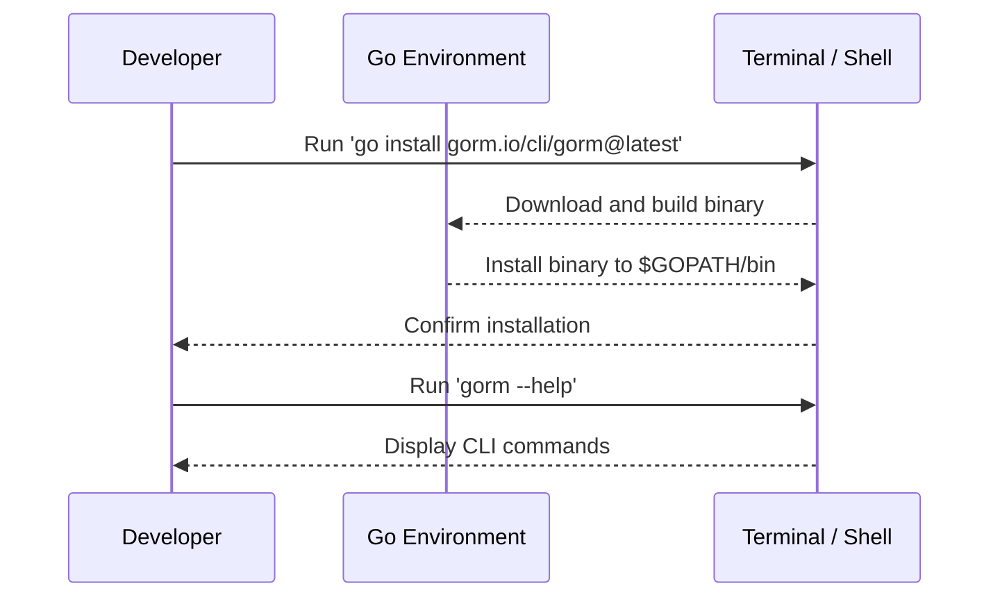

# Installing GORM CLI

Step-by-step instructions for installing GORM CLI via Go, tailored for different operating systems. This guide ensures your installation is smooth and prepares you to generate type-safe query code quickly.

---

## 1. Prerequisites

Before installing GORM CLI, verify your environment meets the following:

- **Go Version**: Ensure Go 1.18 or higher is installed to support generics.
- **Operating System**: Installation supports major OS platforms including Windows, macOS, and Linux.
- **Environment Variables**: `GOPATH` and `PATH` configured properly so installed binaries are accessible from your terminal.

For detailed system requirements and dependencies, see [Prerequisites & System Requirements](/getting-started/setup-installation/prerequisites-system-requirements).

<Check>
Confirm Go version:

```bash
go version
```
Expected output should be at least 1.18 or higher, e.g., `go version go1.19 linux/amd64`.
</Check>

---

## 2. Installation Instructions

GORM CLI installs easily via the Go command line tool.

### 2.1 Install via Go CLI

Execute the following command in your terminal or command prompt:

```bash
go install gorm.io/cli/gorm@latest
```

This command downloads and installs the latest GORM CLI binary into your Go bin directory.

### 2.2 Verify Binary Accessibility

Make sure that the Go bin directory (typically `$HOME/go/bin`) is in your system `PATH`. On Linux/macOS, you can add this to your shell profile:

```bash
export PATH=$PATH:$(go env GOPATH)/bin
```

Windows users should add `%GOPATH%\bin` to their system PATH.

### 2.3 Confirm Installation

Run the following to verify the installation succeeded:

```bash
gorm --help
```

You should see output listing available commands and usage information. Sample output snippet:

```
GORM CLI Tool

Usage:
  gorm [command]

Available Commands:
  gen         Generate GORM query code from raw SQL interfaces
  help        Help about any command

Flags:
  -h, --help   help for gorm
```

If you encounter errors such as `command not found`, double-check your `PATH` settings and Go installation.

---

## 3. Platform-Specific Notes

### macOS and Linux

- Ensure the `$GOPATH/bin` is in your shell's `PATH`.
- Use `which gorm` to confirm the binary location.

### Windows

- After installation, add `%GOPATH%\bin` to the Environment Variables PATH.
- Open a new Command Prompt or PowerShell window for changes to take effect.

---

## 4. Common Installation Issues & Troubleshooting

<AccordionGroup title="Troubleshooting Installation">
<Accordion title="'gorm' command not found after installation">
Check if `$GOPATH/bin` or `%GOPATH%\bin` is included in your system's PATH environment variable. Restart your terminal session after updating PATH.

Verify by running:

```bash
echo $PATH
which gorm
```

</Accordion>
<Accordion title="Go version is below 1.18 or not found">
Upgrade to Go 1.18+ using your OS package manager or official Go installation from https://go.dev/dl/. Then verify with:

```bash
go version
```

</Accordion>
<Accordion title="Installation permissions errors">
Run the `go install` command with appropriate permissions. On Linux/macOS, you might need to adjust directory ownership or use sudo cautiously. Avoid running `go install` with sudo if possible.

Check that Go environment variables are correctly configured:

```bash
go env
```

</Accordion>
</AccordionGroup>

---

## 5. Next Steps After Installation

Once installed, you are ready to start generating GORM query code.

- Proceed to [Writing Your First Models and Query Interfaces](/getting-started/first-steps-usage/writing-models-interfaces) to define your data types and query signatures.
- When ready, see [Generating Code with GORM CLI](/getting-started/first-steps-usage/generating-code) for instructions on running code generation.
- Validate your installation and generated code with [Validating Your Installation](/getting-started/setup-installation/validating-installation).

<Tip>
Keep your GORM CLI installation up to date by periodically running:

```bash
go install gorm.io/cli/gorm@latest
```

This ensures you have the latest features and fixes.
</Tip>

---

## 6. Summary Diagram: Installation Workflow



---