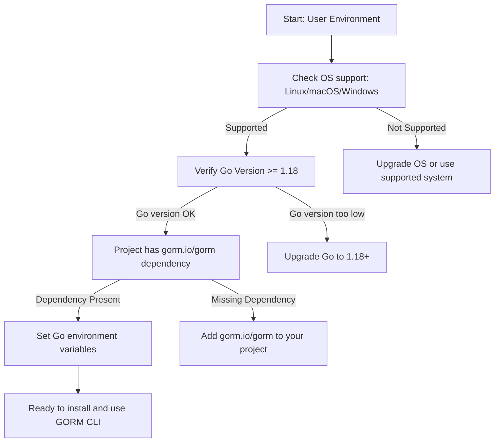

# Prerequisites & System Requirements

This page details everything you need to run the GORM CLI tool reliably. Before proceeding with installation or code generation, ensure your environment meets these requirements to avoid unexpected errors or incompatibilities.

---

## Supported Operating Systems

GORM CLI is a Go command-line tool compatible with all operating systems supported by Go 1.18 and later versions. Specifically, it runs smoothly on:

- Linux
- macOS
- Windows

Because it is distributed as a Go binary, no OS-specific installation steps are required aside from having a supported Go environment.


## Required Go Version

GORM CLI requires Go **1.18 or higher**. This is critical because:

- Go 1.18 introduced generics, which GORM CLI relies on heavily to generate type-safe APIs.
- Using older Go versions will cause build or runtime failures.

If you have any Go installation below 1.18, please upgrade before using the CLI.


## Dependency on GORM Framework

GORM CLI integrates closely with the [GORM ORM](https://gorm.io) framework. To use generated code effectively, your project must:

- Import and use GORM version compatible with generics support (GORM v2 with Go 1.18+).
- Have `gorm.io/gorm` installed as a dependency.

Note that GORM CLI itself does not include GORM ORM as a bundled dependency but expects it to be available in your project.


## Network and Environment Considerations

- No special network requirements are necessary to run the CLI itself.
- Make sure your Go environment variables are properly set (e.g., `GOPATH`, `GOROOT` if customized).
- Running behind restrictive firewalls should not affect CLI functionality but ensure open access to online Go module repositories for downloading dependencies.


## Summary of Requirements

| Requirement           | Details                                   |
|----------------------|-------------------------------------------|
| Operating System      | Linux, macOS, Windows                      |
| Go Version           | 1.18 or later (for generics support)      |
| Dependencies         | `gorm.io/gorm` must be available in project |
| Networking            | Access to Go module proxies (for dependencies)


---

## Verification Steps

Before installing or running GORM CLI, verify your setup:

1. **Check Go version:**

```bash
go version
```

Ensure it returns 1.18 or above.

2. **Verify Go Modules:**

If you use Go modules (recommended), execute:

```bash
go env GOPROXY
```

Make sure a valid proxy is set, usually `https://proxy.golang.org,direct`.

3. **Confirm GORM in your Project:**

Within your Go project:

```bash
go list -m all | grep gorm.io/gorm
```

You should see `gorm.io/gorm` listed with a version.


<Tip>
Always run `go mod tidy` in your project to ensure dependencies are up to date, especially `gorm.io/gorm`.
</Tip>


## Common Pitfalls

- **Using older Go versions:** Upgrading Go to 1.18+ is mandatory.
- **Missing `gorm.io/gorm` module:** Generated APIs depend on this package.
- **Mismatched Go environment:** Ensure your system PATH uses the correct Go version.


## Next Steps

Once you confirm your environment meets these prerequisites, proceed to [Installing GORM CLI](/getting-started/setup-installation/installing-gorm-cli) to perform the installation.

You can also verify your installation after setup by visiting [Validating Your Installation](/getting-started/setup-installation/validating-installation).

---

## Additional Resources

- [GORM CLI Overview & Features](https://gorm.io/cli)
- [GORM ORM Documentation](https://gorm.io/docs/index.html)
- [Go Releases and Installation](https://golang.org/dl/)

---

## Summary Diagram



This flow assures environment readiness before installation.

---