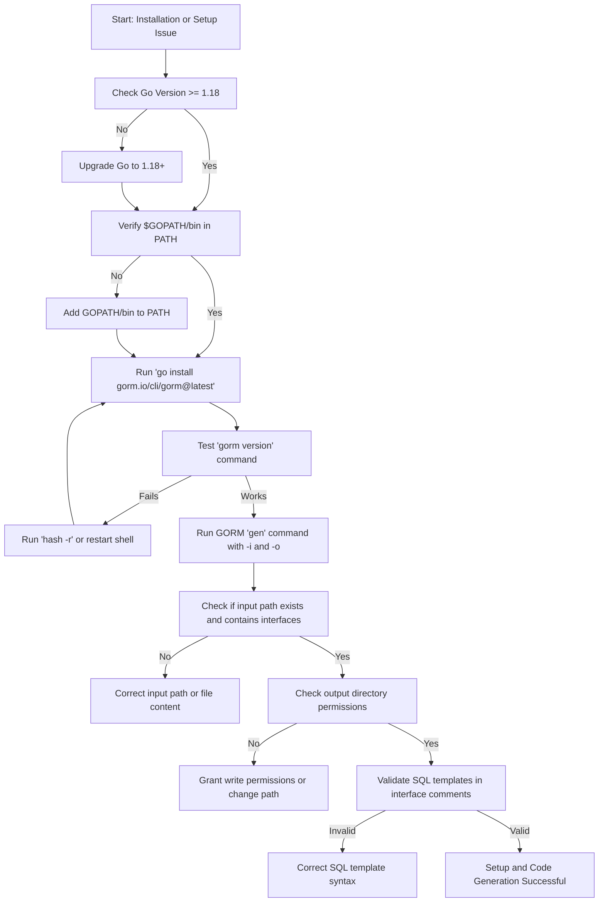

# Troubleshooting Installation & Setup

Quickly diagnose and resolve common issues encountered during the installation and setup of the GORM CLI tool. This guide focuses on typical problems such as version mismatches, missing dependencies, and command-line interface (CLI) recognition errors.

---

## 1. Common Installation Problems and Solutions

### 1.1 CLI Not Found After Installation

If, after installing GORM CLI using `go install gorm.io/cli/gorm@latest`, running `gorm` in your terminal results in a "command not found" error:

- **Cause:** The Go binary installation path might not be included in your system's `PATH` environment variable.

- **Solution:**
  1. Determine your Go bin directory:

     ```bash
     go env GOPATH
     ```
     This typically returns a directory like `/home/youruser/go` or `C:\Users\youruser\go`.

  2. Append the `bin` folder inside that path to your environment `PATH`:

     - **Linux/macOS:** Add this to your shell profile (`~/.bashrc`, `~/.zshrc`, etc.):

       ```bash
       export PATH="$(go env GOPATH)/bin:$PATH"
       ```

       Then reload your shell config:

       ```bash
       source ~/.bashrc
       ```

     - **Windows (PowerShell):** 

       ```powershell
       $env:PATH += ";$(go env GOPATH)\bin"
       ```

  3. Verify installation:

     ```bash
     gorm version
     ```
     This should output the installed version or brief CLI info.

<Tip>
Ensure you restart your terminal or reload environment variables after modifying `PATH` to make the CLI accessible.
</Tip>

---

### 1.2 Version Compatibility Issues

GORM CLI requires **Go 1.18 or later** (due to generics usage).

If you see errors related to Go version incompatibility:

- **Solution:**

  1. Check your current Go version:

     ```bash
     go version
     ```

  2. If your version is less than 1.18, update to a supported version by downloading it from [https://go.dev/dl/](https://go.dev/dl/).

  3. After upgrading, verify again, then reinstall GORM CLI.

---

### 1.3 Missing or Incorrect Dependencies

Depending on your environment and use case, GORM CLI requires 
- Access to a properly configured Go toolchain
- For database-driven examples/tests, expected database drivers and DSNs

If you experience errors related to missing packages or drivers:

- Run `go mod tidy` in your project to fetch all dependencies.
- Ensure your `go.mod` includes necessary database drivers if you use GORM's database features.

Example error:

```output
cannot find package "gorm.io/gorm" ...
```

- Solution: Add the missing package:

```bash
go get gorm.io/gorm
```

---

## 2. Diagnosing CLI Generation Issues

When invoking `gorm gen -i ./path/to/interfaces -o ./generated` for code generation, some common pitfalls occur:

### 2.1 Input File Not Found or Empty

- Verify the input path `-i` points to a valid Go file or directory containing query interfaces.

- The input must contain valid Go interfaces annotated with raw SQL comments.

- If no interfaces are found, generation will skip processing.

### 2.2 Output Directory Permissions

- Ensure that the `-o` path exists or can be created by the CLI.

- Permissions to write to the specified directory must be granted.

- If permission denied errors appear, update directory permissions or choose another path.

### 2.3 SQL Template Parsing Errors

- The CLI expects SQL templates in method comments to be valid and parsable.

- Check your interface method comments for syntax errors or invalid template directives.

- Proper SQL template usage is critical, e.g., using `@@table`, `@param`, `{{where}}`, and `{{set}}` correctly.

- Refer to the [Template DSL Concepts](https://your-docs-url/overview/system-architecture/core-concepts-terminology) and examples in the documentation.

---

## 3. Ensuring Environment Readiness

### 3.1 Verify Go and CLI Installation

Run:

```bash
go version
gorm version
```

Expected output example:

```output
go version go1.20 linux/amd64
gorm version vX.Y.Z
```

### 3.2 Validate Project Setup

Make sure your project has:
- Go modules enabled (`go.mod` present)
- Interfaces with proper SQL templates

### 3.3 Network and Firewall

If database connectivity or dependency fetching fails, check:
- Network access
- Firewall or proxy settings

---

## 4. Troubleshooting CLI Command Recognition

If the shell gives errors when running `gorm` commands, try these checks:

### 4.1 Shell Rehash / Cache

- Run `hash -r` (bash/zsh) to clear command lookup cache.

### 4.2 Use Full Path

- Try running the CLI via its full path:

```bash
$(go env GOPATH)/bin/gorm version
```

### 4.3 Reinstall

- Uninstall and reinstall:

```bash
go clean -modcache
go install gorm.io/cli/gorm@latest
```

---

## 5. Quick Troubleshooting Reference

<AccordionGroup title="Quick Fixes">  
<Accordion title="Command 'gorm' not recognized">  
- Ensure `$GOPATH/bin` is in your `PATH` environment.  
- Reload your shell or restart terminal.  
- Run `go install gorm.io/cli/gorm@latest` again if needed.  
</Accordion>  
<Accordion title="Go Version Too Low">  
- Check Go version with `go version`.  
- Upgrade to Go 1.18+.  
</Accordion>  
<Accordion title="Output Directory Write Permission Denied">  
- Check directory permissions where you are generating code.  
- Change directory or grant write rights.  
</Accordion>  
<Accordion title="Input Path Invalid or Empty">  
- Confirm the interface files exist at the `-i` path.  
- Verify files contain valid Go interfaces with SQL templates in comments.  
</Accordion>  
<Accordion title="SQL Template Parsing Failures">  
- Validate your method comments for well-formed SQL and template syntax.  
- Review template directives (e.g., `{{where}}`, `{{set}}`) for correctness.
</Accordion>
</AccordionGroup>

---

## 6. Getting Additional Help

- Visit the [Installing GORM CLI](https://your-docs-url/getting-started/setup-installation/installing-cli) page for detailed installation instructions.
- Check [System Requirements & Prerequisites](https://your-docs-url/getting-started/setup-installation/requirements-prerequisites) to ensure environment compatibility.
- Look at [Configuration & Customization Essentials](https://your-docs-url/overview/features-and-integration/config-customization) for advanced tuning to avoid setup issues.
- Ask in the GORM community forums or GitHub discussions for troubleshooting assistance.

---

## 7. Summary Diagram — Common Cause & Resolution Path



---

By following these steps and checks in logical order, you will quickly identify and fix common installation and setup problems with the GORM CLI.

---

### Useful Links
- [Installing GORM CLI](https://your-docs-url/getting-started/setup-installation/installing-cli)
- [System Requirements & Prerequisites](https://your-docs-url/getting-started/setup-installation/requirements-prerequisites)
- [Configuration & Customization Essentials](https://your-docs-url/overview/features-and-integration/config-customization)
- [GORM CLI Overview & Integration](https://your-docs-url/overview/features-and-integration/integration-points)


---

If unresolved issues persist, consider searching or filing an issue on the GORM CLI GitHub repository to get direct support from the maintainers.


---

_End of Troubleshooting Guide for Installation & Setup_
