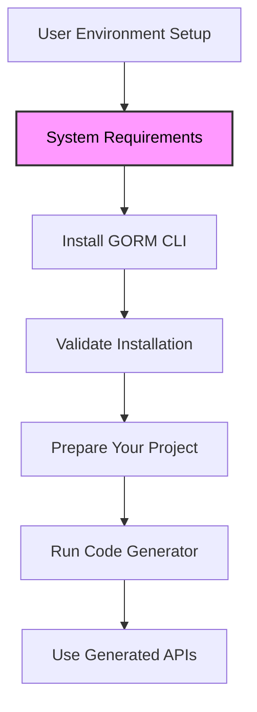

# System Requirements for GORM CLI

Ensure your development environment meets the following prerequisites and dependencies to run GORM CLI effectively. This page helps you avoid compatibility issues and tooling mismatches before starting your GORM CLI setup.

---

## 1. Go Version Requirement

GORM CLI requires **Go 1.18 or higher** because it leverages Go generics introduced in this version. Without Go 1.18+, the CLI will not function correctly.

> To check your installed Go version, run:

```bash
go version
```

You must see `go version go1.18` or newer.

---

## 2. Environment Dependencies

### Go Toolchain

- **Go 1.18+ installed and available in your system `PATH`.**
- `go` executable usable for installing and running the CLI tool.

### External Dependencies

- The CLI depends on the **GORM ORM package (`gorm.io/gorm`)** being accessible within your Go environment, but does not require separate manual installation since it comes via Go modules in your project.

### Network Access for Installation

Installing the CLI uses the following command:

```bash
go install gorm.io/cli/gorm@latest
```

Ensure your machine can reach `gorm.io` and related Go module repositories.


---

## 3. Hardware and OS Requirements

As a Go command-line tool, GORM CLI imposes minimal hardware constraints beyond what Go needs.

- **OS**: Compatible with any OS where Go 1.18+ is supported (Linux, macOS, Windows).
- **Memory**: 512MB RAM minimum recommended for comfortable operation.
- **Disk Space**: Minimal; primarily depends on generated project code size.

---

## 4. Required Permissions and Access

- You need **read/write access** to your Go project directory to generate files.
- Access to the internet during installation (for module downloads).
- Access to configure or run Go tools (`go install`, `go mod` commands).

---

## 5. Summary of Requirements

| Requirement Type       | Specification                   | Notes                                      |
|-----------------------|---------------------------------|--------------------------------------------|
| Go Version            | 1.18 or later                    | For generics support                        |
| External packages     | Accessible `gorm.io/cli/gorm`    | Fetched automatically via go modules       |
| OS                    | Linux, macOS, Windows            | Any OS supported by Go                      |
| Permissions           | Read/write to project directory  | To generate output files                    |
| Network               | Required for installation        | For `go install` and module resolution     |

---

## 6. Verification

After installation, verify your setup by running:

```bash
gorm --help
```

Expected behavior:
- Displays CLI usage and available commands.
- No error indicating missing Go version or environment mismatch.

---

## 7. Troubleshooting Common Environmental Issues

<AccordionGroup title="Troubleshooting System Requirements">
<Accordion title="Go Version Not Supported">
Check your Go version with `go version`. Upgrade Go if below 1.18. Download from https://golang.org/dl/
</Accordion>
<Accordion title="Go Binary Not Found">
Ensure the Go binary is in your system `PATH`. On Unix-like systems, add `export PATH=$PATH:/usr/local/go/bin` to your shell profile.
</Accordion>
<Accordion title="Network Issues During Install">
If `go install` fails:
- Check your internet connection
- Ensure no firewall or proxy blocks access to `gorm.io` or `proxy.golang.org`
</Accordion>
<Accordion title="Permission Denied Errors">
Make sure you have write permissions to your working directory where the CLI will generate files.
If necessary, run install commands with appropriate user permissions.
</Accordion>
</AccordionGroup>

---

## 8. Next Steps

Once system requirements are met, proceed to the next steps to install and validate GORM CLI:

- [Install the GORM CLI](/getting-started/setup-introduction/install-cli)
- [Validate Your Installation](/getting-started/setup-introduction/validate-install)
- Explore the [Quickstart & Main Workflow](/overview/architecture-workflows-integration/quickstart-and-primary-workflow) for hands-on usage.

---

## References & Further Reading

- [GORM CLI Overview](../../overview/intro-product-value-core-concepts/what-is-gorm-cli)
- [Installation & Setup Guide](/guides/getting-started/installation-setup)
- [Troubleshooting Setup Issues](/getting-started/setup-introduction/troubleshooting)

<Tip>
Always use Go 1.18 or higher to benefit from generics, which unlock type-safe and fluent APIs generated by GORM CLI.
</Tip>

<Note>
GORM CLI auto-discovers your Go interfaces and models—ensuring your environment matches system requirements helps avoid subtle code generation errors.
</Note>

---

# Visual Diagram: Position of System Requirements in Documentation Workflow



This diagram illustrates where the System Requirements fit into the overall onboarding flow.

---

Your environment compliance is the crucial first step to unlock the powerful code generation and type-safe APIs that GORM CLI delivers.