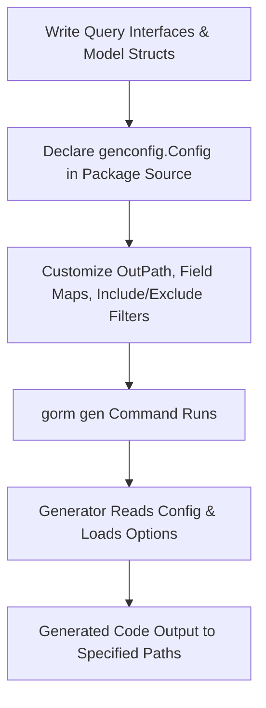

# Initial Configuration

Configure your first code generation run in seconds. This guide walks you through the essential and optional settings to structure your query interfaces and models, plus how to leverage the advanced but optional `genconfig.Config` for customization such as custom field mappings or specifying output directories.

---

## 1. Why Configure?

GORM CLI works out-of-the-box with zero configuration for simple projects. However, configuring your generation setup unlocks:

- **Custom output locations:** Organize generated files in your preferred directory.
- **Selective generation:** Include or exclude specific interfaces or struct models.
- **Custom field handling:** Map Go types or struct tags to specialized field helpers.
- **File-level control:** Apply configs per source file instead of whole packages.

This flexibility makes your code generation fit seamlessly with your project architecture.

---

## 2. Core Configuration: `genconfig.Config`

The key to customization is declaring a `var _ = genconfig.Config{}` literal **at package-level** inside any Go file in the package you want to generate code for. This config will be picked up automatically by the generator during a run.

### Minimal Example

```go
package examples

import (
    "database/sql"
    "gorm.io/cli/gorm/field"
    "gorm.io/cli/gorm/genconfig"
)

var _ = genconfig.Config{
    OutPath: "examples/output", // place generated files here
    FieldTypeMap: map[any]any{
        sql.NullTime{}: field.Time{}, // custom wrapper for sql.NullTime fields
    },
    FieldNameMap: map[string]any{
        "date": field.Time{},  // gen:"date" tag fields get Time helper
        "json": JSON{},       // gen:"json" tag fields get custom JSON helper (example)
    },

    IncludeInterfaces: []any{"Query*"}, // only interfaces prefixed with 'Query'
    ExcludeInterfaces: []any{"*Deprecated*"},

    IncludeStructs: []any{"User", "Account*"}, // whitelist models by name
    ExcludeStructs: []any{"*DTO"},               // exclude DTO suffix structs

    FileLevel: false, // Apply config to whole package (true = per file)
}
```

### Notes:

- **OutPath:** Overrides the output directory for the generated files of the current package.
- **FieldTypeMap:** Maps specific Go types to field helper wrappers, enabling support for custom or database-specific types.
- **FieldNameMap:** Applies wrapper mappings based on struct tags (e.g., `gen:"json"`). This overrides the `FieldTypeMap` for tagged fields.
- **Interface and Struct Filters:** You can control precisely which interfaces and models are included or excluded using shell-style pattern matching or type literals.
- **FileLevel:** When set true, config applies only to the file it's declared in (useful for granular control).

---

## 3. Structuring Your Query Interfaces and Models

### Interface-Driven Query Definitions

Write your query interfaces using Go generics, annotating methods with SQL templates. For example:

```go
package examples

type Query[T any] interface {
  // SELECT * FROM @@table WHERE id=@id
  GetByID(id int) (T, error)

  // SELECT * FROM @@table WHERE @@column=@value
  FilterWithColumn(column string, value string) (T, error)

  // SELECT * FROM @@table
  // {{where}}
  //   {{if user.Name != ""}} name=@user.Name {{end}}
  //   {{if user.Age > 0}} AND age=@user.Age {{end}}
  // {{end}}
  FilterByUser(user User) ([]T, error)
}
```

### Model Structs

Define your models as Go structs, typically mirroring your database schema. For example:

```go
package models

type User struct {
  ID    uint
  Name  string
  Email string
  Age   int
  // Optional tags to customize generation
  Profile string `gen:"json"`
}
```

### How Configuration Maps to Models

- Use **field type maps** to direct the generator to use specific field helpers for Go types, e.g., mapping `sql.NullTime` to a time-based helper.
- Use **field name maps** with struct tags to indicate when specialized helpers should be used (e.g., JSON encoding helpers).

---

## 4. Setting Up Your First `genconfig.Config`

### Step 1: Create or edit a Go file in your target package

Put a `genconfig.Config` variable in any source file inside your package, for example, `examples/query.go` or `examples/config.go`.

### Step 2: Import necessary packages

```go
import (
  "database/sql"
  "gorm.io/cli/gorm/field"
  "gorm.io/cli/gorm/genconfig"
)
```

### Step 3: Declare the configuration literal

Define the `var _ = genconfig.Config{}` literal with your chosen options. For a basic setup:

```go
var _ = genconfig.Config{
  OutPath: "generated",
  IncludeInterfaces: []any{"Query*"},
  IncludeStructs: []any{"User"},
}
```

This example generates code only for interfaces starting with `Query` and structs named `User`, outputting results to the `generated` directory.

---

## 5. Advanced Configuration Options

### Custom Field Type Mapping

If your models use custom or complex Go types that need special SQL handling, map them to corresponding field helpers:

```go
FieldTypeMap: map[any]any{
  sql.NullTime{}: field.Time{}, // sql.NullTime uses Time helper
  mypackage.MyCustomType{}: CustomFieldHelper{},
}
```

### Tag-Based Field Mapping

Use struct tags to mark fields for custom helpers, then map those tags:

```go
FieldNameMap: map[string]any{
  "json": JSON{}, // fields tagged gen:"json" use JSON helper
  "date": field.Time{},
}
```

Example model field:

```go
Profile string `gen:"json"`
```

### Selective Inclusion and Exclusion

Control generation scope precisely:

- **IncludeInterfaces:** Only generate code for interfaces matching these patterns.
- **ExcludeInterfaces:** Skip generating code for interfaces matching these patterns.
- **IncludeStructs:** Only generate for models matching these patterns.
- **ExcludeStructs:** Skip models matching these patterns.

Patterns support shell-style wildcards, e.g., "Query*", "*Deprecated*", or explicit type literals like `models.User{}`.

### File-Level Configuration

Set `FileLevel: true` to apply the config only in the defining file, useful for multi-package or divided codebases.

---

## 6. Putting It All Together: Example Configuration

```go
package examples

import (
  "database/sql"
  "gorm.io/cli/gorm/field"
  "gorm.io/cli/gorm/genconfig"
)

var _ = genconfig.Config{
  OutPath: "examples/generated",
  FieldTypeMap: map[any]any{
    sql.NullTime{}: field.Time{},
  },
  FieldNameMap: map[string]any{
    "json": JSON{},
  },
  IncludeInterfaces: []any{"Query*"},
  ExcludeInterfaces: []any{"*Deprecated*"},
  IncludeStructs: []any{"User", "Account*"},
  ExcludeStructs: []any{"*DTO"},
  FileLevel: false,
}
```

This configuration:

- Outputs generated code to `examples/generated`
- Uses the `Time` field helper for `sql.NullTime`
- Uses a custom `JSON` field helper for fields tagged with `gen:"json"`
- Generates code only for interfaces prefixed with `Query` (excluding deprecated ones)
- Generates code for named structs `User`, and structs beginning with `Account` (excluding DTOs)
- Applies globally to the package

---

## 7. Running the Generator After Configuring

Once your configuration is declared, generate your code with:

```bash
gorm gen -i ./examples -o ./examples/generated
```

The CLI will automatically detect your `genconfig.Config` and apply it during generation.

---

## 8. Tips, Best Practices, and Pitfalls

- **Place config in the same package:** The config variable must be in a Go source file within the package you want to generate code for.
- **Keep naming consistent:** Pattern matching is case sensitive. Use exact names or wildcards carefully.
- **Use `Include*` lists to narrow focus:** Providing a whitelist skips unrelated interfaces/structs, speeding generation.
- **FieldNameMap overrides FieldTypeMap:** If both apply to a field, the tag-based FieldNameMap takes precedence.
- **Separate config for multi-level projects:** Use `FileLevel: true` for finer control when mixing multiple domains in one package.
- **For custom helpers, define proper Go types:** Ensure your custom field helpers implement SQL generation interfaces correctly.

---

## 9. Troubleshooting Common Configuration Issues

<AccordionGroup title="Common Issues">
<Accordion title="Configuration Not Detected">
Verify that your `genconfig.Config` declaration is:
- At package-level (not inside functions)
- In a Go source file in the package you're generating
- Properly imported for any referenced symbols

Check `gorm gen` output for warnings related to config loading.
</Accordion>
<Accordion title="Filtering Not Working as Expected">
Remember that include lists take precedence over exclude lists.

Examples:
- If `IncludeInterfaces` is non-empty, only matching interfaces generate.
- If exclude patterns don’t seem applied, check if an include whitelist is overriding.

Patterns must be shell-style wildcards or exact type literals.
</Accordion>
<Accordion title="Field Helper Mappings Are Ignored">
- Make sure field helper types are concrete struct instances, e.g., `field.Time{}`.
- Ensure your type mappings match the exact Go type (no pointer mismatch).
- Use `FieldNameMap` for fields tagged with `gen:"tag"`; it overrides type mappings.
- Confirm imports and references for custom helpers are correct and accessible.
</Accordion>
</AccordionGroup>

---

## 10. Next Steps

- Explore [Generating Your First Code](https://your-docs-domain/getting-started/first-run-validation/generating-code) for running your first generation and using outputs.
- See [Understanding Generated Code](https://your-docs-domain/guides/getting-started/understanding-generated-code) to grasp the generated API.
- For advanced customization, check [Customizing Generation with genconfig](https://your-docs-domain/guides/advanced-usage/customizing-generation).

---

## Summary Diagram of Configuration Flow



---

You are now ready to configure and tailor GORM CLI generation to your project structure with confidence and precision.
