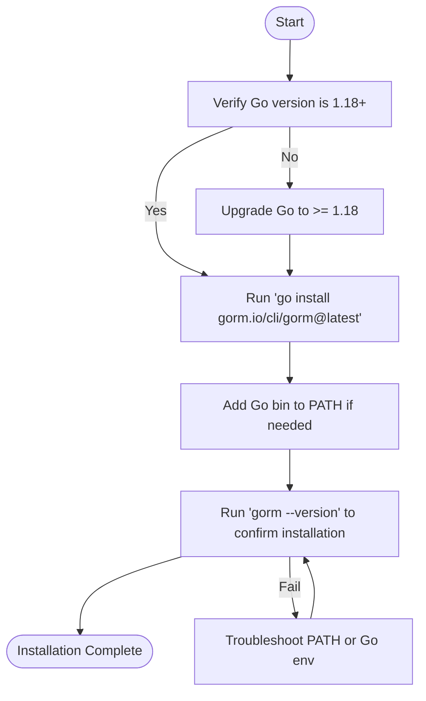

# Installation Guide for GORM CLI

This guide provides practical, step-by-step instructions to install the GORM CLI tool using the native Go ecosystem, ensuring compatibility everywhere Go runs. You will learn how to install, upgrade/downgrade, and verify your GORM CLI installation on multiple platforms.

---

## 1. Prerequisites & System Requirements

Before proceeding with the installation, ensure your environment meets the following requirements:

- **Go Version**: Go 1.18 or above (required for generics support).
- **Go Environment**: GOPATH and GOROOT configured properly.
- **Operating Systems**: Supported everywhere Go runs, including Linux, macOS, and Windows.

<Tip>
Verify your Go version by running:
```bash
go version
```
It must return 1.18+.
</Tip>

## 2. Installing GORM CLI

The simplest and recommended installation method is through the Go toolchain's native `go install` command.

### Step-by-Step Installation

<Steps>
<Step title="Run Go Install Command">
Execute the following command in your terminal or command prompt:

```bash
go install gorm.io/cli/gorm@latest
```

This fetches the latest version of GORM CLI and installs the `gorm` binary in your `$GOPATH/bin` or `$GOBIN` directory.
</Step>

<Step title="Verify Binary Location">
Ensure that your Go binaries directory is included in your system's PATH. For example, on Unix-like systems:

```bash
export PATH=$PATH:$(go env GOPATH)/bin
```

On Windows, add `%GOPATH%\bin` or `%GOBIN%` to your system environment PATH.
</Step>

<Step title="Confirm Installation">
Verify that the `gorm` CLI is installed and accessible:

```bash
gorm --version
```

You should see output similar to:

```
GORM CLI Tool version x.y.z
```

indicating successful installation.
</Step>
</Steps>

<Tip>
If the `gorm` command is not found, double-check your PATH environment variable and make sure Go binaries directory is included.
</Tip>

### Platform-Specific Notes

- On **macOS/Linux**, you may need to add the Go bin directory to your shell profile (e.g., `.bashrc`, `.zshrc`).
- On **Windows**, ensure the Go bin directory is in your "Environment Variables" PATH and restart your command prompt.

## 3. Upgrading or Downgrading GORM CLI

You can change your installed version using the `go install` command with a specific version tag.

### Upgrade to Latest

```bash
go install gorm.io/cli/gorm@latest
```

### Downgrade to a Specific Version

Replace `vX.Y.Z` with the version you want.

```bash
go install gorm.io/cli/gorm@vX.Y.Z
```

## 4. Verification of Installation

After installation, verify the installation and check that the `gorm` CLI responds correctly.

### Check Version

```bash
gorm --version
```

Expected output confirms the installed version.

### Basic Help Menu

Run the help command to verify the CLI loads and shows commands:

```bash
gorm --help
```

You should see a list of available CLI commands like `gen`.

<Tip>
If you encounter permission errors or command not found issues, re-check your PATH settings and consider reinstalling with the appropriate permissions.
</Tip>

## 5. Common Pitfalls & Troubleshooting

<AccordionGroup title="Installation Troubleshooting">
<Accordion title="GORM CLI Not Found After Installation">
- Ensure `$(go env GOPATH)/bin` or `$GOBIN` directory is in your system PATH.
- Run `go env GOPATH` to locate your bin directory.
- Restart your terminal to reload environment variables after changes.
</Accordion>

<Accordion title="Go Version Not Compatible">
- Make sure your Go version is 1.18 or above.
- Old versions won't recognize generics used in GORM CLI.
- Upgrade Go via your system package manager or official installers.
</Accordion>

<Accordion title="Permission Denied Error When Installing">
- Use a user with proper write permissions to Go directories.
- Avoid `sudo` with `go install` unless absolutely necessary.
- Alternatively, adjust permissions of your GOPATH/bin directory.
</Accordion>

<Accordion title="Command Runs but No Output or Errors">
- Run `gorm --help` to check if CLI is operational.
- Confirm your shell environment is sourcing the correct `gorm` binary.
- Reinstall to ensure no corrupted binary issues.
</Accordion>
</AccordionGroup>

## 6. Next Steps

With GORM CLI installed, you are ready to integrate it into your Go projects and start generating type-safe query code.

- Proceed to the [Initial Configuration Guide](/getting-started/setup-prerequisites-installation/initial-configuration) to configure generation options.
- Review [Generating Your First Code](/getting-started/first-run-validation/generating-code) to create your first GORM CLI generated files.


---

## Summary of Installation Workflow



---