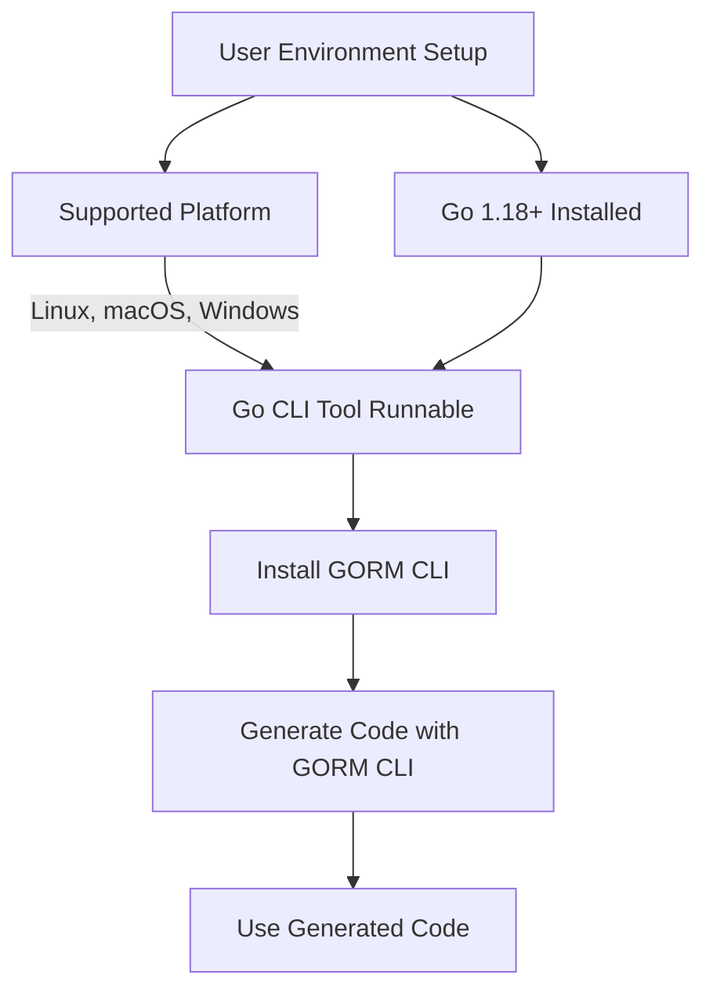

# System Requirements

This page outlines the essential system prerequisites to ensure a smooth and successful experience running the **GORM CLI** tool. Before installation and usage, confirm that your environment meets these requirements to harness full functionality without disruptions.

---

## 1. Go Version Requirement

- **Minimum Go Version:** 1.18 or higher

GORM CLI leverages Go generics and other language features introduced in Go 1.18. Running the CLI tool on earlier Go versions will result in incompatibility errors.

<Tip>
Ensure your Go environment is version 1.18 or above. You can verify your current Go version by running:

```bash
go version
```

Upgrade instructions can be found at the official Go website: https://golang.org/dl/
</Tip>

---

## 2. Supported Platforms

GORM CLI is a Go tool and thus supports all platforms where Go itself is supported. These include:

- Linux
- macOS
- Windows

The tool requires a working Go installation on one of these platforms.

<Info>
While GORM CLI does not impose platform-specific restrictions, ensure your environment supports the Go version 1.18+ requirement.
</Info>

---

## 3. Required Dependencies

- **Go Modules:** Enabled (`GO111MODULE=on` recommended)
- **GORM package:** Your project should integrate or have access to `gorm.io/gorm` since generated code depends on it.

The CLI tool generates interfaces and helpers tightly integrated with GORM, so projects need the GORM library to consume the outputs.

---

## 4. Access & Permissions

- **Command Line Access:** Terminal or shell with permission to run Go commands and install binaries.
- **Network Access:** Required for:
  - Downloading the GORM CLI tool
  - Fetching Go module dependencies

---

## 5. Additional Considerations

- **Disk Space:** Minimal footprint, typical Go toolchain size
- **Memory:** Typical development machine resources sufficient

---

## 6. Verifying Your Environment

Run these commands to confirm readiness:

```bash
# Confirm Go version (must be 1.18+)
go version

# Verify Go modules enabled
go env GO111MODULE

# Validate ability to install GORM CLI
go install gorm.io/cli/gorm@latest
```

If these commands run without errors, your environment meets the requirements to use GORM CLI.

---

## Troubleshooting Common Environment Issues

<AccordionGroup title="Common Setup Issues and Fixes">
<Accordion title="Go version below 1.18">
Check if you have multiple Go versions installed. Use the version manager or uninstall older versions. Download and install Go 1.18 or later.
</Accordion>
<Accordion title="Go modules disabled or unset">
Set environment variable:

```bash
export GO111MODULE=on
```

This ensures dependency management is enabled.
</Accordion>
<Accordion title="Network access denied when fetching tool">
Ensure no firewall or proxy blocks internet access during installation. Configure Go proxy if needed.
</Accordion>
</AccordionGroup>

---

## Next Steps

With your environment verified, proceed to:

- [Installation](../setup-prerequisites/installation) of the GORM CLI tool
- [Project Configuration](../first-steps/project-configuration) to prepare your Go codebase for code generation

Consult the [Overview: What is GORM CLI?](../../overview/intro-value/what-is-gorm-cli) to understand how system requirements fit into the broader workflow.


---

## Summary Diagram: System Requirements Context



---

For detailed installation guidance after verifying system requirements, refer to the [Installation Guide](/getting-started/setup-prerequisites/installation).


---