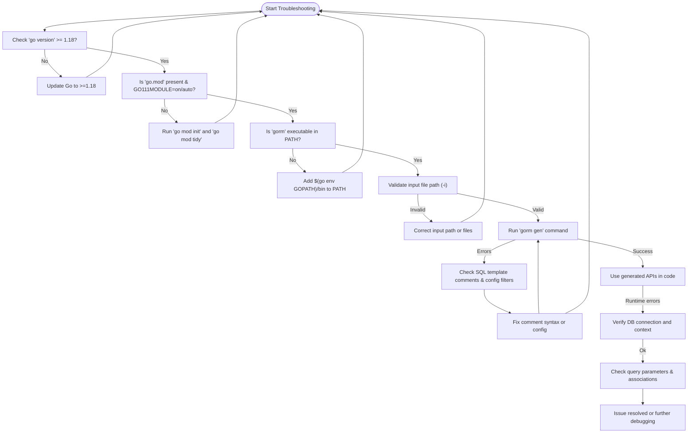

# Troubleshooting Common Issues

This guide helps you diagnose and resolve frequent problems encountered during the installation and configuration of GORM CLI. Whether you're facing Go version conflicts, path errors, missing dependencies, or generator misconfiguration, follow these actionable steps to quickly restore your setup and progress smoothly.

---

## 1. Installation Problems

### 1.1 Go Version Conflicts

GORM CLI requires **Go 1.18 or later** to support generics. If you get errors related to unknown syntax or unsupported Go features:

- Verify your Go version by running:

  ```bash
  go version
  ```

- If your version is below 1.18, upgrade to the latest stable release from the official [Go website](https://golang.org/dl/).

<Tip>
Always use the latest Go version supported by your project to ensure compatibility and security.
</Tip>

### 1.2 GOPATH and Module Issues

If you see errors like `cannot find package` or issues about import paths:

- Check if your project is outside your `GOPATH`. GORM CLI and modern Go modules expect your project to be in a Go module (with a `go.mod` file).

- Initialize a Go module if you haven't already:

  ```bash
  go mod init your/module/name
  go mod tidy
  ```

- Confirm module-aware mode is enabled by running:

  ```bash
  go env GO111MODULE
  ```

  It should output `on` or `auto`.

<Warning>
Avoid placing your project inside `GOPATH/src` unless you understand GOPATH's behavior with modules.
</Warning>

### 1.3 `go install` Command Fails

If the command to install GORM CLI fails:

```bash
go install gorm.io/cli/gorm@latest
```

- Confirm internet access and proxy settings are not blocking module download.
- Run `go clean -modcache` to clear corrupted caches.
- Check if your Go proxy environment variables (`GOPROXY`) are properly configured.

### 1.4 Permission Denied or Binary Not Found After Install

- Make sure `$GOPATH/bin` or `$HOME/go/bin` (where Go installs binaries) is included in your system's `PATH` environment variable.

- For Unix/Linux/macOS, add the following to your shell profile (`~/.bashrc`, `~/.zshrc`, etc.):

  ```bash
  export PATH="$PATH:$(go env GOPATH)/bin"
  ```

- After updating `PATH`, reload the shell or open a new terminal.

<Check>
Verify installation by running:

```bash
gorm --help
```

This should display GORM CLI usage information.
</Check>

---

## 2. Configuration & Usage Issues

### 2.1 Missing or Incorrect Input Path

The generator requires a valid input path pointing to Go source files with your query interfaces.

- If you see errors like `error processing <path>: no such file or directory`:

  - Confirm the `-i` (`--input`) path is correct and points to existing Go files.
  - Use relative or absolute paths correctly.
  - Avoid pointing to generated code directories.

Example:

```bash
gorm gen -i ./examples/query.go -o ./generated
```

### 2.2 Output Directory Permission or Path Errors

- Ensure the output directory exists or can be created by GORM CLI.
- Confirm your user has write permissions to the output path.
- Check for typos or invalid characters in paths.

<Tip>
Use the default output path (./g) if uncertain, or specify a clear relative path for generated code.
</Tip>

### 2.3 Generator Does Not Produce Any Output

- Confirm your input Go files contain interfaces with SQL template comments.
- Check if your `genconfig.Config` applies filters that exclude all interfaces or structs.
- Remove or adjust `IncludeInterfaces`, `ExcludeInterfaces`, `IncludeStructs`, and `ExcludeStructs` filters if too restrictive.

Example problem config:

```go
var _ = genconfig.Config{
  IncludeInterfaces: []any{"NonExistentInterface"},
}
```

would exclude all interfaces.

### 2.4 Compilation Errors in Generated Code

- Review the generated code for invalid Go syntax.
- Check your interface method comments for properly formatted SQL templates.
- Ensure all required imports are present.
- Make sure all referenced types and models exist and are imported.

<Tip>
Keep interface comments concise and follow the SQL templating DSL carefully. Refer to [Writing and Using SQL Templates](/guides/advanced-usage/template-dsl-guide) for detailed syntax.
</Tip>

---

## 3. Runtime Issues Using Generated APIs

### 3.1 Errors Executing Generated Queries

- Confirm your database connection (`*gorm.DB`) is correctly initialized and passed.
- Check context propagation to avoid canceled or timed-out operations.
- Review filters and parameters passed to generated methods for correctness.

Example of proper usage:

```go
user, err := generated.Query[User](db).GetByID(ctx, 123)
if err != nil {
    // handle error
}
```

### 3.2 Association Helpers Not Working as Expected

- Ensure your models define associations correctly (e.g., foreign keys, tags).
- Review association helper usage examples in [Association Guides](/guides/core-workflows/association-guides).

---

## 4. Common Pitfalls and Best Practices

- Always check your Go environment setup (`go env`) and update regularly.
- Keep your interface comments and models in sync with your database schema.
- Use configuration filters judiciously to avoid accidental exclusion.
- When experiencing issues, clean your generated code folder and regenerate fresh output.

---

## 5. Getting Additional Help

- Consult the [System Requirements](/getting-started/installation-and-setup/system-requirements) page for environment setup.
- See [Defining Models & Query Interfaces](/getting-started/your-first-code-generation/defining-models-interfaces) for writing correct inputs.
- Review [Generating Code](/getting-started/your-first-code-generation/generating-code) for command usage details.
- Check [Validating Your Setup](/getting-started/your-first-code-generation/validating-your-setup) for verifying output correctness.

If problems persist:

- Open issues or questions on the official GitHub repository: [https://github.com/go-gorm/cli](https://github.com/go-gorm/cli)
- Participate in community discussions or review open issues.

---

## Appendix: Quick Troubleshooting Checklist

- Is Go version ≥ 1.18?
- Is your project using Go modules with a proper `go.mod`?
- Is the `gorm` CLI binary in your `PATH`?
- Are input paths correct and pointing to valid Go source files?
- Are output directories writable?
- Do interface files contain SQL template comments?
- Any filters in your config excluding all interfaces or structs?
- Are database connection and context properly passed to generated APIs?

Use this checklist whenever you encounter issues to isolate the root cause.

---

With this guide, you can systematically identify and fix most early-stage problems in getting GORM CLI up and running.

You will be up and generating safe, fluent query helpers in no time.

---

<Info>
For in-depth guidance, explore related documentation chapters linked below.
</Info>

# Links & References

- [System Requirements](/getting-started/installation-and-setup/system-requirements)
- [Installation](/getting-started/installation-and-setup/installation)
- [Configuration Setup](/getting-started/installation-and-setup/configuration-setup)
- [Defining Models & Query Interfaces](/getting-started/your-first-code-generation/defining-models-interfaces)
- [Generating Code](/getting-started/your-first-code-generation/generating-code)
- [Validating Your Setup](/getting-started/your-first-code-generation/validating-your-setup)
- [Using the Generated APIs](/guides/core-workflows/using-generated-apis)

---

# Troubleshooting Flow Diagram


