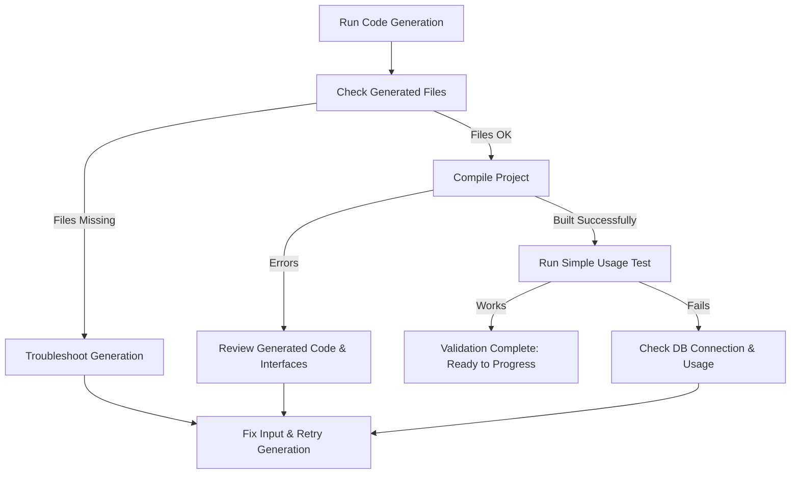

# Quick Validation & Next Steps

This guide provides you with straightforward, repeatable checks to ensure your code generation with GORM CLI has successfully produced the expected files. It also points you toward valuable resources to deepen your understanding and enhance your usage of GORM CLI. Before diving into complex integration or advanced templating, validating your initial generation is essential to confirm your setup works as intended.

---

## 1. Verify Generated Files Exist and Are Correct

After running your first generation, you want to confirm that the generated code files have been created in the expected output directory.

### Steps:

1. Navigate to your output directory (default `./g` or your configured `-o` path).

2. Look for generated `.go` files, typically named after your source interfaces or models, such as `query.go` or `models.go`.

3. Open the generated files and verify they contain:
   - Interface implementations matching your defined query interfaces.
   - Strongly typed field helper structs representing your models.

4. Confirm the files are not empty and include recognizable function or variable names matching your interface and model names.

### Outcome:

You should see generated Go source code ready for use in your project with no surprising omissions or empty files.

---

## 2. Basic Compile-Time Validation

To make sure your generated code is syntactically valid and integrates properly into your project:

### Steps:

1. Run `go build ./...` or your project's standard build command.

2. Watch carefully for any errors originating from the generated files.

3. If errors appear, review the generated files and your source interface/model definitions for mismatches or missing dependencies.

### Outcome:

Successful compilation confirms that generation produces valid code that fits into your current Go project without syntax errors.

---

## 3. Run Simple Functional Tests

Run quick runtime tests to ensure generated query APIs and helpers behave as expected.

### Example Scenario:

Using the previously generated code for a model `User`:

```go
// Basic usage example
user, err := generated.Query[User](db).GetByID(ctx, 1)
if err != nil {
    log.Fatalf("Failed to fetch user by ID: %v", err)
}
fmt.Println("Fetched user:", user)
```

### Steps:

- Build and run a simple program or test case that:
  - Uses a generated query method (e.g., `GetByID`).
  - Prints or verifies the resulting data.

- Confirm that no runtime errors occur and that the data matches expectations.

### Outcome:

A successful data fetch using generated code confirms your generated query APIs are functional and connected to your database.

---

## 4. Quick Troubleshooting Tips

If your validation uncovers problems, consider the following:

- **Missing Generated Files:** Verify your input path and generation command flags are correct. Confirm no errors occurred during generation.
- **Compilation Errors:** Check your interface method signatures and ensure they follow GORM CLI requirements (e.g., return at least an error, properly declared parameters).
- **Runtime Failures:** Confirm your database connection `db` is properly configured and accessible.
- **File Permission Issues:** Ensure your user has write access to the output directory.

For persistent issues, consult the [Troubleshooting Installation Issues guide](/getting-started/troubleshooting-and-faq/troubleshooting-installation) and verify your environment matches prerequisites.

---

## 5. Next Learning Steps

Once validation confirms your initial setup works, accelerate your mastery with these recommended next steps:

- **Deepen Your Configuration Knowledge:** Explore [Initial Configuration](/getting-started/configure-and-generate/basic-config) to customize output paths, type mappings, and inclusion filters.

- **First Generation Guide:** Follow [Generating Code: Your First Workflow](/getting-started/configure-and-generate/first-generation) for methodical instructions from model/interface definition to complete code generation.

- **Project Integration:** Learn how to smoothly [Integrate Generated Code](/getting-started/configure-and-generate/project-integration) into your Go projects with real usage examples.

- **Explore Advanced Features:** Investigate [Template-Based Queries & SQL DSL](/guides/advanced-usage-patterns/template-based-queries) and [Working with Associations](/guides/advanced-usage-patterns/working-with-associations) for powerful query capabilities.

---

<Check>
Ensure you can confidently locate and read generated files, compile your project without errors, and execute basic queries with the generated APIs before moving on.
</Check>

<Info>
If you encounter issues with validation or initial usage, the troubleshooting guides and installation verification pages offer detailed assistance.
</Info>

---

## Summary Diagram of Your Validation Flow



This flow highlights your journey from generation through validation, emphasizing key points to verify and troubleshoot.

---

## Reference Commands

```bash
# Run code generation, specifying input interface file and output folder
gorm gen -i ./examples/query.go -o ./generated

# List generated files
ls ./generated

# Check generated code syntax
go build ./generated

# Run your program or test with generated code
go run ./cmd/yourapp
```

---

## Additional Resources

- [Validating Your Installation](/getting-started/setup-and-installation/first-run-validation)
- [Troubleshooting Installation Issues](/getting-started/troubleshooting-and-faq/troubleshooting-installation)
- [Getting Started: Configuration & Generation](/getting-started/configure-and-generate/basic-config)
- [Integrating Generated Code into Projects](/getting-started/configure-and-generate/project-integration)

Use these resources for deeper exploration and resolving common pitfalls encountered during setup and validation.

---