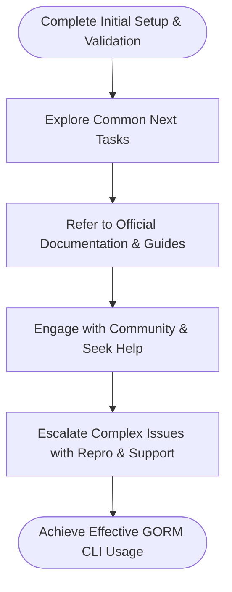

# Next Steps & Getting Support

This guide helps you navigate your journey after completing the initial setup and getting started with GORM CLI. Whether you're looking to deepen your understanding, troubleshoot issues, or engage with the community, this page directs you to essential resources and outlines practical next steps to ensure you leverage GORM CLI effectively.

---

## 1. Confirming a Successful Setup

Before moving forward, verify your environment is correctly configured and the generated code works as expected:

- **Run sample queries and mutations** using your generated APIs as described in the [Quick Validation & Usage Test](/getting-started/first-run-and-validation/validate-usage) guide.
- **Check your generated code output** matches your expectations and project structure.
- **Ensure your models and interfaces** are correctly defined following [Defining Models and Query Interfaces](/getting-started/first-run-and-validation/create-models-and-interfaces).

This confirmation ensures your foundation is solid before exploring more advanced features.

<Check>
Perform these validation steps first to avoid cascading issues and to have a stable baseline for your GORM CLI experience.
</Check>

---

## 2. Exploring Common Next Tasks

With your initial setup validated, consider the following practical next steps tailored to your needs:

- **Integrate generated query APIs and field helpers** into your GORM projects to achieve type-safe and fluent database operations.
- **Customize generation behavior** by defining package-level `genconfig.Config` settings to control output paths, field type mappings, and filtering mechanisms. See [Customizing Code Generation](/guides/advanced-patterns/customizing-generation) for details.
- **Learn to work with associations** such as has-many, belongs-to, and many-to-many relationships using the generated helpers through [Working with Associations](/guides/advanced-patterns/associations-deep-dive).
- **Implement template-based queries** for advanced SQL customization within interfaces, covered in [Template-Based Queries](/guides/advanced-patterns/template-sql-workflows).

Taking these steps will expand your capabilities with GORM CLI and adapt it fully to your project's complexity.

<Info>
Explore these guides based on your familiarity and project requirements to unlock the full potential of GORM CLI.
</Info>

---

## 3. Using Official Documentation and Resources

GORM CLI's official documentation is well-structured to support your learning and problem-solving:

- Start at the [Getting Started section](/getting-started/setup-and-installation/prerequisites) for prerequisites, installation, and configuration basics.
- Consult [Core Concepts and Terminology](/overview/architecture-core-concepts/core-concepts-terminology) to solidify your understanding of the internal workflow and API design.
- Leverage [Troubleshooting Common Issues](/getting-started/troubleshooting-and-help/troubleshooting-common-issues) for targeted help with known pitfalls and error scenarios.

These curated resources will keep you on track and make advanced usage approachable.

---

## 4. Engaging with Community and Getting Help

When you encounter issues beyond basic troubleshooting or want to contribute and learn from others:

- **GitHub Repository:** Report bugs, request features, and review source code at the official repo [https://github.com/go-gorm/cli](https://github.com/go-gorm/cli).
- **Community Forums and Discussions:** Join GORM community channels (such as GORM's Discord, GitHub Discussions, or Go forums) to ask questions and share experiences.
- **Issue Reporting:** Provide clear, minimal reproducible examples when filing issues to accelerate resolution.

Community engagement often leads to quicker solutions and deeper insights.

<Note>
Always ensure your environment matches the supported versions (Go 1.18+, compatible GORM versions) before seeking help to eliminate common compatibility problems.
</Note>

---

## 5. Escalating Complex Problems

If your issue is intricate or affects your production environments, consider the following escalation steps:

- **Create reproducible tests:** Use minimal setups and generated code examples to isolate the problem.
- **Consult Related Guides:** Check advanced documentation to rule out configuration or usage errors.
- **Direct Contact:** Look for official support channels provided by GORM maintainers or your enterprise support plans.

Structured escalation and clear communication will help resolve complex challenges effectively.

---

## Summary of Next Steps Workflow

---

## 6. Additional Tips and Best Practices

- Keep your `genconfig.Config` files under version control to maintain consistent generation behaviors across teams.
- Regularly update `gorm.io/cli/gorm` to access the latest features and fixes.
- Write meaningful SQL templates in your interfaces; use the DSL to keep generated code efficient and readable.
- Automate testing of generated code where possible to catch integration issues early.

---

For a smooth journey beyond initial setup, always rely on official documentation and community assets as your primary resources.

---

## Where to Go From Here

| Next Guide | Description |
|------------|-------------|
| [Troubleshooting Common Issues](/getting-started/troubleshooting-and-help/troubleshooting-common-issues) | Resolve the most frequent problems encountered during setup or generation |
| [Customizing Code Generation](/guides/advanced-patterns/customizing-generation) | Fine-tune generation configurations to fit complex project requirements |
| [Working with Associations](/guides/advanced-patterns/associations-deep-dive) | Master advanced association operations with generated helpers |
| [Template-Based Queries](/guides/advanced-patterns/template-sql-workflows) | Harness SQL template DSL for highly customized queries |

---

If you need more details or specialized help, refer to the GORM CLI GitHub repository issues page or community links for prompt assistance.

---

_Last updated: main branch_

---

<footer style="font-size:0.85em;color:#666;margin-top:2em;">Documentation generated by GORM CLI Senior Technical Writer</footer>