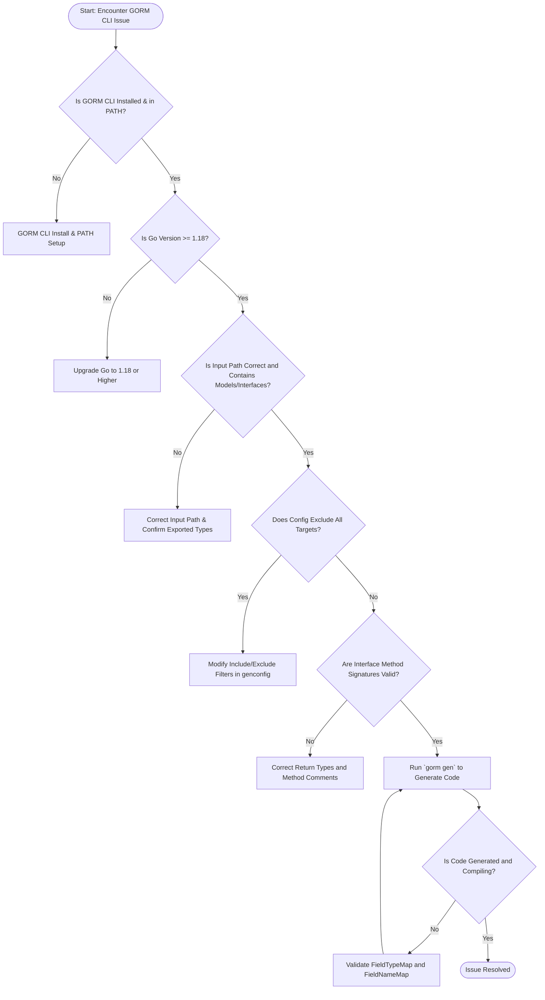

# Troubleshooting Common Issues

This reference guide addresses the most frequent setup and code generation challenges encountered when using GORM CLI. Whether you face missing commands, Go version conflicts, code output problems, or misconfigured models and interfaces, this guide provides you with direct, actionable solutions to resolve each issue quickly and get back to productive development.

---

## 1. Missing or Unrecognized Commands

**Problem:** You run a GORM CLI command like `gorm gen` and receive an error indicating the command is not found.

### Resolution Steps:

1. **Verify Installation of GORM CLI:**
   Make sure GORM CLI is installed using the recommended Go tool approach:

   ```bash
   go install gorm.io/cli/gorm@latest
   ```

2. **Check Your PATH:**
   Ensure your `$GOPATH/bin` or Go install path is included in your system's `PATH` environment variable.

3. **Confirm Command Availability:**
   Run:

   ```bash
   gorm --help
   ```

   to verify the CLI responds and lists commands including `gen`.

4. **Reinstall or Update:**
   If problems persist, reinstall GORM CLI or upgrade to the latest version:

   ```bash
   go install -u gorm.io/cli/gorm@latest
   ```

<Check>
Always use Go 1.18 or above for GORM CLI installation, as earlier versions lack generics required by the tool.
</Check>

---

## 2. Go Version Incompatibility

**Symptom:** Commands result in errors about generics or incompatible Go versions.

### Diagnosis:

- GORM CLI requires **Go 1.18+** due to use of generics.
- Running `go version` shows a lower version.

### Fix:

1. Upgrade your Go toolchain to version 1.18 or later.

2. Confirm by running:

```bash
go version
```

3. Reinstall GORM CLI after the upgrade.

<Warning>
Using Go versions before 1.18 leads to compilation and runtime failures in generated code that utilizes generics.
</Warning>

---

## 3. Code Generation Produces No Output Files or Empty Output

**Issue:** After running `gorm gen -i [input] -o [output]`, no files are generated or output directory remains empty.

### Common Causes:

- Incorrect or missing input path.
- Models and interfaces not recognized due to package or naming issues.
- Configuration filters exclude all interfaces and structs.

### How to Fix:

1. Verify the input path points to the directory or file containing your interfaces with SQL template annotations.

2. Confirm your interfaces and structs are properly exported (capitalized names) and contain valid Go syntax.

3. Check for restrictive configuration (`genconfig.Config`) that may exclude all generation:

   - Look for `IncludeInterfaces`/`ExcludeInterfaces` or `IncludeStructs`/`ExcludeStructs` filters.
   - Adjust the filters to include your target interfaces and models.

4. Run the generator with verbose output to observe processing logs.

Example:

```bash
gorm gen -i ./examples -o ./generated
```

5. Inspect logs for skipped files or warnings.

<Tip>
If using package-level config files, remember that `FileLevel` controls if config applies to the entire package subtree or only the file containing the config.
</Tip>

---

## 4. Errors Related to Misconfigured Models or Interfaces

**Common Symptoms:**

- Panics or errors mentioning method signatures or return values.
- Generator complaints about unsupported return types or missing error returns.

### Root Cause:

Method signatures in query interfaces must fit GORM CLI expectations for code generation:

- Methods returning data must return one or two values, with the last being `error`.
- Methods that are `finish` methods with raw SQL must return at least one result and an error.

### How to Correct:

1. Ensure all interface methods that perform data queries return:

   - `(T, error)`, or
   - `(TagetStruct, error)`, or
   - For methods without data return, a single `error` return.

2. Avoid multiple (>2) return parameters.

3. Confirm the last return parameter type is exactly `error` (case-sensitive).

4. For methods using SQL templates (`// SELECT...`, `// UPDATE...`), verify the comment annotations match method names and parameters.

Example of correct signature:

```go
// SELECT * FROM @@table WHERE id=@id
GetByID(id int) (T, error)
```

<Warning>
Method signatures deviating from these rules cause generation failures with explicit panic messages identifying the problem method.
</Warning>

---

## 5. Output Code Fails to Compile

### Possible Causes:

- Version mismatch between GORM CLI and your GORM ORM dependency.
- Custom field mappings incompatible with generated code.
- Incorrect use of generics or return types.

### Resolution:

1. Confirm that your `gorm.io/gorm` package is compatible with GORM CLI generated code versions.

2. Validate your configuration for field type mappings. Misconfigured or missing mappings for named Go types can lead to undefined symbols.

3. Examine your model struct tags especially `gen:"..."` annotations to ensure they correspond to registered field helpers.

4. Re-run generator to refresh output after configuration or model changes.

<Tip>
Keep your Go modules up to date and use reproducible builds where possible to avoid version drifts between generated code and imported packages.
</Tip>

---

## 6. Troubleshooting Template SQL Syntax Errors

**Problem:** Template parsing errors during code generation from SQL comments.

### Cause:

- Incorrect use of template DSL directives such as `{{where}}`, `{{set}}`, or parameter bindings.

### How to Approach:

1. Review your query interface comments holding SQL templates carefully.

2. Validate that:
   - Placeholders (`@param`) exactly match method parameters.
   - Template blocks like `{{if}}` and `{{for}}` are correctly opened and closed.
   - Use `@@table` and `@@column` placeholders as intended.

3. Simplify complex templates for initial testing and expand once basic functionality is confirmed.

4. Consult the [Template DSL guide](/concepts/data-modeling-and-templates/template-dsl-principles) for detailed syntax and examples.

---

## 7. Common Configuration Pitfalls

- Overly restrictive `Include*` or `Exclude*` filters that remove all your interfaces and models.
- Setting `FileLevel` to true when config should apply package-wide.
- Using patterns in `IncludeInterfaces` or `ExcludeStructs` that don’t match exact types or are not glob patterns.

### Best Practices:

- When using patterns, confirm with simple matches before applying complex globs.
- Make incremental config changes and regenerate to verify effect.
- Use type literals (e.g., `models.User{}`) for precision in config.

---

## Additional Tips

- Always run `gorm gen` from your project root or specify relative paths accurately.
- Use the `-o` flag to direct generated code to a dedicated output directory segregating generated files from source.
- Version control generated files cautiously; consider regenerating on significant schema or interface changes.

---

## Getting Help

- Review the [Troubleshooting & Next Steps](/getting-started/troubleshooting-validation/troubleshooting) page for broader and updated troubleshooting guidance.
- File issues and ask questions in the [GORM CLI GitHub repository](https://github.com/go-gorm/cli/issues).
- Engage with GORM community channels and forums for peer support.

---

## Summary Diagram of Troubleshooting Flow



---