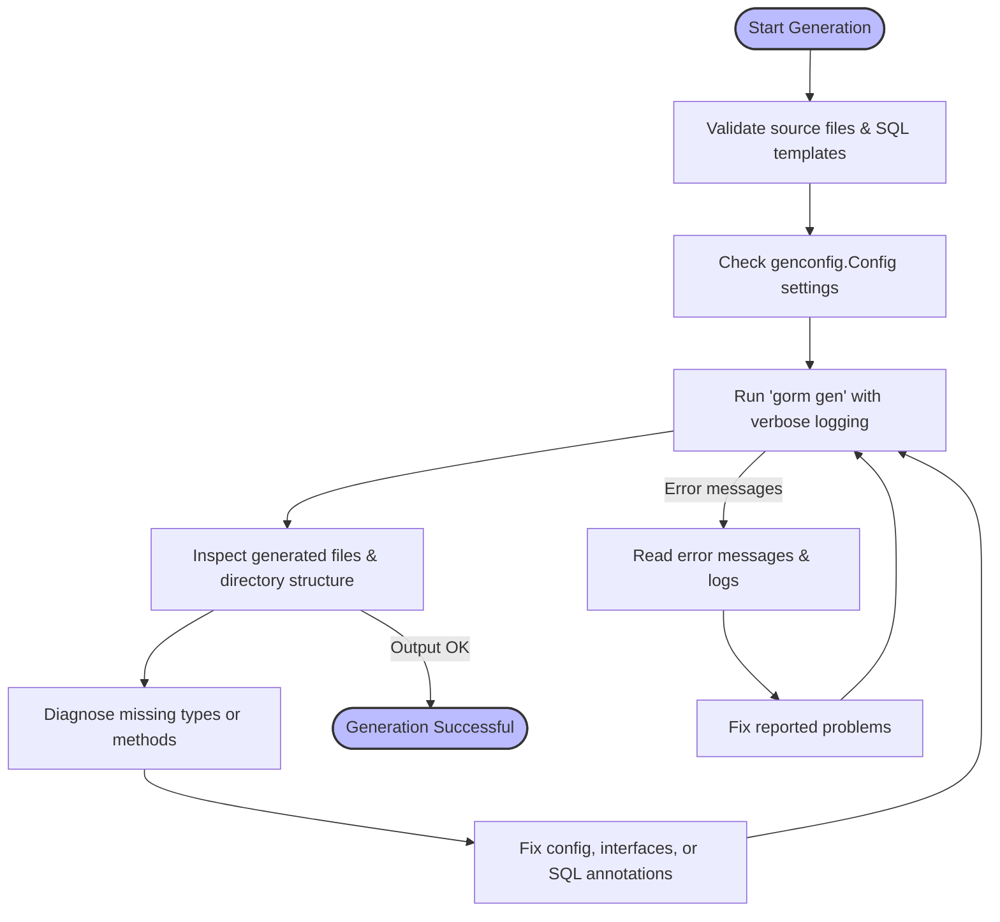

# Troubleshooting Generation & Output

This guide helps you overcome common issues encountered during GORM CLI code generation and output phases. It focuses on typical hurdles such as missing types, anomalies in the output directory structure, configuration detection problems, and understanding error messages and logs. Follow these step-by-step instructions to diagnose and resolve issues early and ensure smooth code generation and integration.

---

## 1. Diagnosing Missing or Unexpected Types in Generated Code

A frequent issue users face is that generated code references types or field helpers unexpectedly missing, or the generation silently excludes interfaces or structs.

### Step-by-step resolution:

1. **Verify Your Model and Interface Definitions**
   - Confirm that all structs and interfaces you want generated are correctly defined and exported (start with uppercase).
   - Make sure your interfaces have valid method signatures and SQL comments are properly formatted.

2. **Check Your `genconfig.Config` Settings**
   - Inspect any `genconfig.Config` used in your package or folder subtree.
   - Pay attention to inclusion and exclusion lists (`IncludeInterfaces`, `ExcludeInterfaces`, `IncludeStructs`, `ExcludeStructs`), which use shell-style patterns or type literals.

3. **Ensure Proper Type Mapping for Custom Types**
   - If you have special or non-standard field types (e.g., `sql.NullTime` or JSON types), map them in `FieldTypeMap` or `FieldNameMap` so the generator knows which field helpers to emit.

4. **Confirm that Files are Being Processed**
   - The CLI will skip generated files detected by naming conventions.
   - Confirm that your source files are not excluded unintentionally.

5. **Run the Generator with Verbose Logging**
   - When running `gorm gen`, add verbose or debug flags if available to see which files and types are being processed.

6. **Validate Output Directories and Files**
   - Confirm the output directory matches the configured `OutPath` in any `genconfig.Config`, or your CLI arguments.
   - Confirm generated files include the expected interfaces and structs.

**Troubleshooting tip:**

<Warning>
Be aware that the presence of multiple `genconfig.Config` declarations in nested directories can cause overrides that unintentionally exclude your types. Examine your directory structure for scattered configs.
</Warning>

---

## 2. Addressing Output Directory Anomalies

Sometimes generated files appear in unexpected locations or do not follow your intended output paths.

### Action steps:

1. **Understand Directory Hierarchy and `OutPath` Settings**
   - The CLI maintains your input directory structure inside the output directory.
   - A root or nearest parent `genconfig.Config` with `OutPath` set overrides the base output path.

2. **Check `FileLevel` Flag in Configurations**
   - If `FileLevel` is true, config applies only to the current file.
   - If false (default), it applies to all files in the directory subtree.

3. **Match CLI Output Arguments to `genconfig`**
   - Conflicts between CLI `-o` flags and config `OutPath` can cause confusing outputs.

4. **Verify Permissions and Directory Existence**
   - Ensure GORM CLI has write access to output paths.
   - Manually create missing directories if automatic creation fails.

5. **Use Absolute Paths for Clarity**
   - Use absolute paths in configs or CLI commands when troubleshooting to avoid relative path confusion.

**Quick fix:**

<Note>
If your files are scattered or missing, try removing all `OutPath` configurations and rely solely on CLI `-o` flag to establish a baseline output structure.
</Note>

---

## 3. Resolving Configuration Detection Issues

If your generation does not pick up the intended `genconfig.Config` or ignores mappings,

### Verify the following:

1. **Package-Level Placement**
   - `genconfig.Config` must be declared at the package (file) level, typically as a `var _ = genconfig.Config{...}`

2. **Import correctness**
   - Make sure your config file imports `gorm.io/cli/gorm/genconfig` correctly.

3. **Config Syntax and Field Names**
   - Verify config uses exact field names: `FieldTypeMap`, `FieldNameMap`, `IncludeInterfaces`, etc.

4. **Structure of Maps and Slices**
   - Field mappings should be declared with proper types and keys.

5. **File Discovery via Paths**
   - Nested configs are auto-detected by path during generation. Keep config files in directories where it should apply.

6. **FileLevel Flag Impact**
   - If `FileLevel` is true, config is only applied to the file defining it, not to other files.

**Debug yourself:**

<Info>
Run the generator with logging and observe if your config is listed in the applicable configs output before generation.
</Info>

---

## 4. Interpreting Error Messages and Log Output

Understanding CLI and runtime errors early can save time.

### Common errors and what they mean:

- `Failed to parse SQL template`:
  - Your SQL comment in interface method contains syntax errors in the templating DSL.
  - Action: Review conditional directives (`{{if}}`, `{{else}}`, `{{end}}`) and ensure balanced blocks.

- `Method must return at least one value`:
  - Your method signature is malformed or does not match expectations.
  - Action: Ensure methods returning data have either `(T, error)` or `error` alone.

- `Skipping generated file:` messages:
  - CLI detected the file as generated and skipped it to avoid infinite loops.
  - Action: Remove or exclude generated files from your input path.

- `permission denied` or `cannot create directory` errors:
  - File system write issues.
  - Action: Check your OS file permissions and directories.

### How to Increase Diagnostic Output:

Run the CLI command with debug flags (`-v`, `--debug`) or similarly supported flags. Review:

- Files being processed
- Configs applied
- Interfaces and structs detected
- Generated file locations

---

## 5. Practical Troubleshooting Workflows

Follow this flow when generation or output behaves unexpectedly:

<Steps>
<Step title="Step 1: Check Source Files and SQL Annotations">
Ensure interfaces have valid SQL annotations. Run a simple test on one interface with minimal queries.
</Step>
<Step title="Step 2: Review Configuration Overrides">
Look into any `genconfig.Config` files in your packages/directories.
</Step>
<Step title="Step 3: Run Generation with Verbose Logging">
Use `gorm gen -i ./yourpkg -o ./output -v` to see detailed diagnostics.
</Step>
<Step title="Step 4: Validate Output Directory Structure">
Confirm generated files appear where expected and include content.
</Step>
<Step title="Step 5: Inspect Generated Code for Missing Types">
Look inside generated files if certain types or helpers are absent.
</Step>
</Steps>

---

## 6. Examples of Common Fixes

### Fix: Missing Generated Methods
Update your interface method comment to include explicit SQL templates.

```go
// SELECT * FROM @@table WHERE id=@id
GetByID(id int) (T, error)
```

### Fix: Custom Type Field Helper Missing
Add a mapping in your config:

```go
var _ = genconfig.Config{
  FieldTypeMap: map[any]any{
    sql.NullTime{}: field.Time{},
  },
}
```

### Fix: Generated Files Scatter Across Unexpected Folders
Ensure only one `OutPath` config or CLI flag, and align your directory layout. Use absolute paths if necessary.

---

## 7. Additional Resources & Next Steps

- [Installation Instructions](/getting-started/setup-installation/installation-instructions) for setting up GORM CLI properly.
- [Configuration & Customization](/getting-started/first-steps/configuration-setup) to learn more about `genconfig.Config`.
- [Validating Generated Code](/getting-started/first-steps/validating-generated-code) for checking correctness in generated files.
- [Common Installation Issues](/getting-started/troubleshooting/common-install-errors) for environment problems.

---

<Tip>
A disciplined approach to structuring your source code, SQL annotations, and consistent configuration management will prevent most generation issues.
</Tip>

---

## Summary Diagram: Generation and Output Troubleshooting Flow



---