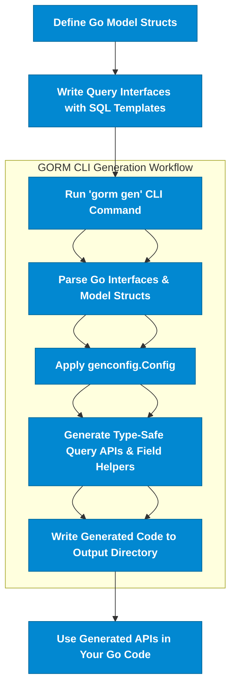

# What is GORM CLI?

GORM CLI is a powerful tool designed to supercharge your GORM-based Go projects by generating **interface-driven, type-safe query APIs** and **model-driven field helpers**. It seamlessly enhances your development workflow by providing compile-time safety and fluent, discoverable methods for database operations — all with minimal manual coding.

---

## Why Use GORM CLI?

Imagine writing expressive, type-safe queries and updates effortlessly, without struggling with boilerplate code or risking runtime SQL errors. GORM CLI transforms your Go interfaces and model structs into robust, compile-safe APIs that help you:

- Build queries with confidence using generated methods derived from SQL templates in your interfaces.
- Access model fields effortlessly with field helpers for filters, updates, and associations.
- Manage complex association operations (Create, Update, Unlink, Delete) safely, directly from generated code.
- Customize generation via simple configuration to fit your project needs.

This means faster development, safer code, and a cleaner project structure.

---

## Core Value Proposition

GORM CLI focuses on delivering two essential generators that work in harmony:

1. **Query API Generator**
   - Converts Go interfaces annotated with SQL templates into concrete, type-safe methods.
   - Supports rich SQL templating (conditional clauses, dynamic columns, loops) directly in comments.

2. **Field Helper Generator**
   - Produces strongly typed helpers for model struct fields.
   - Enables expressive, chainable predicates and setters with compile-time checks.

Together, these provide a fluent API interface for reads, writes, and association management, rooted deeply in Go’s type system.

---

## Key Benefits for Go Developers

- **Compile-Time Safety:** Catch errors early by relying on generated API methods tailored to your data models and queries.
- **Discoverability:** Use IDE autocomplete and fluent method chaining to explore your API surface.
- **Reduced Boilerplate:** Avoid repetitive SQL and query building code.
- **Seamless GORM Integration:** Generated code works natively with `gorm.io/gorm`.
- **Flexible Configuration:** Control output paths, include/exclude patterns, and field mappings through configuration.

---

## How GORM CLI Fits Into Your Workflow

1. **Define your models:** Standard Go structs representing your database schema.
2. **Write query interfaces:** Go interfaces with SQL templates in method comments.
3. **Generate code:** Run `gorm gen` CLI command to produce type-safe query APIs and field helpers.
4. **Use generated APIs:** Replace raw SQL and boilerplate with generated fluent methods.

This integration empowers you to maintain strongly typed, clean, and maintainable database interaction layers.

---

## Example Quick Start Snippet

```go
// Define a query interface with SQL templates
// SELECT * FROM @@table WHERE id=@id
// GetByID fetches record by ID
func (Query[T]) GetByID(id int) (T, error)

// Define your model struct
type User struct {
  gorm.Model
  Name string
  Age  int
}
```

Generate the code by running:

```bash
gorm gen -i ./examples -o ./generated
```

Use the generated API:

```go
// Fetch user by ID
user, err := generated.Query[User](db).GetByID(ctx, 123)

// Query users older than 18
users, err := gorm.G[User](db).Where(generated.User.Age.Gt(18)).Find(ctx)
```

---

## What You Will Gain By Using GORM CLI

- **Fluent Query APIs:** Write less code and interact with the database more intuitively.
- **Strongly Typed Field Helpers:** Safely build predicates, perform updates, and work with associations.
- **Efficient Association Management:** Powerful helpers for has one/many, belongs to, and many-to-many relations.
- **Customizable Generation:** Optimize generated code to fit your application's architecture.

---

## Going Further

For comprehensive onboarding, explore these topics next:

- [Installation Guide](../welcome-and-installation/installation)
- [Writing Your First Query Interface](../../guides/core-workflows/writing-type-safe-queries)
- [Using Generated Field Helpers](../../guides/core-workflows/using-field-helpers)
- [Managing Associations with Helpers](../../guides/core-workflows/association-operations)
- [Advanced Template DSL](../../guides/advanced-usage-patterns/template-dsl)


---

## Troubleshooting

- Ensure you have **Go 1.18** or higher, as GORM CLI depends on generics.
- If your interfaces lack properly formatted SQL templates in comments, code generation will fail.
- Use configuration (`genconfig.Config`) to include/exclude packages or structs to avoid unwanted code generation.

---

## Diagram: How GORM CLI Works



This flow reflects the journey from your source interface and model definitions to fully generated APIs ready for use.

---