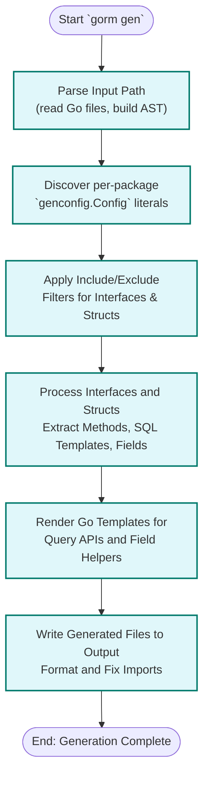

# Generating Code with the `gorm gen` Command

The `gorm gen` command is the core tool for transforming your Go interface definitions and model structs into fully generated, type-safe, and idiomatic GORM query APIs and field helpers. This page guides you through the practical workflow of invoking the CLI tool, specifying input and output directories, and understanding how files are processed to produce your desired generated code.

---

## 1. Overview of the `gorm gen` Command

The `gorm gen` command reads your Go code containing raw SQL interface definitions enriched with SQL template comments, along with your model structs. It processes this source code, applies any configured generation rules, and emits new Go source files with the generated query implementations and helper fields.

This workflow enables faster development, compile-time type safety, and seamless integration into your existing GORM projects.

---

## 2. Invocation & Parameters

### Installing the CLI tool
Before you start code generation, ensure you have installed the CLI tool using:

```bash
go install gorm.io/cli/gorm@latest
```

### Basic Command Usage

```bash
gorm gen -i <input-path> -o <output-path>
```

- `-i, --input`: **(required)** Path to the Go file or directory containing your interface definitions and models. For example, `./examples` or `./examples/query.go`.
- `-o, --output`: Directory where generated files will be placed. Defaults to `./g` if omitted.

### Example

To generate code for your example package:

```bash
gorm gen -i ./examples -o ./generated
```

This reads all relevant `.go` files under `./examples` and writes the generated code into `./generated`, preserving package-relative folder structure.

---

## 3. File Processing & Generation Workflow

Once invoked, the CLI goes through a multi-stage flow:

<Steps>
<Step title="Input Parsing and AST Analysis">
The generator scans the input path recursively (if a directory), parsing Go source files and building ASTs (Abstract Syntax Trees). It extracts interfaces with SQL template comments and structs for field helper generation.
</Step>
<Step title="Configuration Discovery & Filtering">
Per-package `genconfig.Config` declarations are automatically detected in source files. These optional configs determine output paths, custom field mappings, and filtering of which interfaces or structs to include/exclude.
</Step>
<Step title="Data Model & Interface Processing">
Detailed processing extracts method parameters, return types, and SQL template content.

Structs are parsed for their fields, associations, and field tags to shape the field helper APIs.
</Step>
<Step title="Code Template Rendering">
Using embedded Go templates, the generator produces Go source files implementing:
- Concrete implementations of your query interfaces with parameter binding and SQL execution
- Field helpers with typed predicates and update helpers based on your models

Imports are automatically managed and formatted.
</Step>
<Step title="Output Writing and Formatting">
Generated files are written to the output directory, preserving package-relative paths.
The generated code is processed with Go imports tooling for clean import statements and formatting.
</Step>
</Steps>

---

## 4. Achieving Repeatable Regeneration

### Best Practises

- **Version Control:** Commit your interfaces, models, and `genconfig.Config` declarations before running the generator.
- **Consistent Input:** Always run generation on the same package or directory inputs.
- **Output Separation:** Use separate output directories for generated code (e.g., `./generated`, or `./g`) so generated files can be clearly distinguished from source files.
- **Automation:** Integrate `gorm gen` commands into your build or codegen scripts for repeatable runs.

### Example Regeneration Command

```bash
gorm gen -i ./examples -o ./generated
```

Rerun this command after you change your interfaces or models to produce updated generated files.

---

## 5. Troubleshooting Common Issues

<AccordionGroup title="Common Problems and Solutions">
<Accordion title="Input Path Not Valid or Empty">
- **Problem:** You specified a wrong or empty input path.
- **Solution:** Verify the input path exists and contains Go files. Use absolute paths if needed.
</Accordion>
<Accordion title="No Files Generated in Output Directory">
- **Problem:** Generation finishes but no files appear.
- **Solution:** Check that your interfaces and structs match any include/exclude filters in `genconfig.Config`. Also ensure your interfaces have methods with valid SQL template comments and correct return types.
</Accordion>
<Accordion title="Generated Code Fails to Compile or Format">
- **Problem:** Output files have syntax errors or poor formatting.
- **Solution:** Ensure your input Go code is valid and correctly formatted. Custom SQL template comments must be well-formed. Report bugs if formatting always fails.
</Accordion>
<Accordion title="Configuration Not Applied as Expected">
- **Problem:** Custom output paths, field type mappings, or filters in `genconfig.Config` are ignored.
- **Solution:** Confirm that the `genconfig.Config` literal is declared in the package that contains your source files and is not excluded by `FileLevel` or other filters.
</Accordion>
</AccordionGroup>

---

## 6. Tips & Best Practices

- Always provide clear SQL templates in interface method comments using the DSL supported by the tool — this ensures correct generated method bodies.
- Use per-package `genconfig.Config` when you need customization per package, such as output location or field type overrides.
- Keep your input directory clean from generated files to avoid processing loops — use output dirs not under input paths.
- Leverage shell-style patterns in `IncludeInterfaces` or `ExcludeStructs` for precise control over generation scope.

---

## 7. Next Steps & Further Documentation

- After generating code, refer to **[Using the Generated APIs in Your Application](/guides/core-workflows/using-generated-apis)** to understand how to consume and integrate the generated types.
- To customize generation behavior, see **[Customizing Code Generation with genconfig](/guides/advanced-usage/customizing-generation)**.
- To write SQL templates with correct DSL patterns, consult **[Writing and Using SQL Templates](/guides/advanced-usage/template-dsl-guide)**.

---

## 8. Command Reference Summary

```bash
Usage: gorm gen -i <input> -o <output>

Flags:
  -i, --input string    Path to Go interface file or directory containing SQL interfaces (required)
  -o, --output string   Directory to place generated code (default "./g")

Examples:
  gorm gen -i ./examples -o ./generated
  gorm gen -i ./pkg/repository -o ./generated/repo
```

---

## 9. Under the Hood: Workflow Diagram



---

For detailed examples and deeper understanding, explore the related guides linked above or browse example projects in the official repository.

---

<Check>
You have now learned how to invoke the `gorm gen` command, specify your input and output paths, understand the internal processing workflow, and handle common issues. This foundation empowers you to generate type-safe, fluent, and idiomatic GORM APIs efficiently and reliably.
</Check>
