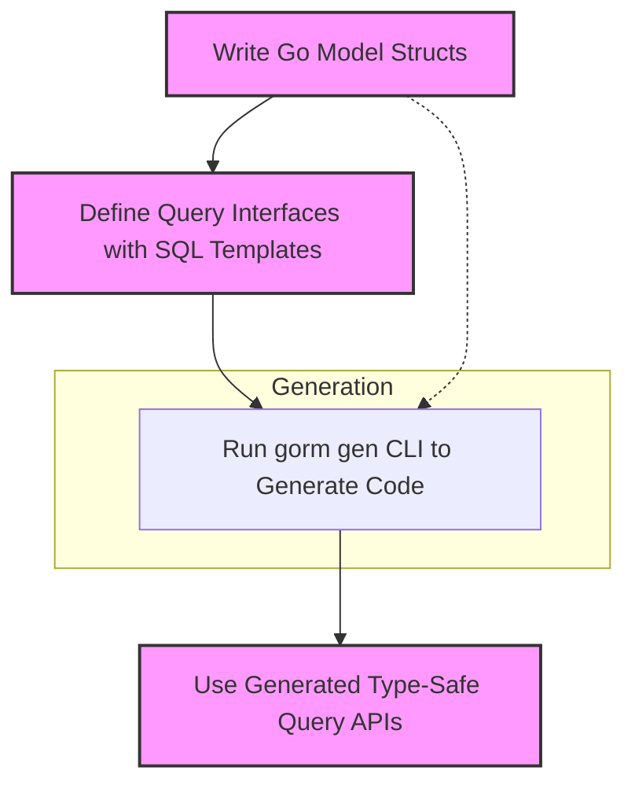

# Defining Your Models and Query Interfaces

Learn how to declare Go model structs and write query interfaces using SQL templates. All examples use the recommended patterns for maximum type-safety and code generation compatibility.

---

## Overview

GORM CLI simplifies data access by generating type-safe query APIs from user-defined Go interfaces with SQL templates, complemented by model-driven field helpers generated from Go model structs. This page guides you through crafting your models and query interfaces the right way so you can maximize compile-time safety and take full advantage of GORM CLI’s code generation.

By defining models and query interfaces properly, you lay the foundation for seamless, fluent, and efficient data access in your project.

---

## 1. Declaring Your Go Model Structs

Your model structs represent database tables. GORM CLI generates field helpers based on these structs, enabling strongly-typed filters, updates, ordering, and association helpers.

### Best Practices for Model Structs

- **Place your models in a dedicated package or folder** for clear separation and ease of generation.
- **Use exported struct fields with proper Go types.** Include basic types (e.g., `string`, `int`, `bool`, `time.Time`) and types implementing standard interfaces (`sql.Scanner`, `driver.Valuer`, or `schema.SerializerInterface`).
- **Annotate fields with GORM tags**, especially for custom column names or relationships.
- **Use the `gen` struct tag to influence field helper mapping** (e.g., `gen:"json"` to use a JSON field helper).

### Example Model Definition

```go
package models

import (
	"time"
	"database/sql"
)

type User struct {
	ID        uint      // id column
	Name      string    // name column
	Age       int       // age column
	CreatedAt time.Time // created_at column
	Profile   string    `gen:"json"` // custom JSON field helper
}
```

### Understanding Field Helper Generation

- Basic scalar fields (int, string, bool, time.Time) generate corresponding helpers like `field.Number[int]` or `field.String`.
- Fields with `gen` tags can map to custom helpers (e.g., JSON).
- Associations generate special helpers (`field.Struct[T]` or `field.Slice[T]`).

### Tips

<Tip>
Use consistent naming conventions and keep your struct definitions clean to ensure generated helpers are intuitive and maintainable.
</Tip>

<Warning>
Avoid private or unexported fields as they will not generate field helpers.
</Warning>

---

## 2. Writing Your Query Interfaces with SQL Templates

GORM CLI generates type-safe, concrete query implementations from Go interfaces with SQL templates embedded in method comments. These interfaces define how you want to query or update data.

### Rules for Query Interfaces

- **Define your interface with one or more generic methods** that include SQL templates in method doc comments.
- Use `T any` as a generic type parameter to support any model type.
- **Write SQL or templating DSL in comments using the template directives** to bind Go params to SQL safely and dynamically.
- Ensure methods return appropriate types: result structs plus `error` or only `error` for finish methods.
- Do not include context parameters explicitly; the generator will inject `context.Context` automatically if needed.

### SQL Template DSL Directives

| Directive   | Description                                  | Example                                     |
| ----------- | -------------------------------------------- | ------------------------------------------- |
| `@@table`   | Resolves to the model’s table name           | `SELECT * FROM @@table WHERE id=@id`        |
| `@@column`  | Dynamic column binding                        | `WHERE @@column=@value`                      |
| `@param`    | Binds Go params to SQL to avoid injection    | `WHERE name=@user.Name`                      |
| `{{where}}` | Conditional WHERE clause block                | `{{where}} age > 18 {{end}}`                 |
| `{{set}}`   | Conditional SET clause (typically in UPDATE) | `{{set}} name=@name {{end}}`                 |
| `{{if}}`    | Conditional SQL fragment inside templates     | `{{if age > 0}} AND age=@age {{end}}`        |
| `{{for}}`   | Loop over collections to build conditions     | `{{for _, tag := range tags}} ... {{end}}`  |

### Example Query Interface

```go
package examples

type Query[T any] interface {
	// SELECT * FROM @@table WHERE id=@id
	GetByID(id int) (T, error)

	// SELECT * FROM @@table WHERE @@column=@value
	FilterWithColumn(column string, value string) (T, error)

	// UPDATE @@table
	// {{set}}
	//   {{if user.Name != ""}} name=@user.Name, {{end}}
	//   {{if user.Age > 0}} age=@user.Age, {{end}}
	//   {{if user.Age >= 18}} is_adult=1 {{else}} is_adult=0 {{end}}
	// {{end}}
	// WHERE id=@id
	UpdateInfo(user models.User, id int) error

	// where("name=@name AND age=@age")
	FilterByNameAndAge(name string, age int)
}
```

### Working with Parameters and Results

- Parameters (in method signature) bind automatically to SQL placeholders.
- Return values: typically `(T, error)` for queries, or `error` alone for updates.
- Context is automatically added by the generator behind the scenes.

### Tips

<Info>
Embedding SQL directly in interface comments allows flexible, dynamic queries with compile-time checked method signatures.
</Info>

<Warning>
Ensure your SQL templates match method parameters exactly to avoid generation errors.
</Warning>

---

## 3. Example: Defining a Model and Query Interface in One Package

Putting models and query interfaces together in the same package or directory simplifies generation and usage.

```go
package examples

// User model

type User struct {
	ID   uint
	Name string
	Age  int
}

// Query interface

type Query[T any] interface {
	// SELECT * FROM @@table WHERE id=@id
	GetByID(id int) (T, error)

	// where("name=@name AND age=@age")
	FilterByNameAndAge(name string, age int)
}
```

Generate code with:

```bash
gorm gen -i ./examples -o ./generated
```

Use generated APIs:

```go
u, err := generated.Query[User](db).GetByID(ctx, 123)
users, err := generated.Query[User](db).FilterByNameAndAge("alice", 30).Find(ctx)
```

---

## 4. Common Pitfalls and How to Avoid Them

- **Missing return values**: Query methods with raw SQL must return at least one value, typically `(T, error)`.
- **Incorrect parameter bindings**: Keep parameter names and types in sync with placeholders in SQL templates.
- **Unexported fields in models**: Field helpers generate only for exported fields.
- **Forgetting to generate code**: Run `gorm gen` after defining or changing models/interfaces.
- **Naming mismatches**: Use consistent table and field naming, let `@@table` and `@@column` handle table and column names.

<Warning>
If generation fails, check SQL template syntax carefully and verify method signatures.
</Warning>

---

## 5. Next Steps: From Models to Running the Generator

Once you have defined your models and query interfaces using the patterns above, the next logical step is to run the generator. For detailed instructions, see: [Generating Code](/getting-started/your-first-generation/running-the-generator).

After generation, explore how to use the generated type-safe APIs for data queries and modifications: [Using Generated APIs](/getting-started/your-first-generation/using-generated-apis).

To customize your generation process, review optional configuration: [Basic Configuration](/getting-started/configuration-and-troubleshooting/basic-configuration).

---

## Summary Diagram: High-Level Workflow for Defining Models and Query Interfaces



---

## Troubleshooting Common Defining Issues

<AccordionGroup title="Troubleshooting Your Models and Interfaces">
<Accordion title="Model Field Helpers Not Generating">
Check that your struct fields are **exported** (start with uppercase), and that any custom types implement `Scanner` or `Valuer` interfaces if needed. Fields with private visibility or unsupported types won’t generate helpers.
</Accordion>
<Accordion title="Generator Fails Due to Interface Method Signatures">
Verify each interface method:

- Has correct return types (usually `(T, error)` or `error`).
- SQL template placeholders exactly match parameter names.
- Context parameters are omitted; the generator will inject them.

Ensure SQL templates are properly formatted and using the DSL directives.
</Accordion>
<Accordion title="SQL Template Syntax Errors">
Templates must be syntactically correct. Use the documented DSL directives and avoid invalid Go template syntax. If errors occur, isolate by simplifying the SQL templates and gradually adding complexity.
</Accordion>
</AccordionGroup>

---

For more comprehensive explanations and examples, explore related documentation:

- [Getting Started: Running the Generator](../../your-first-generation/running-the-generator)
- [Using Generated APIs](../../your-first-generation/using-generated-apis)
- [Template-Based Query Generation](../../../guides/advanced-patterns/template-based-sql)
- [Model-Driven Field Helpers](../../../guides/core-workflows/field-helpers-basics)

---

This page equips you with everything needed to confidently craft your model structs and query interfaces for seamless code generation with GORM CLI.
