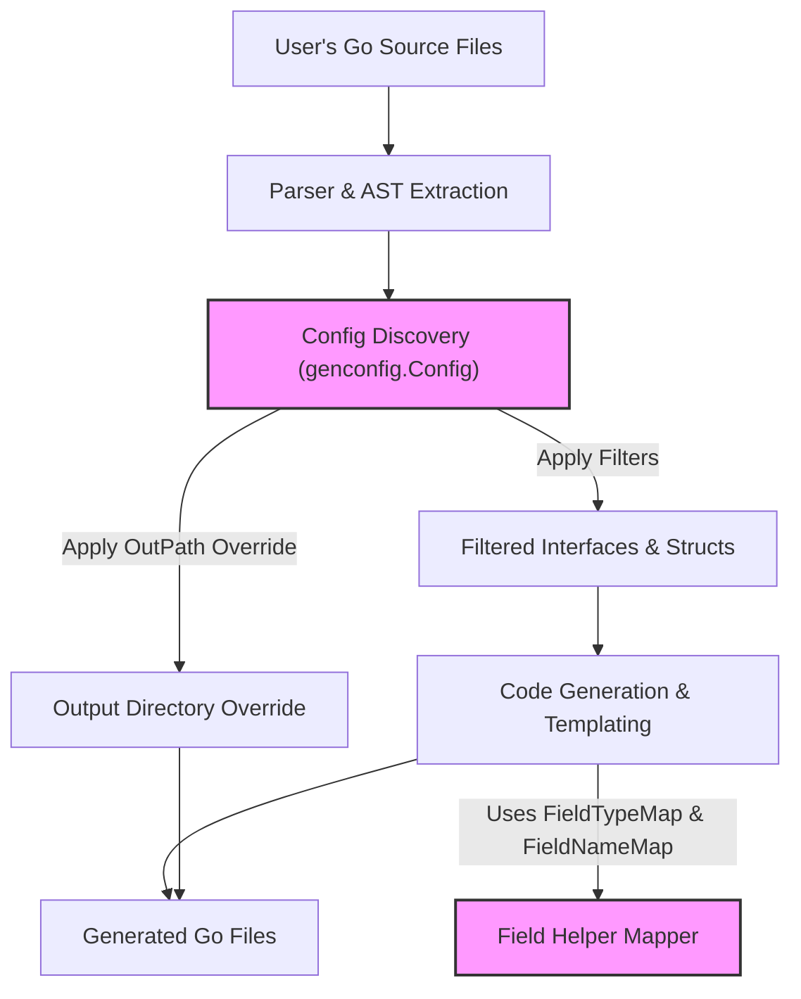

# Configurable Generation

The GORM CLI provides flexible and powerful configuration options through the optional `genconfig.Config` struct. This enables you to tailor code generation precisely to your projects' needs by controlling what code is generated, how fields are mapped to helpers, and how output is organized.

Whether you are working on a small package or a large codebase with complex interface hierarchies and custom field types, understanding how to use and apply `genconfig.Config` will help you unlock the full potential of GORM CLI's generation capabilities.

---

## Why Configure Generation?

By default, GORM CLI generates type-safe query APIs and model-driven field helpers for all eligible Go interfaces and structs it discovers. However, many real-world projects require fine control over the generation process to:

- Limit generated code only to specific interfaces or structs
- Remap certain Go types or tagged fields to custom field helper types
- Override output paths per package
- Apply generation settings only at file or package level

This is where `genconfig.Config` becomes invaluable.


## Declaring a Config

`genconfig.Config` is a Go struct literal declared at the package or file level in your source code. GORM CLI automatically discovers these declarations by scanning your code during generation.

A minimal example:

```go
package examples

import (
  gencfg "gorm.io/cli/gorm/genconfig"
  "gorm.io/cli/gorm/field"
  "database/sql"
)

var _ = gencfg.Config{
  OutPath: "examples/output",
  FieldTypeMap: map[any]any{
    sql.NullTime{}: field.Time{},
  },
  FieldNameMap: map[string]any{
    "date": field.Time{},
  },
  IncludeInterfaces: []any{"Query*"},
}
```

This snippet configures the generator to output files to a custom folder, map `sql.NullTime` fields to `field.Time` helpers, map tagged fields (`gen:"date"`) to `field.Time`, and include only interfaces with names starting with "Query".


## Configuration Fields Explained

### Output Path Override (`OutPath`)

- Overrides the default output directory for generated files within the package where the `Config` is declared.
- Useful when you want to organize generated code in a dedicated folder.
- If unset, generation defaults to `./g` or the CLI flag `-o` value.

### Field Type Mapping (`FieldTypeMap`)

- Defines explicit mappings between Go types and field helper types.
- Keys are Go type instances, values are field helper instances.
- Allows customizing or extending field helper behavior for specific Go types.

Example:

```go
FieldTypeMap: map[any]any{
  sql.NullTime{}: field.Time{},
}
```

This instructs the generator to use `field.Time` helpers for any field of type `sql.NullTime`.

### Field Name Mapping (`FieldNameMap`)

- Maps field tag names (for example, tag `gen:"json"`) to custom field helper instances.
- Takes precedence over `FieldTypeMap`.
- Enables per-column customization based on struct tags.

Example:

```go
FieldNameMap: map[string]any{
  "json": JSON{}, // Custom JSON helper
}
```

This lets you declare custom field helpers for fields tagged with `gen:"json"` in your structs.

### File-Level Scope (`FileLevel`)

- When `true`, configuration applies only to the current file instead of the entire package.
- Useful for fine-grained control in multi-file packages.

### Interface and Struct Inclusion/Exclusion Filters

Use these arrays to control which interfaces and structs are included or excluded from generation.

- `IncludeInterfaces` / `ExcludeInterfaces`: Slice of patterns or typed selectors.
- `IncludeStructs` / `ExcludeStructs`: Slice of patterns or type literals.

Selectors support:

- Shell-style patterns: e.g., "Query*", "*Repo"
- Fully qualified type names: e.g., "models.User"
- Type literal expressions: e.g., `models.User{}`

Filtering logic:

- Inclusion filters take priority: if `Include*` is non-empty, only matching entries are generated.
- Exclusion filters are applied afterward to remove unwanted entries.

Example:

```go
IncludeInterfaces: []any{"Query*"},
ExcludeInterfaces: []any{"*Deprecated*"},
IncludeStructs: []any{"User", models.Account{}},
ExcludeStructs: []any{"*DTO"},
```

This includes interfaces starting with "Query" but excludes deprecated ones; only generates User and Account structs while skipping DTO-named structs.

---

## Practical Usage Patterns

### Restrict Generation to Specific Interfaces

Focus generation on core query interfaces:

```go
var _ = genconfig.Config{
  IncludeInterfaces: []any{"Query*"},
}
```

### Map Custom Go Types to Helpers

Mapping SQL nullable or custom types ensures correct helper generation:

```go
var _ = genconfig.Config{
  FieldTypeMap: map[any]any{
    sql.NullTime{}: field.Time{},
    mypkg.CustomDate{}: field.Time{},
  },
}
```

### Use Field Tags to Control Helpers

Customize only columns with `gen:"json"` tag:

```go
var _ = genconfig.Config{
  FieldNameMap: map[string]any{
    "json": JSON{},
  },
}
```

### Exclude Legacy or Unsupported Types

Exclude obsolete interfaces or structs:

```go
var _ = genconfig.Config{
  ExcludeInterfaces: []any{"*Legacy*"},
  ExcludeStructs: []any{"*DTO"},
}
```

### Configure File-Level Overrides

When multiple files in a package need different configs:

```go
var _ = genconfig.Config{
  FileLevel: true,
  OutPath: "custom/output/path",
}
```


## Best Practices

- **Use inclusion lists sparingly:** Prefer to exclude outdated interfaces or structs instead of listing every included one.
- **Favor `FieldNameMap` over `FieldTypeMap` for tag-based customization:** This ensures precise control for tagged fields.
- **Keep output directories organized:** Override `OutPath` to separate generated code from handwritten source for easier maintenance.
- **Apply filtering to avoid generating empty code:** Use include/exclude filters to keep generated packages clean.
- **Version control generated code separately:** Treat generated files as build artifacts to avoid manual changes.


## Extending with Custom Field Helpers

GORM CLI supports introducing custom field helpers for specialized SQL generation or complex column types.

Steps to extend:

1. Define a custom helper type with appropriate methods.
2. Map your helper in `FieldNameMap` or `FieldTypeMap` via `genconfig.Config`.
3. Tag struct fields as needed with custom `gen` tags.
4. Use generated helpers in your queries for expressive, type-safe operations.

For a detailed walkthrough on JSON helpers and custom field mapping, see [Adding and Using Custom Field Helpers (e.g. JSON)](/guides/advanced-usage/json-field-helpers).


## Troubleshooting Configurations

- **Config not applied?** Ensure your `genconfig.Config` is declared as a package-level variable with a blank identifier (`var _ = ...`) so the generator detects it.
- **Filters too restrictive?** If no code is generated, check your include/exclude patterns for mismatches.
- **Incorrect helper mapping?** Verify types and tags match exactly, considering package paths.
- **FileLevel confusion?** If configs don't seem to apply across a package, check the `FileLevel` flag.


## Diagram: Configuration Influence on Generation Workflow



This flowchart visualizes how user configs control which code is generated, where it's output, and how fields are mapped to helpers.


---

## Summary

Using `genconfig.Config` empowers you to customize GORM CLI's generation process with precision. From output directories to field helper mappings and selective filtering, configuration is your essential tool for managing scalable, maintainable, and consistent code generation.

Explore custom field helpers, incremental configuration for large projects, and best practices to get the most from your setup.

---

## Additional Resources

- [Using the Generated APIs in Your Application](/guides/core-workflows/using-generated-apis)
- [Writing and Using SQL Templates](/guides/advanced-usage/template-dsl-guide)
- [Adding and Using Custom Field Helpers (e.g. JSON)](/guides/advanced-usage/json-field-helpers)
- [Core Concepts & Terminology](/overview/core-concepts-architecture/core-concepts-terminology)
- [Code Generation Workflow](/gorm-cli-concepts/core-architecture/code-generation-workflow)

---

## Examples

### Example Configuration File

```go
package examples

import (
  gencfg "gorm.io/cli/gorm/genconfig"
  "gorm.io/cli/gorm/field"
  "database/sql"
)

// Configure generation for this package
var _ = gencfg.Config{
  OutPath: "examples/generated",
  FieldTypeMap: map[any]any{
    sql.NullTime{}: field.Time{},
  },
  FieldNameMap: map[string]any{
    "json": JSON{},
    "date": field.Time{},
  },
  IncludeInterfaces: []any{"Query*"},
  ExcludeInterfaces: []any{"*Deprecated*"},
  ExcludeStructs: []any{"*DTO"},
}
```

This example:

- Outputs generated files under `examples/generated`
- Maps `sql.NullTime` fields to `field.Time`
- Maps fields tagged with `gen:"json"` or `gen:"date"`
- Includes interfaces whose names start with "Query"
- Excludes deprecated interfaces and DTO structs

---

<Tip>
Use configuration to limit generation scope early in your project to reduce build noise and speed up generation.
</Tip>

<Note>
Remember, `FieldNameMap` overrides `FieldTypeMap` in conflicts for maximum flexibility.
</Note>

<Warning>
Incorrect filter patterns can cause zero code generation; validate your selectors carefully.
</Warning>

<Check>
Regularly commit and version control your generated code separately from handwritten code to avoid accidental edits.
</Check>
